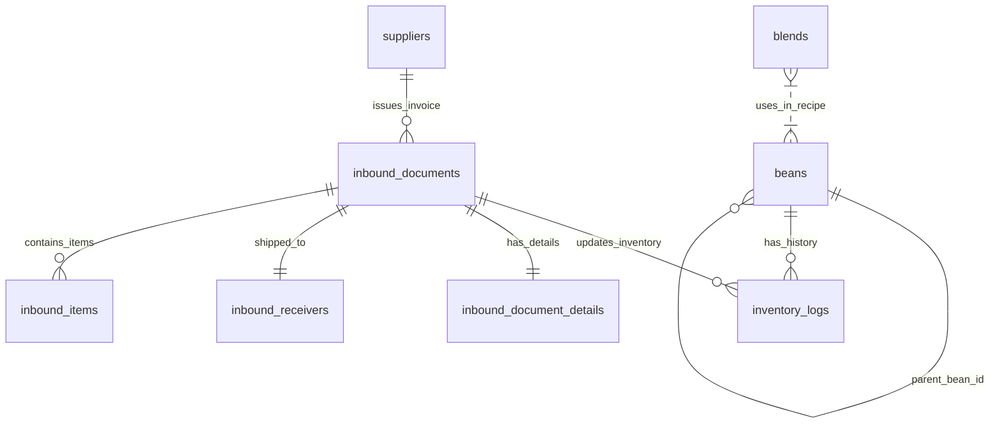

# 🗄️ TheMoon 데이터베이스 스키마 (Database Schema)

> **작성일**: 2025-12-07
> **버전**: 0.0.6
> **DBMS**: PostgreSQL 15+ (Production), SQLite 3 (Development)

---

## 📋 목차

1. [ER Diagram](#er-diagram)
2. [테이블 상세](#테이블-상세)
3. [인덱스 전략](#인덱스-전략)
4. [데이터 무결성 규칙](#데이터-무결성-규칙)

---

## ER Diagram
 


---

## 테이블 상세

### 1. beans (원두 통합 테이블)

**목적**: 생두, 원두, 블렌드 원두를 하나의 테이블에서 통합 관리

| Column                  | Type         | Nullable | Default | PK  |
| ----------------------- | ------------ | -------- | ------- | --- |
| `id`                    | INTEGER      | NO       | NULL    | YES |
| `name`                  | VARCHAR(100) | NO       | NULL    |     |
| `type`                  | VARCHAR(12)  | NO       | NULL    |     |
| `sku`                   | VARCHAR(100) | YES      | NULL    |     |
| `name_ko`               | VARCHAR(100) | YES      | NULL    |     |
| `name_en`               | VARCHAR(200) | YES      | NULL    |     |
| `origin`                | VARCHAR(100) | YES      | NULL    |     |
| `origin_ko`             | VARCHAR(50)  | YES      | NULL    |     |
| `origin_en`             | VARCHAR(50)  | YES      | NULL    |     |
| `variety`               | VARCHAR(50)  | YES      | NULL    |     |
| `grade`                 | VARCHAR(50)  | YES      | NULL    |     |
| `processing_method`     | VARCHAR(50)  | YES      | NULL    |     |
| `roast_profile`         | VARCHAR(6)   | YES      | NULL    |     |
| `parent_bean_id`        | INTEGER      | YES      | NULL    |     |
| `quantity_kg`           | FLOAT        | NO       | NULL    |     |
| `avg_price`             | FLOAT        | NO       | NULL    |     |
| `purchase_price_per_kg` | FLOAT        | YES      | NULL    |     |
| `cost_price`            | FLOAT        | YES      | NULL    |     |
| `description`           | TEXT         | YES      | NULL    |     |
| `notes`                 | TEXT         | YES      | NULL    |     |
| `expected_loss_rate`    | FLOAT        | NO       | NULL    |     |
| `created_at`            | DATETIME     | YES      | NULL    |     |
| `updated_at`            | DATETIME     | YES      | NULL    |     |

**Foreign Keys**:
- `parent_bean_id` -> `beans.id`

**Enum 값**:
- `type`: `'GREEN_BEAN'`, `'ROASTED_BEAN'`, `'BLEND_BEAN'`
- `roast_profile`: `'LIGHT'`, `'MEDIUM'`, `'DARK'`

---

### 2. suppliers (공급처)

**목적**: 원두 및 자재 공급처 관리

| Column                | Type    | Nullable | Default | PK  |
| --------------------- | ------- | -------- | ------- | --- |
| `id`                  | INTEGER | NO       | NULL    | YES |
| `name`                | VARCHAR | NO       | NULL    |     |
| `representative_name` | VARCHAR | YES      | NULL    |     |
| `contact_phone`       | VARCHAR | YES      | NULL    |     |
| `contact_email`       | VARCHAR | YES      | NULL    |     |
| `address`             | VARCHAR | YES      | NULL    |     |
| `registration_number` | VARCHAR | YES      | NULL    |     |

---

### 3. blends (블렌드 레시피)

**목적**: 커피 블렌드 레시피 저장

| Column               | Type         | Nullable | Default           | PK  |
| -------------------- | ------------ | -------- | ----------------- | --- |
| `id`                 | INTEGER      | NO       | NULL              | YES |
| `name`               | VARCHAR(200) | NO       | NULL              |     |
| `description`        | TEXT         | YES      | NULL              |     |
| `recipe`             | JSON         | NO       | NULL              |     |
| `target_roast_level` | VARCHAR(50)  | YES      | NULL              |     |
| `notes`              | TEXT         | YES      | NULL              |     |
| `created_at`         | DATETIME     | YES      | CURRENT_TIMESTAMP |     |
| `updated_at`         | DATETIME     | YES      | NULL              |     |

**recipe 구조 (JSON)**:
```json
[
  {"bean_id": 6, "ratio": 0.4},
  {"bean_id": 9, "ratio": 0.4}
]
```

---

### 4. inbound_documents (입고 내역서)

**목적**: OCR 스캔된 입고 내역서 헤더 정보

| Column            | Type     | Nullable | Default | PK  |
| ----------------- | -------- | -------- | ------- | --- |
| `id`              | INTEGER  | NO       | NULL    | YES |
| `contract_number` | VARCHAR  | YES      | NULL    |     |
| `supplier_name`   | VARCHAR  | YES      | NULL    |     |
| `supplier_id`     | INTEGER  | YES      | NULL    |     |
| `receiver_name`   | VARCHAR  | YES      | NULL    |     |
| `invoice_date`    | VARCHAR  | YES      | NULL    |     |
| `total_amount`    | FLOAT    | YES      | NULL    |     |
| `image_url`       | VARCHAR  | YES      | NULL    |     |
| `drive_file_id`   | VARCHAR  | YES      | NULL    |     |
| `notes`           | TEXT     | YES      | NULL    |     |
| `created_at`      | DATETIME | YES      | NULL    |     |

**Foreign Keys**:
- `supplier_id` -> `suppliers.id`

---

### 5. inbound_document_details (입고 상세)

**목적**: 입고 내역서 상의 상세 공급자 및 재무 정보

| Column                     | Type     | Nullable | Default | PK  |
| -------------------------- | -------- | -------- | ------- | --- |
| `id`                       | INTEGER  | NO       | NULL    | YES |
| `inbound_document_id`      | INTEGER  | NO       | NULL    |     |
| `document_number`          | VARCHAR  | YES      | NULL    |     |
| `issue_date`               | VARCHAR  | YES      | NULL    |     |
| `delivery_date`            | VARCHAR  | YES      | NULL    |     |
| `payment_due_date`         | VARCHAR  | YES      | NULL    |     |
| `invoice_type`             | VARCHAR  | YES      | NULL    |     |
| `supplier_business_number` | VARCHAR  | YES      | NULL    |     |
| `supplier_address`         | TEXT     | YES      | NULL    |     |
| `supplier_phone`           | VARCHAR  | YES      | NULL    |     |
| `supplier_fax`             | VARCHAR  | YES      | NULL    |     |
| `supplier_email`           | VARCHAR  | YES      | NULL    |     |
| `supplier_representative`  | VARCHAR  | YES      | NULL    |     |
| `supplier_contact_person`  | VARCHAR  | YES      | NULL    |     |
| `supplier_contact_phone`   | VARCHAR  | YES      | NULL    |     |
| `subtotal`                 | FLOAT    | YES      | NULL    |     |
| `tax_amount`               | FLOAT    | YES      | NULL    |     |
| `grand_total`              | FLOAT    | YES      | NULL    |     |
| `currency`                 | VARCHAR  | YES      | NULL    |     |
| `payment_terms`            | TEXT     | YES      | NULL    |     |
| `shipping_method`          | VARCHAR  | YES      | NULL    |     |
| `notes`                    | TEXT     | YES      | NULL    |     |
| `remarks`                  | TEXT     | YES      | NULL    |     |
| `created_at`               | DATETIME | YES      | NULL    |     |
| `updated_at`               | DATETIME | YES      | NULL    |     |

**Foreign Keys**:
- `inbound_document_id` -> `inbound_documents.id`

---

### 6. inbound_receivers (공급받는자)

**목적**: 입고 내역서 상의 공급받는자 정보

| Column                | Type     | Nullable | Default | PK  |
| --------------------- | -------- | -------- | ------- | --- |
| `id`                  | INTEGER  | NO       | NULL    | YES |
| `inbound_document_id` | INTEGER  | NO       | NULL    |     |
| `name`                | VARCHAR  | YES      | NULL    |     |
| `business_number`     | VARCHAR  | YES      | NULL    |     |
| `address`             | TEXT     | YES      | NULL    |     |
| `phone`               | VARCHAR  | YES      | NULL    |     |
| `contact_person`      | VARCHAR  | YES      | NULL    |     |
| `created_at`          | DATETIME | YES      | NULL    |     |
| `updated_at`          | DATETIME | YES      | NULL    |     |

**Foreign Keys**:
- `inbound_document_id` -> `inbound_documents.id`

---

### 7. inbound_items (입고 품목)

**목적**: 입고 내역서 내 개별 품목 상세

| Column                | Type     | Nullable | Default | PK  |
| --------------------- | -------- | -------- | ------- | --- |
| `id`                  | INTEGER  | NO       | NULL    | YES |
| `inbound_document_id` | INTEGER  | NO       | NULL    |     |
| `item_order`          | INTEGER  | NO       | NULL    |     |
| `bean_name`           | VARCHAR  | YES      | NULL    |     |
| `specification`       | VARCHAR  | YES      | NULL    |     |
| `unit`                | VARCHAR  | YES      | NULL    |     |
| `quantity`            | FLOAT    | YES      | NULL    |     |
| `origin`              | VARCHAR  | YES      | NULL    |     |
| `unit_price`          | FLOAT    | YES      | NULL    |     |
| `supply_amount`       | FLOAT    | YES      | NULL    |     |
| `tax_amount`          | FLOAT    | YES      | NULL    |     |
| `notes`               | TEXT     | YES      | NULL    |     |
| `created_at`          | DATETIME | YES      | NULL    |     |
| `updated_at`          | DATETIME | YES      | NULL    |     |

**Foreign Keys**:
- `inbound_document_id` -> `inbound_documents.id`

---

### 8. inventory_logs (재고 이력)

**목적**: 모든 재고 변동 추적 (감사 로그)

| Column                | Type        | Nullable | Default | PK  |
| --------------------- | ----------- | -------- | ------- | --- |
| `id`                  | INTEGER     | NO       | NULL    | YES |
| `bean_id`             | INTEGER     | NO       | NULL    |     |
| `change_type`         | VARCHAR(15) | NO       | NULL    |     |
| `change_amount`       | FLOAT       | NO       | NULL    |     |
| `current_quantity`    | FLOAT       | NO       | NULL    |     |
| `notes`               | TEXT        | YES      | NULL    |     |
| `related_id`          | INTEGER     | YES      | NULL    |     |
| `created_at`          | DATETIME    | YES      | NULL    |     |
| `inbound_document_id` | INTEGER     | YES      | NULL    |     |

**Foreign Keys**:
- `inbound_document_id` -> `inbound_documents.id`
- `bean_id` -> `beans.id`

**Enum 값 (change_type)**:
- `PURCHASE`: 구매 입고 (+)
- `ROASTING_INPUT`: 로스팅 투입 (-)
- `ROASTING_OUTPUT`: 로스팅 산출 (+)
- `BLENDING_INPUT`: 블렌딩 투입 (-)
- `SALES`: 판매 출고 (-)
- `LOSS`: 손실/폐기 (-)
- `ADJUSTMENT`: 재고 조정 (±)

---

## 인덱스 전략

### beans 테이블

```sql
CREATE INDEX idx_beans_name ON beans(name);
CREATE INDEX idx_beans_type ON beans(type);
CREATE INDEX idx_beans_sku ON beans(sku);
CREATE UNIQUE INDEX idx_beans_sku_unique ON beans(sku);
CREATE INDEX idx_beans_created_at ON beans(created_at);

-- Full-text search (PostgreSQL)
CREATE INDEX idx_beans_search ON beans USING GIN (
  to_tsvector('simple', coalesce(name,'') || ' ' ||
                        coalesce(origin,'') || ' ' ||
                        coalesce(variety,''))
);
```

### blends 테이블

```sql
CREATE INDEX idx_blends_name ON blends(name);
CREATE INDEX idx_blends_created_at ON blends(created_at);
```

### inventory_logs 테이블

```sql
CREATE INDEX idx_inventory_logs_bean_id ON inventory_logs(bean_id);
CREATE INDEX idx_inventory_logs_change_type ON inventory_logs(change_type);
CREATE INDEX idx_inventory_logs_created_at ON inventory_logs(created_at DESC);

-- 복합 인덱스: 원두별 이력 조회 최적화
CREATE INDEX idx_inventory_logs_bean_created ON inventory_logs(bean_id, created_at DESC);
```

---

## 데이터 무결성 규칙

### 1. 재고 일관성

**규칙**: `beans.quantity_kg` = 모든 `inventory_logs` 변동량 합계

```sql
-- 검증 쿼리
SELECT
    b.id,
    b.name,
    b.quantity_kg AS current_stock,
    COALESCE(SUM(il.change_amount), 0) AS calculated_stock,
    (b.quantity_kg - COALESCE(SUM(il.change_amount), 0)) AS diff
FROM beans b
LEFT JOIN inventory_logs il ON b.id = il.bean_id
GROUP BY b.id, b.name, b.quantity_kg
HAVING ABS(b.quantity_kg - COALESCE(SUM(il.change_amount), 0)) > 0.01;
```

### 2. 블렌드 레시피 비율 합계

**규칙**: 블렌드 레시피의 모든 `ratio` 합 = 1.0

```python
# Python 검증 (Pydantic Validator)
def validate_recipe(recipe: List[dict]) -> List[dict]:
    total_ratio = sum(item['ratio'] for item in recipe)
    if not (0.99 <= total_ratio <= 1.01):  # 부동소수점 오차 허용
        raise ValueError(f"Recipe ratios must sum to 1.0, got {total_ratio}")
    return recipe
```

### 3. Foreign Key 제약

```sql
-- beans.parent_bean_id → beans.id
ALTER TABLE beans
ADD CONSTRAINT fk_beans_parent
FOREIGN KEY (parent_bean_id) REFERENCES beans(id)
ON DELETE SET NULL;

-- inventory_logs.bean_id → beans.id
ALTER TABLE inventory_logs
ADD CONSTRAINT fk_inventory_logs_bean
FOREIGN KEY (bean_id) REFERENCES beans(id)
ON DELETE CASCADE;  -- 원두 삭제 시 로그도 삭제
```

### 4. Check 제약

```sql
-- 재고는 음수 불가 (선택적)
ALTER TABLE beans
ADD CONSTRAINT chk_beans_quantity_nonnegative
CHECK (quantity_kg >= 0);

-- 가격은 양수
ALTER TABLE beans
ADD CONSTRAINT chk_beans_price_positive
CHECK (avg_price >= 0);

-- 손실률은 0~1 사이
ALTER TABLE beans
ADD CONSTRAINT chk_beans_loss_rate_range
CHECK (expected_loss_rate >= 0 AND expected_loss_rate < 1);
```

---

## 샘플 데이터

### beans 테이블 (생두)

```sql
INSERT INTO beans (name, type, origin, variety, grade, processing_method, quantity_kg, avg_price, expected_loss_rate)
VALUES
('예가체프', 'GREEN_BEAN', 'Ethiopia', 'Yirgacheffe', 'G2 Washed', 'Washed', 20.0, 12000, 0.15),
('모모라', 'GREEN_BEAN', 'Ethiopia', 'Mormora', 'G1 Natural', 'Natural', 15.0, 20000, 0.18),
('마사이', 'GREEN_BEAN', 'Kenya', 'Masai', 'AA FAQ', 'Washed', 15.0, 18000, 0.16);
```

### beans 테이블 (원두)

```sql
INSERT INTO beans (name, type, roast_profile, parent_bean_id, quantity_kg, avg_price, cost_price)
VALUES
('예가체프 원두', 'ROASTED_BEAN', 'MEDIUM', 1, 17.0, 14118, 14118);
```

### blends 테이블

```sql
INSERT INTO blends (name, description, recipe, target_roast_level)
VALUES
('Full Moon', '더문의 대표 하우스 블렌드',
 '[{"bean_id":6,"ratio":0.4},{"bean_id":9,"ratio":0.4},{"bean_id":2,"ratio":0.1},{"bean_id":5,"ratio":0.1}]',
 'Medium Dark');
```

### inventory_logs 테이블

```sql
INSERT INTO inventory_logs (bean_id, change_type, change_amount, current_quantity, notes)
VALUES
(1, 'PURCHASE', 20.0, 20.0, 'Initial Stock'),
(1, 'ROASTING_INPUT', -20.0, 0.0, 'Roasted to #2'),
(2, 'ROASTING_OUTPUT', 17.0, 17.0, 'From bean #1');
```

---

## 🔗 관련 문서

**← 상위**: [Documents README](../README.md) | [프로젝트 루트](../../README.md)

**아키텍처 문서**:
- [시스템 개요](SYSTEM_OVERVIEW.md) - 전체 시스템 개요 및 핵심 기능
- [데이터 흐름도](DATA_FLOW.md) - 시스템 내 데이터 흐름 상세 분석
- [API 명세](API_SPECIFICATION.md) ⭐ - 모든 API 엔드포인트 상세 문서
- [기술 스택](TECHNOLOGY_STACK.md) ⭐ - 사용 기술 상세 설명
- [배포 아키텍처](DEPLOYMENT_ARCHITECTURE.md) ⭐ - 배포 환경 상세 구조

**개발 가이드**:
- [개발 가이드](DEVELOPMENT_GUIDE.md) - 5단계 개발 프로세스
- [문제 해결](TROUBLESHOOTING.md) - 16가지 오류 & 해결법

---

**작성**: AI Assistant
**최종 업데이트**: 2025-12-08
**버전**: 0.0.6
