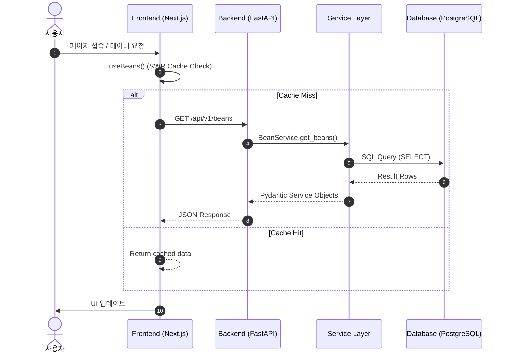
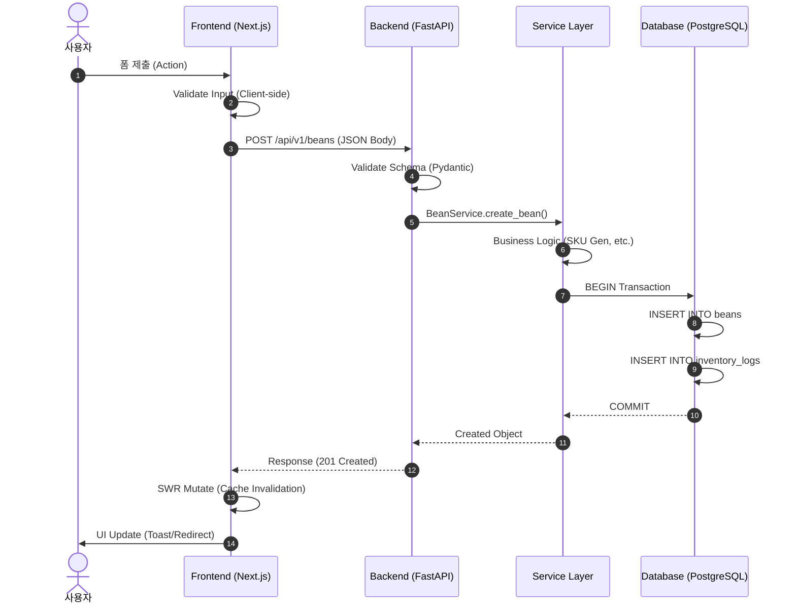
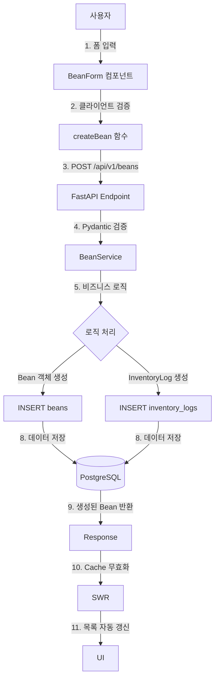
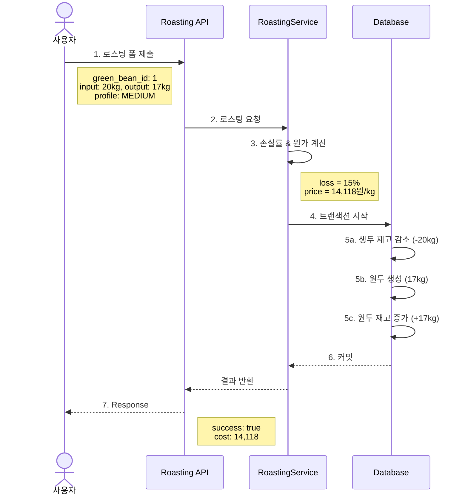
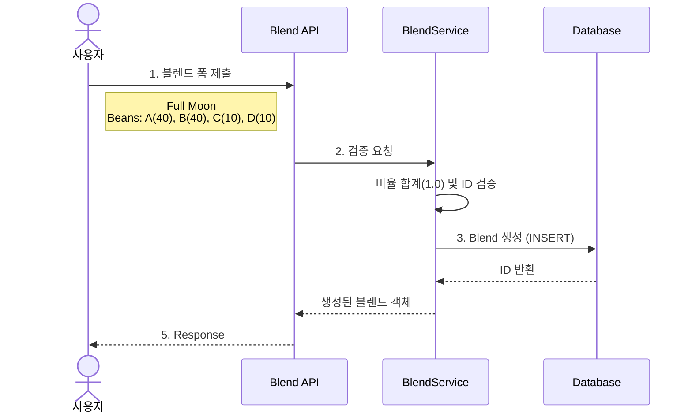
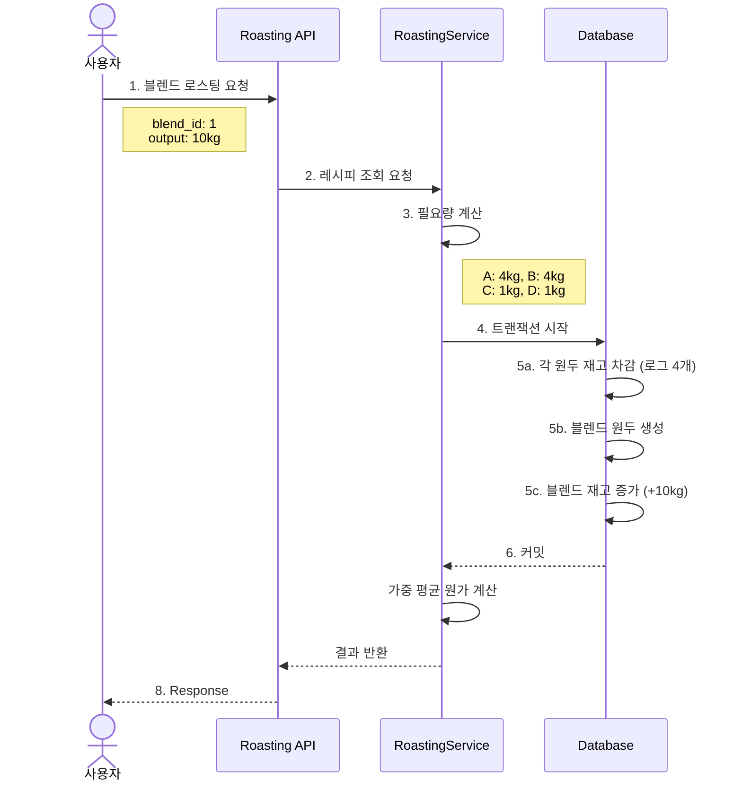
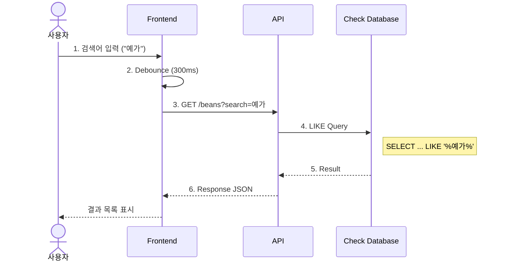
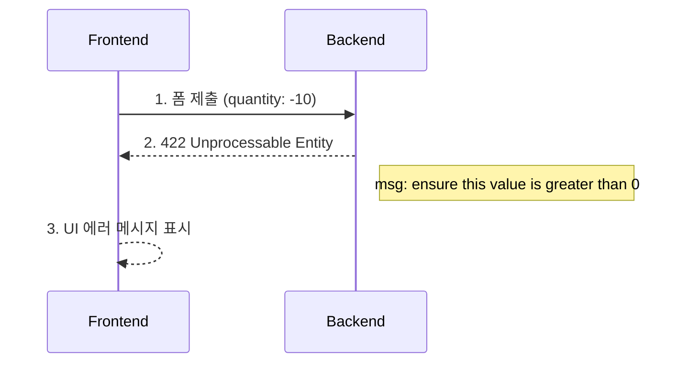
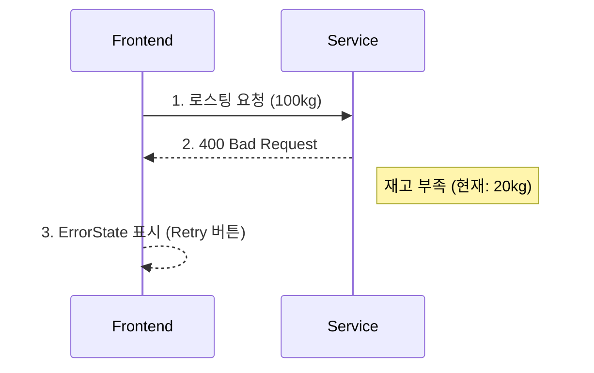
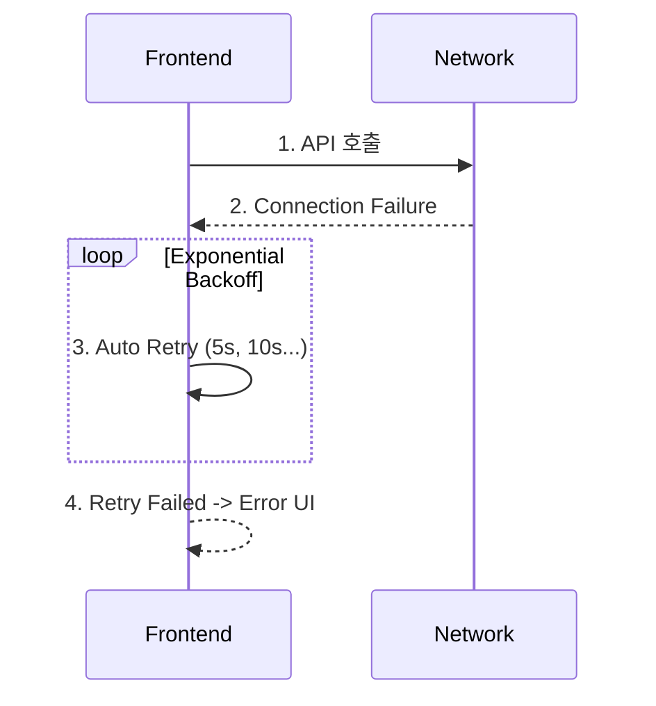

# 🔄 TheMoon 데이터 흐름도 (Data Flow Diagram)

> **작성일**: 2025-12-07
> **버전**: 0.0.6
> **작성자**: AI Assistant

---

## 📋 목차

1. [개요](#개요)
2. [전체 데이터 흐름](#전체-데이터-흐름)
3. [기능별 데이터 흐름](#기능별-데이터-흐름)
4. [데이터 변환 규칙](#데이터-변환-규칙)
5. [에러 처리 흐름](#에러-처리-흐름)

---

## 개요

TheMoon 시스템의 데이터는 **프론트엔드 → 백엔드 → 데이터베이스** 3계층을 거치며,
각 계층에서 검증, 변환, 영속화 과정을 거칩니다.

### 데이터 흐름 원칙

1. **단방향 흐름**: 사용자 액션 → 상태 업데이트 → UI 재렌더링
2. **서버 신뢰**: 프론트엔드는 백엔드 응답을 신뢰하고 그대로 표시
3. **낙관적 업데이트**: SWR의 Optimistic Update 활용
4. **에러 전파**: 각 계층에서 발생한 에러는 상위 계층으로 전파

---

## 전체 데이터 흐름

### 읽기 (Read) 흐름




### 쓰기 (Write) 흐름




---

## 기능별 데이터 흐름

### 1. 생두 등록 (Bean Registration)




### 2. Single Origin 로스팅 (Roasting)




### 3. 블렌드 레시피 생성 (Blend Creation)




### 4. 블렌드 로스팅 (Blend Roasting)




### 5. 재고 조회 및 검색 (Inventory Search)




---

## 데이터 변환 규칙

### Frontend → Backend

| Frontend (TypeScript) | HTTP Body (JSON)                       | Backend (Python)        |
| --------------------- | -------------------------------------- | ----------------------- |
| `name: string`        | `"name": "예가체프"`                   | `name: str`             |
| `type: BeanType`      | `"type": "GREEN_BEAN"`                 | `type: BeanType (Enum)` |
| `quantity_kg: number` | `"quantity_kg": 20`                    | `quantity_kg: float`    |
| `avg_price: number`   | `"avg_price": 12000`                   | `avg_price: float`      |
| `created_at: string`  | `"created_at": "2025-12-07T12:00:00Z"` | `created_at: datetime`  |

### Backend → Database

| Python (SQLAlchemy)    | PostgreSQL (Column Type)   | 예시 값                          |
| ---------------------- | -------------------------- | -------------------------------- |
| `id: int`              | `INTEGER PRIMARY KEY`      | `1`                              |
| `name: str`            | `VARCHAR(255)`             | `"예가체프"`                     |
| `type: BeanType`       | `VARCHAR(20)`              | `"GREEN_BEAN"`                   |
| `quantity_kg: float`   | `NUMERIC(10, 3)`           | `20.000`                         |
| `avg_price: float`     | `NUMERIC(10, 2)`           | `12000.00`                       |
| `created_at: datetime` | `TIMESTAMP WITH TIME ZONE` | `2025-12-07 12:00:00+00`         |
| `recipe: List[dict]`   | `JSONB`                    | `[{"bean_id": 1, "ratio": 0.4}]` |

### Database → Frontend

```python
# 1. PostgreSQL Row
Row(id=1, name='예가체프', quantity_kg=Decimal('20.000'))

# 2. SQLAlchemy Model
bean = Bean(id=1, name='예가체프', quantity_kg=20.0)

# 3. Pydantic Schema
bean_response = BeanResponse(
    id=1,
    name='예가체프',
    quantity_kg=20.0,
    created_at=datetime(2025, 12, 7, 12, 0, 0)
)

# 4. JSON Response
{
  "id": 1,
  "name": "예가체프",
  "quantity_kg": 20.0,
  "created_at": "2025-12-07T12:00:00Z"
}

# 5. TypeScript Interface
interface Bean {
  id: number
  name: string
  quantity_kg: number
  created_at: string
}
```

---

## 에러 처리 흐름

### 검증 에러 (Validation Error)




### 비즈니스 로직 에러




### 네트워크 에러




---

---

## 🔗 관련 문서

**← 상위**: [Documents README](../README.md) | [프로젝트 루트](../../README.md)

**아키텍처 문서**:
- [시스템 개요](SYSTEM_OVERVIEW.md) - 전체 시스템 개요 및 핵심 기능
- [데이터베이스 스키마](DATABASE_SCHEMA.md) - 테이블 구조 및 관계도
- [API 명세](API_SPECIFICATION.md) ⭐ - 모든 API 엔드포인트 상세 문서
- [기술 스택](TECHNOLOGY_STACK.md) ⭐ - 사용 기술 상세 설명
- [배포 아키텍처](DEPLOYMENT_ARCHITECTURE.md) ⭐ - 배포 환경 상세 구조

**개발 가이드**:
- [개발 가이드](DEVELOPMENT_GUIDE.md) - 5단계 개발 프로세스
- [문제 해결](TROUBLESHOOTING.md) - 16가지 오류 & 해결법

---

**작성**: AI Assistant
**최종 업데이트**: 2025-12-08
**버전**: 0.0.6
