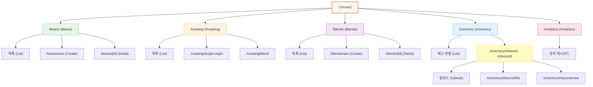
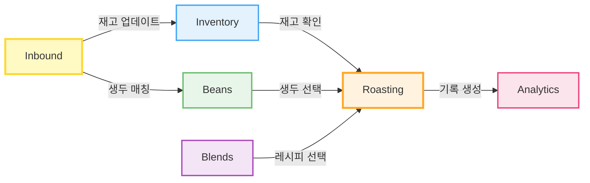

# TheMoon 프로젝트 메뉴 구조 문서

**작성일**: 2025-12-22
**버전**: 1.0
**프로젝트**: TheMoon - 커피 로스팅 원가 계산 시스템

---

## 📋 개요

TheMoon 프로젝트의 전체 메뉴 구조와 페이지 계층을 정리한 문서입니다. Sidebar 메뉴 구조, 라우팅, 사용자 플로우를 시각화합니다.

---

## 🎯 주요 메뉴 (Primary Navigation)

### Sidebar 메뉴 구성 (7개)

| 순서 | 메뉴명 | 경로 | 아이콘 | 설명 |
|------|--------|------|--------|------|
| 1 | **Home** | `/` | Home | 대시보드 홈 |
| 2 | **Beans** | `/beans` | Coffee | 생두 관리 |
| 3 | **Roasting** | `/roasting` | Flame | 로스팅 기록 |
| 4 | **Blends** | `/blends` | Layers | 블렌드 레시피 |
| 5 | **Inventory** | `/inventory` | Package | 재고 관리 |
| 6 | **Inbound** | `/inventory/inbound` | FileText | 입고 명세서 처리 |
| 7 | **Analytics** | `/analytics` | BarChart3 | 분석 대시보드 |

**파일 위치**: `frontend/components/layout/Sidebar.tsx` (Line 31-40)

---

## 🗂️ 전체 메뉴 계층 구조



---

## 📂 페이지 계층 구조 (상세)

### 1. Home (`/`)
**파일**: `frontend/app/page.tsx`

```
/ (루트)
└── 대시보드 홈
    ├── 요약 통계
    ├── 최근 활동
    └── 빠른 액션
```

---

### 2. Beans (`/beans`)
**파일**: `frontend/app/beans/`

```
/beans
├── page.tsx (목록)
│   ├── 생두 카드 그리드
│   ├── 검색/필터
│   └── 정렬
├── /new
│   └── page.tsx (생두 추가 폼)
└── /[id]
    └── page.tsx (생두 상세)
        ├── 기본 정보
        ├── 재고 현황
        └── 로스팅 히스토리
```

**주요 기능**:
- 생두 목록 조회
- 신규 생두 등록
- 생두 정보 수정
- 재고 추적

---

### 3. Roasting (`/roasting`)
**파일**: `frontend/app/roasting/`

```
/roasting
├── page.tsx (목록)
│   ├── 로스팅 기록 리스트
│   └── 필터링 (날짜, 타입)
├── /single-origin
│   └── page.tsx (싱글 오리진 로스팅)
│       ├── 생두 선택
│       ├── 로스팅 프로필
│       └── 수율 계산
└── /blend
    └── page.tsx (블렌드 로스팅)
        ├── 블렌드 레시피 선택
        ├── 로스팅 프로필
        └── 원가 계산
```

**주요 기능**:
- 로스팅 기록 관리
- 싱글 오리진 로스팅
- 블렌드 로스팅
- 수율 및 원가 계산

---

### 4. Blends (`/blends`)
**파일**: `frontend/app/blends/`

```
/blends
├── page.tsx (목록)
│   ├── 블렌드 카드 그리드
│   └── 레시피 검색
├── /new
│   └── page.tsx (블렌드 생성)
│       ├── 블렌드명 입력
│       ├── 생두 배합 (%)
│       └── 목표 맛 프로필
└── /[id]
    └── page.tsx (블렌드 상세)
        ├── 레시피 정보
        ├── 원가 계산
        └── 로스팅 히스토리
```

**주요 기능**:
- 블렌드 레시피 관리
- 신규 블렌드 생성
- 배합 비율 설정
- 원가 시뮬레이션

---

### 5. Inventory (`/inventory`)
**파일**: `frontend/app/inventory/`

```
/inventory
├── page.tsx (재고 현황)
│   ├── 생두별 재고량
│   ├── 재고 이동 히스토리
│   └── 부족 경고
└── /inbound (입고 처리) ⭐
    ├── page.tsx (명세서 업로드)
    │   ├── 이미지 업로드 (드래그 앤 드롭)
    │   ├── URL 입력
    │   ├── OCR 분석
    │   └── 데이터 확인 및 저장
    ├── /list
    │   └── page.tsx (입고 내역 목록)
    │       ├── 필터링 (날짜, 공급자)
    │       └── 상세 보기
    └── /view
        └── page.tsx (입고 상세 조회)
            ├── 명세서 이미지 (썸네일)
            ├── 추출된 데이터
            └── 생두 매칭 결과
```

**주요 기능**:
- 재고 현황 조회
- **입고 명세서 OCR 처리** (핵심 기능)
- 입고 내역 관리
- 자동 재고 업데이트

---

### 6. Analytics (`/analytics`)
**파일**: `frontend/app/analytics/page.tsx`

```
/analytics
└── page.tsx (분석 대시보드)
    ├── 브리핑 카드 (AnalysisBriefing)
    │   ├── 총 로스팅 횟수
    │   ├── 총 생두 사용량
    │   ├── 평균 수율
    │   └── 총 원가
    ├── 차트
    │   ├── 월별 로스팅 추이
    │   ├── 생두별 사용 비율
    │   └── 원가 분석
    └── 필터링 (기간, 타입)
```

**주요 기능**:
- 로스팅 데이터 분석
- 원가 통계
- 트렌드 시각화
- 성과 지표 (KPI)

---

## 🔄 사용자 플로우 (User Flow)

### 플로우 1: 입고 처리 (Inbound Processing)

```mermaid
flowchart TD
    Start([시작]) --> Menu[Sidebar: Inbound 클릭]
    Menu --> Upload[/inventory/inbound]

    Upload --> Choice{입력 방식}
    Choice -->|파일 업로드| FileUpload[이미지 드래그 앤 드롭]
    Choice -->|URL 입력| URLInput[명세서 URL 입력]

    FileUpload --> Validate{이미지 검증}
    URLInput --> Validate

    Validate -->|실패| Error[에러 메시지 표시]
    Error --> Upload

    Validate -->|성공| OCR[OCR 분석 실행]
    OCR --> AICheck{AI 유효성 검사}

    AICheck -->|비문서| InvalidDoc[경고: 비즈니스 문서 아님]
    InvalidDoc --> Upload

    AICheck -->|유효| Extract[데이터 추출]
    Extract --> Display[추출 결과 표시]

    Display --> Review{사용자 확인}
    Review -->|수정 필요| Edit[수동 편집]
    Edit --> Review

    Review -->|확인| Save[데이터 저장]
    Save --> MatchBean[생두 자동 매칭]
    MatchBean --> UpdateInventory[재고 업데이트]
    UpdateInventory --> CreateLog[재고 로그 생성]
    CreateLog --> Success([완료])

    Success --> NextAction{다음 행동}
    NextAction -->|목록 보기| List[/inventory/inbound/list]
    NextAction -->|상세 보기| View[/inventory/inbound/view]
    NextAction -->|계속 입고| Upload

    style Start fill:#e8f5e9
    style Success fill:#c8e6c9
    style Error fill:#ffcdd2
    style InvalidDoc fill:#fff9c4
    style OCR fill:#bbdefb
    style Save fill:#c5cae9
```

### 플로우 2: 로스팅 기록 (Roasting Flow)

```mermaid
flowchart TD
    Start([시작]) --> Menu[Sidebar: Roasting 클릭]
    Menu --> List[/roasting 목록]

    List --> Choice{로스팅 타입}
    Choice -->|싱글 오리진| Single[/roasting/single-origin]
    Choice -->|블렌드| Blend[/roasting/blend]

    Single --> SelectBean[생두 선택]
    SelectBean --> CheckInventory{재고 확인}
    CheckInventory -->|부족| InventoryAlert[재고 부족 경고]
    InventoryAlert --> End1([종료])

    CheckInventory -->|충분| Profile1[로스팅 프로필 입력]
    Profile1 --> Calc1[수율 계산]
    Calc1 --> SaveRoast1[로스팅 기록 저장]
    SaveRoast1 --> UpdateInv1[재고 차감]
    UpdateInv1 --> Success1([완료])

    Blend --> SelectBlend[블렌드 선택]
    SelectBlend --> CheckMulti{모든 생두 재고 확인}
    CheckMulti -->|부족| InventoryAlert
    CheckMulti -->|충분| Profile2[로스팅 프로필 입력]
    Profile2 --> Calc2[원가 계산]
    Calc2 --> SaveRoast2[로스팅 기록 저장]
    SaveRoast2 --> UpdateInv2[각 생두 재고 차감]
    UpdateInv2 --> Success2([완료])

    Success1 --> Analytics[Analytics에서 확인]
    Success2 --> Analytics

    style Start fill:#fff3e0
    style Success1 fill:#ffe0b2
    style Success2 fill:#ffe0b2
    style InventoryAlert fill:#ffcdd2
```

### 플로우 3: 생두 관리 (Bean Management)

```mermaid
flowchart TD
    Start([시작]) --> Menu[Sidebar: Beans 클릭]
    Menu --> List[/beans 목록]

    List --> Action{작업 선택}
    Action -->|신규 등록| New[/beans/new]
    Action -->|상세 보기| Detail[/beans/[id]]
    Action -->|검색/필터| Search[검색 실행]
    Search --> List

    New --> Form[생두 정보 입력]
    Form --> Validate{유효성 검사}
    Validate -->|실패| FormError[에러 표시]
    FormError --> Form
    Validate -->|성공| SaveBean[생두 저장]
    SaveBean --> Success1([완료])
    Success1 --> List

    Detail --> View[상세 정보 표시]
    View --> DetailAction{작업}
    DetailAction -->|수정| Edit[정보 수정]
    DetailAction -->|삭제| Delete[삭제 확인]
    DetailAction -->|재고 확인| Inventory[Inventory로 이동]

    Edit --> SaveEdit[수정 저장]
    SaveEdit --> Detail

    Delete --> Confirm{확인}
    Confirm -->|취소| Detail
    Confirm -->|확인| DeleteBean[생두 삭제]
    DeleteBean --> List

    style Start fill:#e8f5e9
    style Success1 fill:#c8e6c9
    style FormError fill:#ffcdd2
```

---

## 🎨 메뉴 설계 원칙

### 1. 계층 구조
- **1단계**: 주요 기능 (Sidebar 7개 메뉴)
- **2단계**: 세부 기능 (목록, 생성, 상세)
- **3단계**: 특수 작업 (Inbound의 list/view)

### 2. 네이밍 규칙
- **일관성**: 모든 경로는 소문자 사용
- **명확성**: 기능을 직관적으로 표현 (`/beans/new`, `/roasting/blend`)
- **계층**: 슬래시로 명확한 계층 표현

### 3. 아이콘 선택 기준
- **Home**: 홈 아이콘 (대시보드)
- **Coffee**: 생두 (원재료)
- **Flame**: 로스팅 (가공)
- **Layers**: 블렌드 (조합)
- **Package**: 재고 (보관)
- **FileText**: 입고 (문서)
- **BarChart3**: 분석 (통계)

---

## 📊 메뉴 사용 빈도 예상

| 메뉴 | 사용 빈도 | 우선순위 | 주요 사용자 |
|------|----------|---------|------------|
| **Inbound** | 매일 | 🔴 High | 입고 담당자 |
| **Roasting** | 매일 | 🔴 High | 로스터 |
| **Inventory** | 매일 | 🟡 Medium | 재고 관리자 |
| **Beans** | 주간 | 🟡 Medium | 구매 담당자 |
| **Blends** | 주간 | 🟢 Low | 제품 기획자 |
| **Analytics** | 주간 | 🟡 Medium | 관리자 |
| **Home** | 매일 | 🟡 Medium | 전체 |

---

## 🔗 메뉴 간 연결 관계



**관계 설명**:
1. **Inbound → Inventory**: 입고 처리 시 재고 자동 업데이트
2. **Inventory → Roasting**: 로스팅 전 재고 확인 필수
3. **Beans → Roasting**: 생두 선택하여 로스팅
4. **Blends → Roasting**: 블렌드 레시피로 로스팅
5. **Roasting → Analytics**: 로스팅 기록이 분석 데이터로 축적
6. **Inbound → Beans**: 입고 시 생두 자동 매칭 및 생성

---

## 🚀 개선 제안

### 단기 개선 (v0.5)
1. **빵부스러기 네비게이션 (Breadcrumb)** 추가
   - 현재 위치 표시: `Home > Inventory > Inbound > List`
2. **검색 기능** 글로벌 검색 추가
   - 모든 메뉴에서 생두/블렌드/로스팅 기록 검색
3. **최근 방문** 페이지 기록
   - Sidebar에 최근 3개 페이지 표시

### 중기 개선 (v1.0)
1. **대시보드 커스터마이징**
   - Home 페이지에서 위젯 배치 가능
2. **즐겨찾기 메뉴**
   - 자주 사용하는 페이지 즐겨찾기
3. **권한 기반 메뉴**
   - 사용자 역할에 따라 메뉴 표시/숨김

### 장기 개선 (v2.0)
1. **모바일 최적화**
   - 하단 탭 네비게이션 추가
2. **다국어 지원**
   - 메뉴명 한국어/영어 토글
3. **키보드 단축키**
   - `Ctrl+B`: Beans, `Ctrl+R`: Roasting 등

---

## 📝 개발 가이드

### 새 메뉴 추가 방법

1. **Sidebar 업데이트**:
   ```typescript
   // frontend/components/layout/Sidebar.tsx
   const navItems = [
       // ... 기존 메뉴
       { name: 'NewMenu', href: '/new-menu', icon: IconName }
   ]
   ```

2. **페이지 생성**:
   ```bash
   mkdir -p frontend/app/new-menu
   touch frontend/app/new-menu/page.tsx
   ```

3. **아이콘 임포트**:
   ```typescript
   import { IconName } from 'lucide-react'
   ```

4. **테스트**:
   - 네비게이션 동작 확인
   - 활성 상태 하이라이트 확인
   - 모바일 반응형 확인

---

## 📚 참고 문서

- **Sidebar 컴포넌트**: `frontend/components/layout/Sidebar.tsx`
- **라우팅 구조**: `frontend/app/` 디렉토리
- **아이콘 라이브러리**: [Lucide Icons](https://lucide.dev/)
- **Next.js 라우팅**: [App Router 문서](https://nextjs.org/docs/app)

---

## 🔄 변경 이력

| 버전 | 날짜 | 변경 내용 | 작성자 |
|------|------|-----------|--------|
| 1.0 | 2025-12-22 | 초기 메뉴 구조 문서화 | Claude Code |

---

**다음 업데이트**: 메뉴 사용 통계 수집 후 재구성 검토 (2025-Q1)
