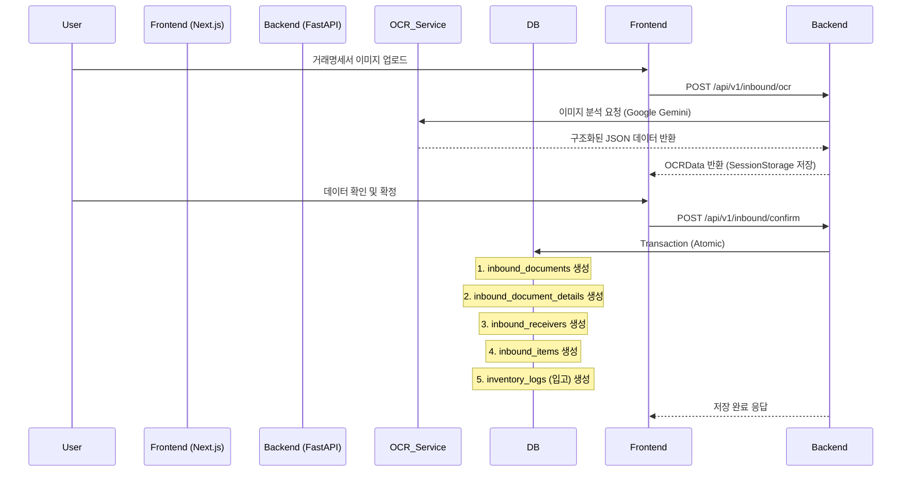
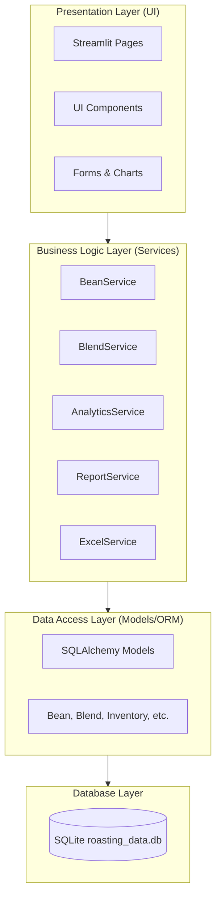
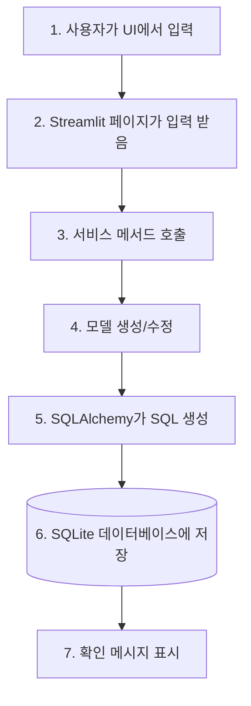
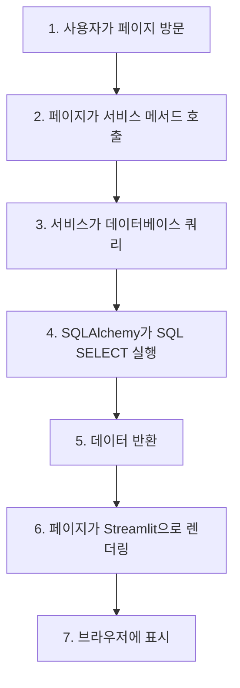
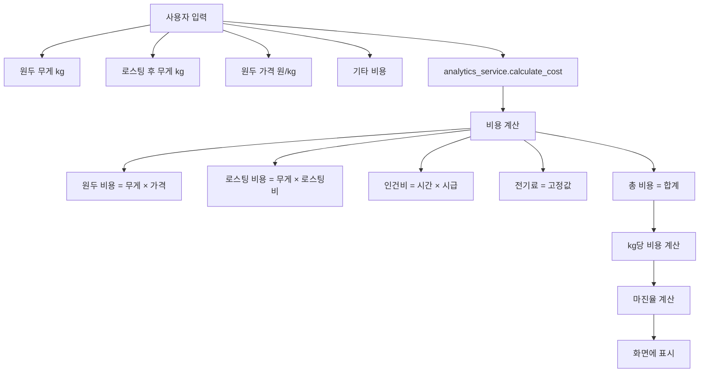
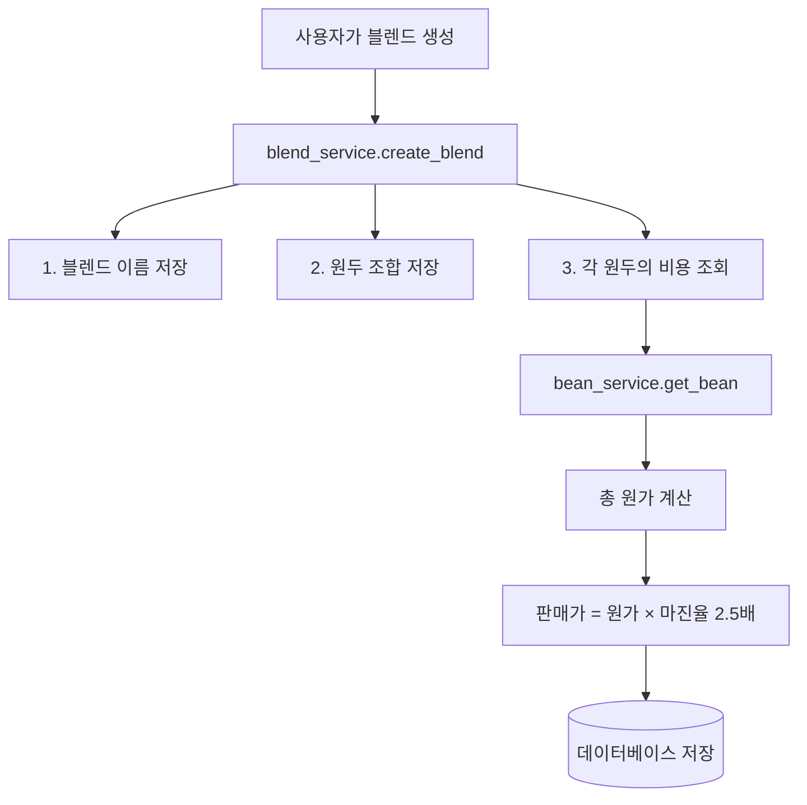
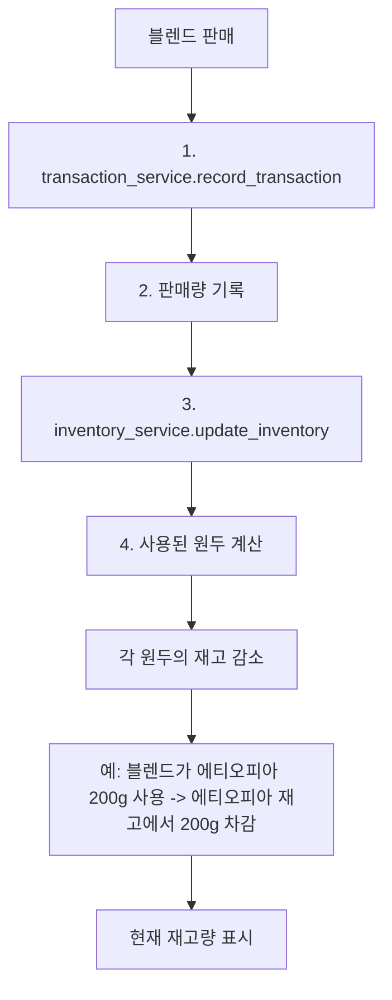
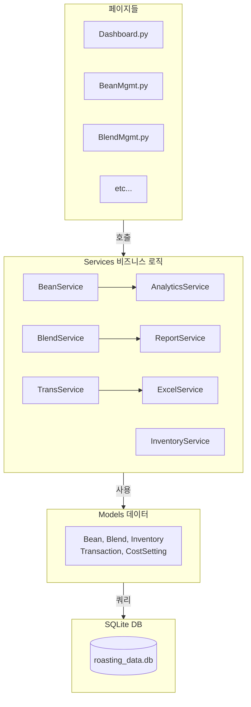
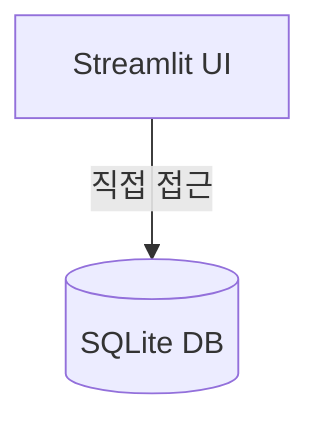
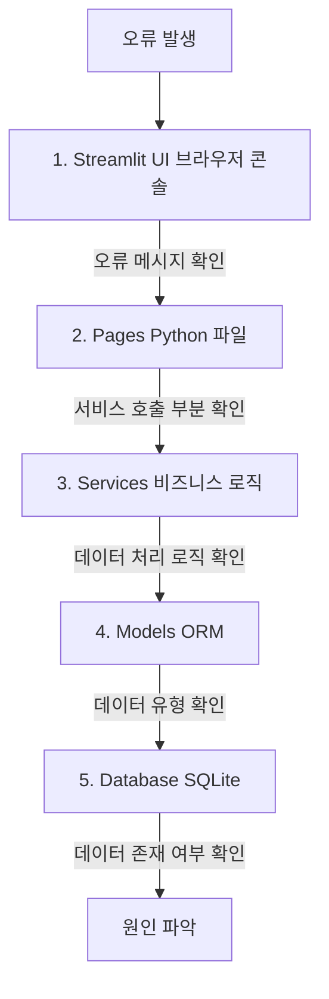

# inbound/viewinbound/view시스템 아키텍처 & 데이터 흐름

> 프로젝트의 기술 스택, 시스템 구조, 데이터 흐름을 설명하는 문서입니다.

---

## 🏗️ 시스템 아키텍처 (Current Tech Stack)

### 3계층 아키텍처

```mermaid
graph TD
    subgraph Presentation ["Presentation Layer (Frontend)"]
        Next[Next.js (App Router)]
        React[React / TypeScript]
        UI[Shadcn UI / Tailwind CSS]
        PortFE[Port: 3500]
      
        Next --- React
        React --- UI
    end

    subgraph Application ["Application Layer (Backend)"]
        Fast[Python / FastAPI]
        Pydantic[Pydantic Models]
        SQLAlchemy[SQLAlchemy ORM]
        PortBE[Port: 8000]
      
        Fast --- Pydantic
        Fast --- SQLAlchemy
    end

    subgraph Data ["Data Layer (Database)"]
        SQLite[("SQLite (themoon.db)")]
        SSOT[Single Source of Truth]
    end

    Next -->|HTTP / JSON| Fast
    Fast -->|SQL| SQLite
```

---

## 🔄 데이터 흐름 (Data Flow)

### 1️⃣ OCR 데이터 처리 및 저장 프로세스 (Inbound)



### 2️⃣ 원두 재고 관리 흐름

```
1. 입고 (Inbound): 
   - OCR 확정 시 `inbound_items` 테이블에 기록됨
   - 동시에 `inventory_logs`에 `INBOUND` 타입으로 수량 증가 기록

2. 출고 (Outbound / Roasting):
   - 로스팅 실행 시 `inventory_logs`에 `USED_FOR_ROASTING`으로 생두 감소
   - 동시에 `inventory_logs`에 `ROASTED_BATCH`로 원두(볶은콩) 증가
```

---

## 💾 데이터베이스 스키마 구조

### 핵심 테이블 그룹

1. **Master Data**

   - `beans`: 원두 마스터 (품종, 원산지 등)
   - `suppliers`: 공급자 정보
   - `blends`: 블렌딩 레시피
2. **Inbound & OCR Data** (OCR 데이터 100% 저장)

   - `inbound_documents`: 헤더 정보 (계약번호, 이미지 등)
   - `inbound_document_details`: 상세 정보 (세금, 결제조건 등 25개 필드)
   - `inbound_receivers`: 공급받는자 정보
   - `inbound_items`: 품목 리스트
3. **Inventory**

   - `inventory_logs`: 모든 수량 변화 기록

---

## 🚧 향후 확장 계획

1. **PostgreSQL 마이그레이션**: 배포 환경을 위한 DB 전환
2. **원가 분석 기능**: `inbound_items`의 단가 정보를 활용한 정밀 원가 계산
3. **통계 대시보드**: 공급자별, 품목별 매입 현황 시각화

---

**Last Updated**: 2025-12-21

> 시스템이 어떻게 동작하는지, 데이터가 어떻게 흐르는지 이해하기 위한 가이드입니다.

---

## 🏗️ 시스템 아키텍처

### 3계층 아키텍처



---

## 🔄 데이터 흐름

### 1️⃣ 사용자 입력부터 저장까지



**예시: 새 원두 추가**

```python
# pages/BeanManagement.py
with st.form("add_bean_form"):
    name = st.text_input("원두명")
    price = st.number_input("가격")

    if st.form_submit_button("추가"):
        # 1. 서비스 호출
        bean_service.add_bean(name, price)
        # 2. DB에 저장됨 (서비스 내부)
        st.success("추가되었습니다!")
```

```python
# services/bean_service.py
def add_bean(self, name, price):
    # 1. 모델 인스턴스 생성
    bean = Bean(name=name, price_per_kg=price)

    # 2. 세션에 추가
    self.db.add(bean)

    # 3. DB에 커밋 (저장)
    self.db.commit()

    return bean
```

```python
# models/bean.py
class Bean(Base):
    __tablename__ = "beans"

    id = Column(Integer, primary_key=True)
    name = Column(String, unique=True)
    price_per_kg = Column(Float)
    # SQLite에 CREATE TABLE 명령 생성
```

---

### 2️⃣ 데이터 조회부터 화면 표시까지



**예시: 원두 목록 표시**

```python
# pages/BeanManagement.py
import streamlit as st
from app.services import bean_service

# 1. 서비스 호출
beans = bean_service.get_all_beans()

# 2. DataFrame으로 변환
df = pd.DataFrame([
    {"이름": b.name, "가격": b.price_per_kg}
    for b in beans
])

# 3. 화면에 표시
st.dataframe(df)
```

---

## 📊 주요 데이터 흐름

### 로스팅 비용 계산 흐름



---

### 블렌드 레시피 흐름



---

### 재고 추적 흐름



---

## 🔗 서비스 간 관계도



---

## 🔄 세션 상태 관리

Streamlit은 상태를 유지하기 위해 `st.session_state`를 사용합니다.

```python
# 데이터 캐싱 (페이지 재로드 시에도 유지)
if "beans" not in st.session_state:
    st.session_state.beans = bean_service.get_all_beans()

# 사용자 선택 저장
selected_bean = st.selectbox(
    "원두 선택",
    [b.name for b in st.session_state.beans]
)
```

---

## 📡 API 없이 직접 데이터 접근

주의: 이 프로젝트는 API 서버가 없습니다.
Streamlit이 직접 데이터베이스에 접근합니다.



이 구조의 장점:

- ✅ 간단함 (서버 설정 불필요)
- ✅ 빠름 (네트워크 지연 없음)

단점:

- ❌ 확장성 낮음 (다중 사용자 동시 접근 어려움)
- ❌ 모바일 접근 불가능

---

## 🔐 데이터 일관성

### 트랜잭션 (Transaction)

모든 데이터 변경은 트랜잭션으로 관리됩니다:

```python
# 성공 케이스
self.db.add(bean)
self.db.commit()  # 데이터 저장

# 실패 케이스 (롤백)
try:
    self.db.add(bean)
    self.db.commit()
except Exception as e:
    self.db.rollback()  # 변경사항 취소
    raise e
```

---

## 📈 성능 최적화

### 쿼리 최적화

```python
# ❌ 느린 방법 (N+1 쿼리)
blends = self.db.query(Blend).all()
for blend in blends:
    bean = self.db.query(Bean).filter(
        Bean.id == blend.bean_id
    ).first()  # 매번 쿼리

# ✅ 빠른 방법 (조인)
blends = self.db.query(Blend).join(Bean).all()
```

### 데이터 캐싱

```python
# 반복되는 데이터는 변수에 저장
beans = bean_service.get_all_beans()

# 여러 번 사용
for use_case in use_cases:
    process(beans)
```

---

## 🔍 디버깅 흐름

오류 발생 시 추적 순서:



**디버깅 명령어:**

```bash
# 에러 로그 확인
./venv/bin/streamlit run app/app.py 2>&1 | grep -i error

# 데이터베이스 확인
sqlite3 data/roasting_data.db ".tables"
sqlite3 data/roasting_data.db "SELECT * FROM beans LIMIT 5;"
```

---

## 🔗 확장 포인트

### 1. API 서버 추가 (향후)

```
추가될 예정:
FastAPI 서버 추가
  └─ 모바일 앱 지원
  └─ 다중 사용자 지원
```

### 2. 실시간 동기화 (향후)

```
WebSocket 추가
  └─ 여러 사용자 실시간 협업
```

### 3. 클라우드 마이그레이션 (향후)

```
PostgreSQL 또는 MySQL로 변경
  └─ 클라우드 배포
  └─ 자동 백업
```

---

**마지막 업데이트: 2025-10-27**
