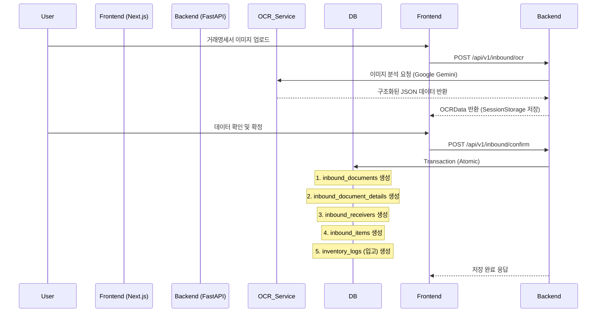

# 시스템 아키텍처 & 데이터 흐름

> 프로젝트의 기술 스택, 시스템 구조, 데이터 흐름을 설명하는 문서입니다.

---

## 🏗️ 시스템 아키텍처 (Current Tech Stack)

### 3계층 아키텍처

```
┌─────────────────────────────────────┐
│   Presentation Layer (Frontend)      │
│   - Next.js (App Router)            │
│   - React / TypeScript              │
│   - Shadcn UI / Tailwind CSS        │
│   - Port: 3500                      │
└──────────────┬──────────────────────┘
               │ HTTP / JSON
┌──────────────▼──────────────────────┐
│   Application Layer (Backend)        │
│   - Python / FastAPI                │
│   - Pydantic Models                 │
│   - SQLAlchemy ORM                  │
│   - Port: 8000                      │
└──────────────┬──────────────────────┘
               │ SQL
┌──────────────▼──────────────────────┐
│   Data Layer (Database)              │
│   - SQLite (themoon.db)              │
│   - Single Source of Truth           │
└─────────────────────────────────────┘
```

---

## 🔄 데이터 흐름 (Data Flow)

### 1️⃣ OCR 데이터 처리 및 저장 프로세스 (Inbound)



### 2️⃣ 원두 재고 관리 흐름

```
1. 입고 (Inbound): 
   - OCR 확정 시 `inbound_items` 테이블에 기록됨
   - 동시에 `inventory_logs`에 `INBOUND` 타입으로 수량 증가 기록

2. 출고 (Outbound / Roasting):
   - 로스팅 실행 시 `inventory_logs`에 `USED_FOR_ROASTING`으로 생두 감소
   - 동시에 `inventory_logs`에 `ROASTED_BATCH`로 원두(볶은콩) 증가
```

---

## 💾 데이터베이스 스키마 구조

### 핵심 테이블 그룹

1. **Master Data**
   - `beans`: 원두 마스터 (품종, 원산지 등)
   - `suppliers`: 공급자 정보
   - `blends`: 블렌딩 레시피

2. **Inbound & OCR Data** (OCR 데이터 100% 저장)
   - `inbound_documents`: 헤더 정보 (계약번호, 이미지 등)
   - `inbound_document_details`: 상세 정보 (세금, 결제조건 등 25개 필드)
   - `inbound_receivers`: 공급받는자 정보
   - `inbound_items`: 품목 리스트

3. **Inventory**
   - `inventory_logs`: 모든 수량 변화 기록

---

## 🚧 향후 확장 계획

1. **PostgreSQL 마이그레이션**: 배포 환경을 위한 DB 전환
2. **원가 분석 기능**: `inbound_items`의 단가 정보를 활용한 정밀 원가 계산
3. **통계 대시보드**: 공급자별, 품목별 매입 현황 시각화

---
**Last Updated**: 2025-12-21

> 시스템이 어떻게 동작하는지, 데이터가 어떻게 흐르는지 이해하기 위한 가이드입니다.

---

## 🏗️ 시스템 아키텍처

### 3계층 아키텍처

```
┌─────────────────────────────────────┐
│   Presentation Layer (UI)            │
│   - Streamlit Pages                  │
│   - UI Components                    │
│   - Forms & Charts                   │
└──────────────┬──────────────────────┘
               │
┌──────────────▼──────────────────────┐
│   Business Logic Layer (Services)    │
│   - BeanService                      │
│   - BlendService                     │
│   - AnalyticsService                 │
│   - ReportService                    │
│   - ExcelService                     │
└──────────────┬──────────────────────┘
               │
┌──────────────▼──────────────────────┐
│   Data Access Layer (Models/ORM)     │
│   - SQLAlchemy Models                │
│   - Bean, Blend, Inventory, etc.     │
└──────────────┬──────────────────────┘
               │
┌──────────────▼──────────────────────┐
│   Database Layer                     │
│   - SQLite (roasting_data.db)        │
└─────────────────────────────────────┘
```

---

## 🔄 데이터 흐름

### 1️⃣ 사용자 입력부터 저장까지

```
1. 사용자가 UI에서 입력
   ↓
2. Streamlit 페이지 (pages/*.py)가 입력 받음
   ↓
3. 서비스 메서드 호출 (services/*.py)
   ↓
4. 모델 생성/수정 (models/*.py)
   ↓
5. SQLAlchemy가 SQL 생성
   ↓
6. SQLite 데이터베이스에 저장
   ↓
7. 확인 메시지 표시
```

**예시: 새 원두 추가**

```python
# pages/BeanManagement.py
with st.form("add_bean_form"):
    name = st.text_input("원두명")
    price = st.number_input("가격")

    if st.form_submit_button("추가"):
        # 1. 서비스 호출
        bean_service.add_bean(name, price)
        # 2. DB에 저장됨 (서비스 내부)
        st.success("추가되었습니다!")
```

```python
# services/bean_service.py
def add_bean(self, name, price):
    # 1. 모델 인스턴스 생성
    bean = Bean(name=name, price_per_kg=price)

    # 2. 세션에 추가
    self.db.add(bean)

    # 3. DB에 커밋 (저장)
    self.db.commit()

    return bean
```

```python
# models/bean.py
class Bean(Base):
    __tablename__ = "beans"

    id = Column(Integer, primary_key=True)
    name = Column(String, unique=True)
    price_per_kg = Column(Float)
    # SQLite에 CREATE TABLE 명령 생성
```

---

### 2️⃣ 데이터 조회부터 화면 표시까지

```
1. 사용자가 페이지 방문
   ↓
2. 페이지가 서비스 메서드 호출
   ↓
3. 서비스가 데이터베이스 쿼리
   ↓
4. SQLAlchemy가 SQL SELECT 실행
   ↓
5. 데이터 반환
   ↓
6. 페이지가 Streamlit으로 렌더링
   ↓
7. 브라우저에 표시
```

**예시: 원두 목록 표시**

```python
# pages/BeanManagement.py
import streamlit as st
from app.services import bean_service

# 1. 서비스 호출
beans = bean_service.get_all_beans()

# 2. DataFrame으로 변환
df = pd.DataFrame([
    {"이름": b.name, "가격": b.price_per_kg}
    for b in beans
])

# 3. 화면에 표시
st.dataframe(df)
```

---

## 📊 주요 데이터 흐름

### 로스팅 비용 계산 흐름

```
사용자 입력
├─ 원두 무게 (kg)
├─ 로스팅 후 무게 (kg)
├─ 원두 가격 (원/kg)
└─ 기타 비용
    ↓
analytics_service.calculate_cost()
    ↓
비용 계산
├─ 원두 비용 = 무게 × 가격
├─ 로스팅 비용 = 무게 × 로스팅비
├─ 인건비 = 시간 × 시급
├─ 전기료 = 고정값
└─ 총 비용 = 합계
    ↓
kg당 비용 계산
    ↓
마진율 계산
    ↓
화면에 표시
```

---

### 블렌드 레시피 흐름

```
사용자가 블렌드 생성
    ↓
blend_service.create_blend()
    ↓
1. 블렌드 이름 저장
2. 원두 조합 저장
3. 각 원두의 비용 조회
    ↓
bean_service.get_bean(name)로 각 원두 가격 조회
    ↓
총 원가 계산
    ↓
판매가 = 원가 × 마진율 (기본 2.5배)
    ↓
데이터베이스 저장
```

---

### 재고 추적 흐름

```
블렌드 판매
    ↓
1. transaction_service.record_transaction() 호출
2. 판매량 기록
    ↓
3. inventory_service.update_inventory() 호출
4. 사용된 원두 계산
    ↓
각 원두의 재고 감소
예) 블렌드가 에티오피아 200g 사용
    → 에티오피아 재고에서 200g 차감
    ↓
현재 재고량 표시
```

---

## 🔗 서비스 간 관계도

```
┌─────────────────────┐
│   페이지들           │
│ Dashboard.py        │
│ BeanMgmt.py        │
│ BlendMgmt.py       │
│ etc...              │
└──────┬──────────────┘
       │
       └─ 호출 →
┌──────────────────────────────────────┐
│   Services (비즈니스 로직)            │
│                                      │
│ BeanService ──┐                     │
│               ├─→ AnalyticsService  │
│ BlendService ─┤                     │
│               ├─→ ReportService     │
│ TransService ─┤                     │
│               ├─→ ExcelService      │
│ InventoryService                    │
└──────────────────┬───────────────────┘
                   │
                   └─ 사용 →
       ┌───────────────────────────┐
       │   Models (데이터)         │
       │                           │
       │ Bean, Blend, Inventory    │
       │ Transaction, CostSetting  │
       └───────────────┬───────────┘
                       │
                       └─ 쿼리 →
           ┌──────────────────────┐
           │   SQLite DB          │
           │  (roasting_data.db)  │
           └──────────────────────┘
```

---

## 🔄 세션 상태 관리

Streamlit은 상태를 유지하기 위해 `st.session_state`를 사용합니다.

```python
# 데이터 캐싱 (페이지 재로드 시에도 유지)
if "beans" not in st.session_state:
    st.session_state.beans = bean_service.get_all_beans()

# 사용자 선택 저장
selected_bean = st.selectbox(
    "원두 선택",
    [b.name for b in st.session_state.beans]
)
```

---

## 📡 API 없이 직접 데이터 접근

```
주의: 이 프로젝트는 API 서버가 없습니다.
Streamlit이 직접 데이터베이스에 접근합니다.

┌─────────────────┐
│  Streamlit UI   │
└────────┬────────┘
         │ 직접 접근
         ↓
┌─────────────────┐
│  SQLite DB      │
└─────────────────┘
```

이 구조의 장점:
- ✅ 간단함 (서버 설정 불필요)
- ✅ 빠름 (네트워크 지연 없음)

단점:
- ❌ 확장성 낮음 (다중 사용자 동시 접근 어려움)
- ❌ 모바일 접근 불가능

---

## 🔐 데이터 일관성

### 트랜잭션 (Transaction)

모든 데이터 변경은 트랜잭션으로 관리됩니다:

```python
# 성공 케이스
self.db.add(bean)
self.db.commit()  # 데이터 저장

# 실패 케이스 (롤백)
try:
    self.db.add(bean)
    self.db.commit()
except Exception as e:
    self.db.rollback()  # 변경사항 취소
    raise e
```

---

## 📈 성능 최적화

### 쿼리 최적화

```python
# ❌ 느린 방법 (N+1 쿼리)
blends = self.db.query(Blend).all()
for blend in blends:
    bean = self.db.query(Bean).filter(
        Bean.id == blend.bean_id
    ).first()  # 매번 쿼리

# ✅ 빠른 방법 (조인)
blends = self.db.query(Blend).join(Bean).all()
```

### 데이터 캐싱

```python
# 반복되는 데이터는 변수에 저장
beans = bean_service.get_all_beans()

# 여러 번 사용
for use_case in use_cases:
    process(beans)
```

---

## 🔍 디버깅 흐름

오류 발생 시 추적 순서:

```
1. Streamlit UI (브라우저 콘솔)
   └─ 오류 메시지 확인

2. Pages (Python 파일)
   └─ 서비스 호출 부분 확인

3. Services (비즈니스 로직)
   └─ 데이터 처리 로직 확인

4. Models (ORM)
   └─ 데이터 유형 확인

5. Database (SQLite)
   └─ 데이터 존재 여부 확인
```

**디버깅 명령어:**
```bash
# 에러 로그 확인
./venv/bin/streamlit run app/app.py 2>&1 | grep -i error

# 데이터베이스 확인
sqlite3 data/roasting_data.db ".tables"
sqlite3 data/roasting_data.db "SELECT * FROM beans LIMIT 5;"
```

---

## 🔗 확장 포인트

### 1. API 서버 추가 (향후)
```
추가될 예정:
FastAPI 서버 추가
  └─ 모바일 앱 지원
  └─ 다중 사용자 지원
```

### 2. 실시간 동기화 (향후)
```
WebSocket 추가
  └─ 여러 사용자 실시간 협업
```

### 3. 클라우드 마이그레이션 (향후)
```
PostgreSQL 또는 MySQL로 변경
  └─ 클라우드 배포
  └─ 자동 백업
```

---

**마지막 업데이트: 2025-10-27**
