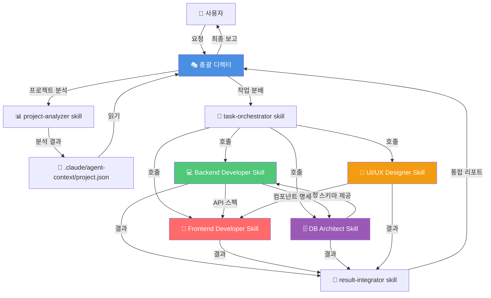
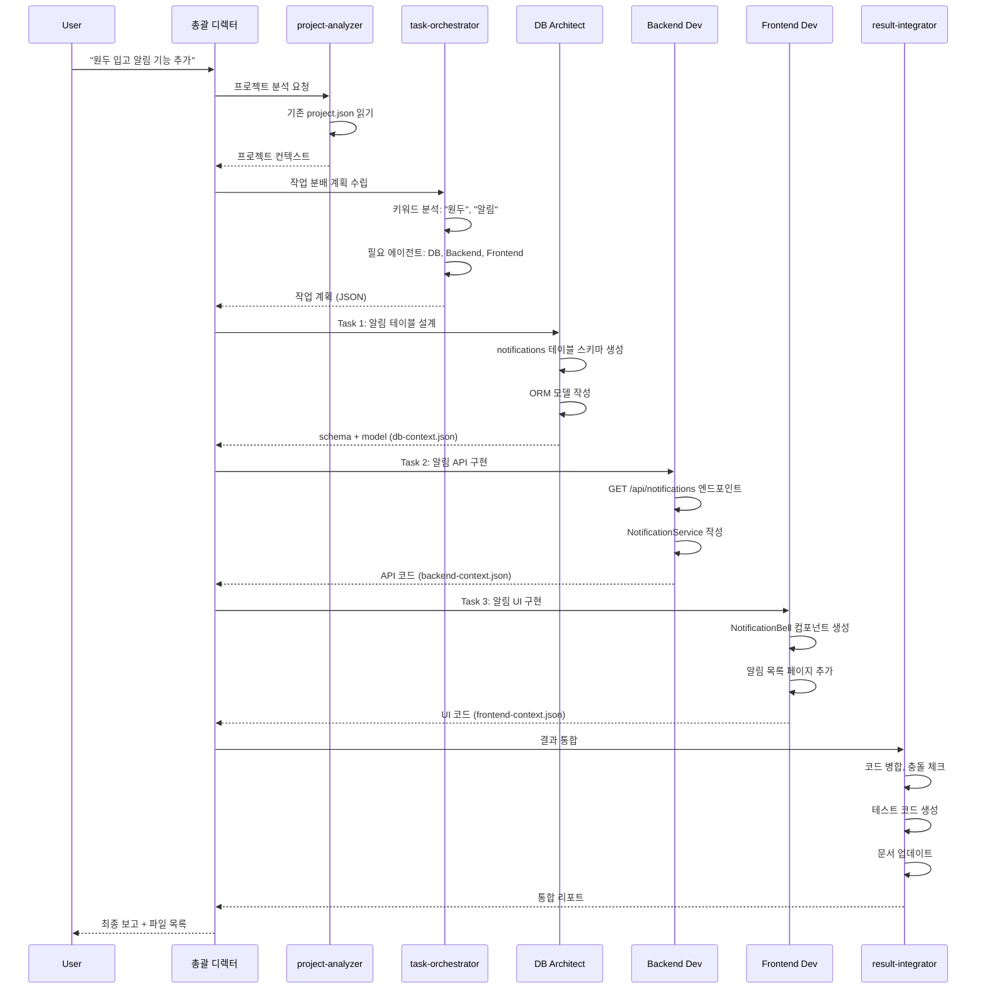

# Claude Code 멀티 에이전트 시스템 설계 플랜

> **작성일**: 2025-11-08
> **버전**: v1.0.0 (설계)
> **목표**: 모든 프로젝트에서 사용 가능한 범용 멀티 에이전트 시스템 구축

---

## 📋 목차

1. [Constitution (기본 원칙)](#1-constitution-기본-원칙)
2. [SUB Agent 시스템 명세](#2-sub-agent-시스템-명세)
3. [Skills 시스템 명세](#3-skills-시스템-명세)
4. [사용자 결정사항 (Clarify)](#4-사용자-결정사항-clarify)
5. [아키텍처 설계 (Plan)](#5-아키텍처-설계-plan)
6. [구현 계획](#6-구현-계획)

---

## 1. Constitution (기본 원칙)

### 📋 프로젝트 목표

**Claude Code SUB Agent & Skills 시스템**을 설계하여, 모든 프로젝트에서 자동으로 역할을 인식하고 협업하는 멀티 에이전트 환경 구축

### 🎯 핵심 원칙

#### 1.1 범용성 (Universal Applicability)
- 모든 프로젝트 타입 지원 (Web, Mobile, Desktop, API 등)
- 기술 스택 무관 (Python, JavaScript, Java, Go 등)

#### 1.2 자동 인식 (Auto-Discovery)
- 프로젝트 구조 자동 분석
- 사용 기술 스택 자동 감지
- 역할별 담당 영역 자동 매핑

#### 1.3 명확한 역할 분리 (Clear Separation of Concerns)
- 각 에이전트는 단일 책임 원칙(SRP) 준수
- 겹치지 않는 명확한 담당 영역

#### 1.4 협업 구조 (Collaborative Architecture)
- 총괄 디렉터가 오케스트레이션
- 에이전트 간 명확한 통신 프로토콜

#### 1.5 확장성 (Scalability)
- 새로운 에이전트 추가 용이
- 스킬 플러그인 방식 확장

### 🚫 제약사항

#### 1. Claude Code 네이티브 기능 활용
- Task tool, SlashCommand, Skill 등 기존 인프라 사용
- 외부 의존성 최소화

#### 2. 성능
- 에이전트 간 통신 오버헤드 최소화
- 토큰 사용량 최적화

#### 3. 사용자 경험
- 복잡도를 사용자에게 노출하지 않음
- 단순한 명령어로 멀티 에이전트 활용

---

## 2. SUB Agent 시스템 명세

### 🎭 Agent 1: 총괄 디렉터 (Orchestrator)

**역할**: 프로젝트 전체 조율, 사용자 요청 분석, 작업 분배, 결과 통합

**책임**:
- 사용자 프롬프트 분석 및 의도 파악
- 필요한 서브 에이전트 식별 및 호출
- 작업 순서 결정 (순차/병렬)
- 서브 에이전트 결과물 통합
- 최종 결과를 사용자에게 보고

**자동 인식 로직**:
```python
# 프로젝트 구조 스캔
- 루트 디렉토리에서 시작
- package.json, requirements.txt, pom.xml 등 확인
- 디렉토리 구조 분석 (src/, app/, backend/, frontend/ 등)
- Git 저장소 메타데이터 읽기
```

**입력**:
- 사용자 자연어 요청
- 프로젝트 컨텍스트

**출력**:
- 작업 분배 계획 (JSON)
- 최종 통합 리포트

**사용 도구**:
- Task tool (서브 에이전트 호출)
- Read, Glob, Grep (프로젝트 분석)
- TodoWrite (작업 추적)

**협업**:
- → 모든 서브 에이전트에게 작업 위임
- ← 모든 서브 에이전트로부터 결과 수신

---

### 💻 Agent 2: 백엔드 개발자 (Backend Developer)

**역할**: 서버사이드 로직, API, 비즈니스 로직 개발

**책임**:
- REST API/GraphQL 엔드포인트 개발
- 비즈니스 로직 구현
- 서비스 레이어 설계
- 미들웨어, 인증/인가 구현
- 백엔드 테스트 코드 작성

**자동 인식 로직**:
```python
BACKEND_INDICATORS = {
    'python': ['flask', 'django', 'fastapi', 'app.py', 'main.py', 'services/'],
    'javascript': ['express', 'koa', 'nestjs', 'server.js', 'api/'],
    'java': ['spring', 'pom.xml', 'build.gradle', 'src/main/java/'],
    'go': ['gin', 'echo', 'main.go', 'handlers/'],
    'ruby': ['rails', 'sinatra', 'Gemfile'],
}
```

**입력**:
- 기능 요구사항
- DB 스키마 (DB Agent로부터)
- API 스펙

**출력**:
- 백엔드 코드 (컨트롤러, 서비스, 모델)
- API 문서
- 테스트 코드

**협업**:
- ← 총괄 디렉터로부터 작업 수신
- ↔ DB Agent와 스키마 협의
- → Frontend Agent에게 API 스펙 전달

---

### 🎨 Agent 3: 프론트엔드 개발자 (Frontend Developer)

**역할**: UI 구현, 사용자 인터랙션, 상태 관리

**책임**:
- 컴포넌트 개발 (React, Vue, Angular 등)
- 상태 관리 (Redux, Vuex, Context API)
- API 연동
- 라우팅 구현
- 프론트엔드 테스트

**자동 인식 로직**:
```python
FRONTEND_INDICATORS = {
    'react': ['package.json:react', 'src/App.jsx', 'components/', 'pages/'],
    'vue': ['package.json:vue', 'src/App.vue', 'views/'],
    'angular': ['angular.json', 'src/app/'],
    'svelte': ['package.json:svelte', 'src/App.svelte'],
    'streamlit': ['app.py', 'pages/', 'st.'],
}
```

**입력**:
- UI/UX 디자인 (Designer로부터)
- API 스펙 (Backend로부터)
- 기능 요구사항

**출력**:
- 컴포넌트 코드
- 스타일 파일 (CSS/SCSS)
- 라우팅 설정

**협업**:
- ← 총괄 디렉터, UI/UX Designer
- ↔ Backend Agent (API 스펙)
- → 최종 UI 구현물 제출

---

### 🗄️ Agent 4: DB 설계 개발자 (Database Architect)

**역할**: 데이터베이스 스키마 설계, 쿼리 최적화, 마이그레이션

**책임**:
- ERD 설계
- 테이블/컬렉션 스키마 정의
- 인덱스 설계
- 마이그레이션 스크립트 작성
- ORM 모델 정의 (SQLAlchemy, Sequelize 등)

**자동 인식 로직**:
```python
DB_INDICATORS = {
    'sqlite': ['.db', '.sqlite', '.sqlite3'],
    'postgresql': ['psycopg2', 'pg', 'postgresql://'],
    'mysql': ['mysql', 'pymysql', 'mysql://'],
    'mongodb': ['pymongo', 'mongoose', 'mongodb://'],
    'redis': ['redis-py', 'ioredis'],
}

ORM_INDICATORS = {
    'sqlalchemy': ['from sqlalchemy', 'models/', 'declarative_base'],
    'sequelize': ['require("sequelize")', 'models/index.js'],
    'prisma': ['schema.prisma', '@prisma/client'],
}
```

**입력**:
- 데이터 요구사항
- 비즈니스 로직 (Backend로부터)

**출력**:
- 스키마 정의 (SQL, NoSQL)
- ORM 모델 코드
- 마이그레이션 파일
- ERD 다이어그램 (Mermaid)

**협업**:
- ← 총괄 디렉터
- → Backend Agent (스키마 전달)
- ↔ Backend Agent (쿼리 최적화 협의)

---

### 🎨 Agent 5: UI/UX 디자이너 (UI/UX Designer)

**역할**: 사용자 경험 설계, 컴포넌트 디자인, 디자인 시스템

**책임**:
- 와이어프레임/목업 생성
- 컴포넌트 라이브러리 설계
- 디자인 토큰 정의 (색상, 타이포그래피, 간격)
- 접근성(a11y) 가이드
- 반응형 디자인

**자동 인식 로직**:
```python
DESIGN_SYSTEM_INDICATORS = {
    'material-ui': ['@mui/material', '@material-ui'],
    'ant-design': ['antd', 'ant-design'],
    'tailwind': ['tailwind.config.js', 'tailwindcss'],
    'bootstrap': ['bootstrap', 'react-bootstrap'],
    'shadcn': ['components/ui/', 'shadcn'],
    'custom': ['components/', 'styles/'],
}
```

**입력**:
- 기능 요구사항
- 브랜드 가이드라인 (있을 경우)
- 기존 디자인 시스템

**출력**:
- 컴포넌트 디자인 명세
- 스타일 가이드
- 접근성 체크리스트
- Figma/HTML 프로토타입

**협업**:
- ← 총괄 디렉터
- → Frontend Agent (컴포넌트 명세)
- ↔ Frontend Agent (구현 가능성 협의)

---

## 3. Skills 시스템 명세

### 📦 Skill 아키텍처

**스킬 정의 원칙**:
1. 하나의 스킬 = 하나의 명확한 목적
2. 재사용 가능한 단위
3. 에이전트 간 공유 가능
4. 독립적 실행 가능

---

### 🎭 Orchestrator Skills

#### Skill 1.1: `project-analyzer`
**담당 에이전트**: 총괄 디렉터
**목적**: 프로젝트 구조 및 기술 스택 자동 분석

**포함 기술**:
- 파일 시스템 스캔 (Glob)
- 의존성 파서 (package.json, requirements.txt, pom.xml)
- Git 메타데이터 분석
- 디렉토리 패턴 인식

**입력**: 프로젝트 루트 경로
**출력**:
```json
{
  "project_type": "web_app",
  "backend": {"language": "python", "framework": "fastapi"},
  "frontend": {"language": "javascript", "framework": "react"},
  "database": {"type": "sqlite", "orm": "sqlalchemy"},
  "architecture": "monorepo"
}
```

---

#### Skill 1.2: `task-orchestrator`
**담당 에이전트**: 총괄 디렉터
**목적**: 작업 분배 및 실행 순서 결정

**포함 기술**:
- 의존성 그래프 생성 (DAG)
- 병렬/순차 실행 계획
- 에이전트 선택 알고리즘
- 결과 통합 로직

**입력**: 사용자 요청 + 프로젝트 분석 결과
**출력**:
```json
{
  "tasks": [
    {"agent": "db-architect", "action": "design_schema", "priority": 1},
    {"agent": "backend-dev", "action": "implement_api", "priority": 2, "depends_on": [1]},
    {"agent": "frontend-dev", "action": "create_ui", "priority": 2, "depends_on": [1]}
  ],
  "execution_mode": "parallel_after_1"
}
```

---

#### Skill 1.3: `result-integrator`
**담당 에이전트**: 총괄 디렉터
**목적**: 여러 에이전트 결과물 통합 및 리포팅

**포함 기술**:
- 결과물 병합 (코드, 문서)
- 충돌 해결
- 최종 리포트 생성
- TodoWrite 업데이트

---

### 💻 Backend Developer Skills

#### Skill 2.1: `api-builder`
**목적**: REST/GraphQL API 엔드포인트 생성

**프레임워크별 템플릿**:
```python
TEMPLATES = {
    'fastapi': 'router → endpoint → pydantic model',
    'express': 'router → middleware → controller',
    'django': 'urls.py → views.py → serializers.py',
    'spring': 'controller → service → repository',
}
```

#### Skill 2.2: `service-layer-builder`
**목적**: 비즈니스 로직 레이어 구현

#### Skill 2.3: `backend-tester`
**목적**: 백엔드 테스트 코드 생성 (pytest, jest, junit)

#### Skill 2.4: `auth-security-builder`
**목적**: 인증/인가 및 보안 구현 (JWT, OAuth, bcrypt)

---

### 🎨 Frontend Developer Skills

#### Skill 3.1: `component-builder`
**목적**: UI 컴포넌트 생성

**프레임워크별 패턴**:
```javascript
COMPONENT_PATTERNS = {
    'react': 'functional component + hooks',
    'vue': 'composition API',
    'angular': 'component + template + service',
    'svelte': 'single file component',
}
```

#### Skill 3.2: `state-manager`
**목적**: 상태 관리 구현 (Redux, Zustand, Vuex)

#### Skill 3.3: `api-integrator`
**목적**: 백엔드 API 연동 (Axios, Fetch, React Query)

#### Skill 3.4: `frontend-tester`
**목적**: 프론트엔드 테스트 (Jest, Testing Library, Playwright)

---

### 🗄️ Database Architect Skills

#### Skill 4.1: `schema-designer`
**목적**: 데이터베이스 스키마 설계

**포함 기술**:
- ERD 생성 (Mermaid)
- 정규화 (1NF ~ 3NF)
- 관계 정의 (1:1, 1:N, N:M)
- 제약조건 (PK, FK, UNIQUE, CHECK)

#### Skill 4.2: `orm-model-builder`
**목적**: ORM 모델 코드 생성

**ORM 템플릿**:
```python
ORM_TEMPLATES = {
    'sqlalchemy': 'declarative_base + Column + relationship',
    'sequelize': 'Model.define + associations',
    'prisma': 'schema.prisma DSL',
    'typeorm': 'Entity + decorators',
}
```

#### Skill 4.3: `migration-builder`
**목적**: 마이그레이션 스크립트 생성 (Alembic, Sequelize, Flyway)

#### Skill 4.4: `query-optimizer`
**목적**: 쿼리 최적화 및 인덱스 설계

---

### 🎨 UI/UX Designer Skills

#### Skill 5.1: `design-system-builder`
**목적**: 디자인 시스템 구축

**디자인 토큰**:
```css
DESIGN_TOKENS = {
    'colors': ['primary', 'secondary', 'accent', 'neutral'],
    'typography': ['font-family', 'font-size', 'line-height', 'letter-spacing'],
    'spacing': ['4px', '8px', '16px', '24px', '32px'],
    'breakpoints': ['mobile', 'tablet', 'desktop'],
}
```

#### Skill 5.2: `component-designer`
**목적**: 컴포넌트 UI 디자인 (Atomic Design, WCAG 2.1)

#### Skill 5.3: `wireframe-builder`
**목적**: 와이어프레임/프로토타입 생성

#### Skill 5.4: `accessibility-auditor`
**목적**: 접근성 검증 (ARIA, 색상 대비, 키보드 내비게이션)

---

### 🔗 공유 Skills (모든 에이전트 사용 가능)

#### Skill 6.1: `code-reviewer`
**목적**: 코드 품질 검증 (Linting, 포맷팅, 보안 스캔)

#### Skill 6.2: `documentation-writer`
**목적**: 자동 문서 생성 (README, API 문서, 아키텍처 다이어그램)

#### Skill 6.3: `git-operator`
**목적**: Git 작업 자동화 (커밋, 브랜치, PR, 충돌 해결)

---

## 4. 사용자 결정사항 (Clarify)

### ✅ 확정된 구현 방식

| 결정 항목 | 선택 | 이유 |
|----------|------|------|
| **에이전트 호출 메커니즘** | Skill 시스템 활용 | 플러그인 형태로 확장 가능, Claude Code 네이티브 |
| **적용 범위** | 모든 프로젝트 (범용) | `~/.claude/plugins/`에 저장, 글로벌 활용 |
| **우선 구현 에이전트** | 총괄 디렉터, 백엔드, DB, 프론트엔드 | 현재 프로젝트에 가장 유용 |
| **통신 방식** | 하이브리드 | JSON 파일(영구) + 메모리(임시) |

---

## 5. 아키텍처 설계 (Plan)

### 📐 시스템 아키텍처 다이어그램



---

### 📁 파일 구조 설계

**범용 시스템 구조** (`~/.claude/plugins/multi-agent-system/`):

```
~/.claude/plugins/multi-agent-system/
├── README.md                           # 시스템 전체 문서
├── ARCHITECTURE.md                     # 아키텍처 상세 설명
├──
├── skills/                             # 각 에이전트 스킬 디렉토리
│   ├── orchestrator/                   # 총괄 디렉터 스킬
│   │   ├── skill.md                   # project-analyzer 스킬 정의
│   │   ├── project-analyzer.py        # 프로젝트 분석 로직
│   │   ├── task-orchestrator.py       # 작업 분배 로직
│   │   └── result-integrator.py       # 결과 통합 로직
│   │
│   ├── backend-developer/              # 백엔드 개발자 스킬
│   │   ├── skill.md                   # backend-developer 스킬 정의
│   │   ├── api-builder.py             # API 생성 템플릿
│   │   ├── service-builder.py         # 서비스 레이어 템플릿
│   │   ├── auth-builder.py            # 인증/보안 템플릿
│   │   └── frameworks/                # 프레임워크별 템플릿
│   │       ├── fastapi_template.py
│   │       ├── express_template.js
│   │       ├── django_template.py
│   │       └── spring_template.java
│   │
│   ├── frontend-developer/             # 프론트엔드 개발자 스킬
│   │   ├── skill.md
│   │   ├── component-builder.py
│   │   ├── state-manager.py
│   │   └── frameworks/
│   │       ├── react_template.jsx
│   │       ├── vue_template.vue
│   │       └── angular_template.ts
│   │
│   ├── db-architect/                   # DB 설계자 스킬
│   │   ├── skill.md
│   │   ├── schema-designer.py
│   │   ├── orm-builder.py
│   │   ├── migration-builder.py
│   │   └── templates/
│   │       ├── sqlalchemy_model.py
│   │       ├── sequelize_model.js
│   │       └── prisma_schema.prisma
│   │
│   ├── ui-ux-designer/                 # UI/UX 디자이너 스킬
│   │   ├── skill.md
│   │   ├── design-system-builder.py
│   │   ├── component-designer.py
│   │   └── design-tokens.json
│   │
│   └── shared/                         # 공유 스킬
│       ├── code-reviewer.py
│       ├── documentation-writer.py
│       └── git-operator.py
│
├── templates/                          # 프로젝트 템플릿
│   ├── web-app/                       # 웹 앱 템플릿
│   ├── api-server/                    # API 서버 템플릿
│   └── fullstack/                     # 풀스택 템플릿
│
├── config/                             # 설정 파일
│   ├── agents.yaml                    # 에이전트 정의
│   ├── skills-mapping.yaml            # 스킬 매핑
│   └── frameworks.yaml                # 프레임워크 감지 규칙
│
└── utils/                              # 유틸리티
    ├── project-detector.py            # 프로젝트 타입 감지
    ├── framework-analyzer.py          # 프레임워크 분석
    └── file-generator.py              # 파일 생성 헬퍼
```

**프로젝트별 컨텍스트** (각 프로젝트 루트):

```
{project_root}/.claude/agent-context/
├── project.json                        # 프로젝트 분석 결과 (하이브리드 방식)
├── tasks.json                          # 현재 작업 상태
├── backend-context.json                # 백엔드 작업 컨텍스트
├── frontend-context.json               # 프론트엔드 작업 컨텍스트
├── db-context.json                     # DB 작업 컨텍스트
└── designer-context.json               # 디자이너 작업 컨텍스트
```

---

### 📝 핵심 설정 파일: `agents.yaml`

```yaml
agents:
  orchestrator:
    name: "총괄 디렉터"
    role: "coordinator"
    skills:
      - project-analyzer
      - task-orchestrator
      - result-integrator
    priority: 1  # 항상 먼저 실행

  backend-developer:
    name: "백엔드 개발자"
    role: "backend"
    skills:
      - api-builder
      - service-layer-builder
      - backend-tester
      - auth-security-builder
    dependencies: [db-architect]  # DB 스키마 필요
    triggers:
      keywords: ["API", "endpoint", "서버", "backend", "비즈니스 로직"]
      file_patterns: ["**/services/**", "**/api/**", "**/controllers/**"]

  frontend-developer:
    name: "프론트엔드 개발자"
    role: "frontend"
    skills:
      - component-builder
      - state-manager
      - api-integrator
      - frontend-tester
    dependencies: [backend-developer, ui-ux-designer]
    triggers:
      keywords: ["UI", "컴포넌트", "화면", "frontend", "페이지"]
      file_patterns: ["**/components/**", "**/pages/**", "**/views/**"]

  db-architect:
    name: "DB 설계 개발자"
    role: "database"
    skills:
      - schema-designer
      - orm-model-builder
      - migration-builder
      - query-optimizer
    dependencies: []  # 독립적
    triggers:
      keywords: ["데이터베이스", "스키마", "테이블", "모델", "DB"]
      file_patterns: ["**/models/**", "**/migrations/**", "schema.prisma"]

  ui-ux-designer:
    name: "UI/UX 디자이너"
    role: "design"
    skills:
      - design-system-builder
      - component-designer
      - wireframe-builder
      - accessibility-auditor
    dependencies: []
    triggers:
      keywords: ["디자인", "UI", "UX", "컴포넌트 디자인", "스타일"]
      file_patterns: ["**/styles/**", "**/design/**", "**/theme/**"]
```

---

### 🔄 워크플로우 시퀀스 예시

**시나리오**: 사용자가 "새로운 원두 입고 알림 기능 추가해줘" 요청



---

### 💾 통신 프로토콜 (하이브리드 방식)

#### 영구 데이터 (JSON 파일)
**위치**: `{project_root}/.claude/agent-context/`

**project.json 구조**:
```json
{
  "analyzed_at": "2025-11-08T03:00:00Z",
  "project_name": "TheMoon_Project",
  "project_root": "/mnt/d/Ai/WslProject/TheMoon_Project",
  "project_type": "web_app",

  "tech_stack": {
    "backend": {
      "language": "python",
      "framework": "streamlit",
      "dependencies": ["sqlalchemy", "pandas", "plotly"]
    },
    "frontend": {
      "framework": "streamlit",
      "ui_library": "streamlit_components"
    },
    "database": {
      "type": "sqlite",
      "orm": "sqlalchemy"
    }
  },

  "recommended_agents": ["backend-developer", "db-architect", "frontend-developer"]
}
```

#### 임시 데이터 (메모리)
- Task tool의 `prompt` / `result` 파라미터 활용
- 에이전트 간 직접 전달
- 세션 종료 시 소멸

---

### 📊 성능 최적화 전략

#### 1. 캐싱
- `project.json` 캐싱 (프로젝트 구조 변경 시에만 재분석)
- 에이전트 컨텍스트 파일 재사용

#### 2. 병렬 실행
- 독립적인 에이전트는 병렬 실행
- Task tool의 병렬 호출 활용

#### 3. 토큰 최적화
- 컨텍스트 파일은 필요한 정보만 저장
- 대용량 코드는 파일 경로만 전달

---

## 6. 구현 계획

### Phase 1: 기반 구축 (v1.0.0)
**예상 시간**: 3~4시간

**작업 내용**:
- [ ] 디렉토리 구조 생성 (`~/.claude/plugins/multi-agent-system/`)
- [ ] 설정 파일 작성 (`agents.yaml`, `frameworks.yaml`)
- [ ] 프로젝트 분석기 구현 (`utils/project-detector.py`)
- [ ] 총괄 디렉터 스킬 작성 (`skills/orchestrator/skill.md`)

**산출물**:
- 기본 디렉토리 구조
- 설정 파일 (YAML)
- 프로젝트 자동 감지 유틸리티

---

### Phase 2: 우선순위 에이전트 구현 (v1.1.0 ~ v1.4.0)
**예상 시간**: 4~6시간

#### v1.1.0: 총괄 디렉터 완성
- [ ] project-analyzer 실행 로직
- [ ] task-orchestrator 실행 로직
- [ ] result-integrator 실행 로직

#### v1.2.0: DB Architect 스킬
- [ ] schema-designer (ERD + SQL)
- [ ] orm-model-builder (SQLAlchemy 템플릿)
- [ ] migration-builder

#### v1.3.0: Backend Developer 스킬
- [ ] api-builder (FastAPI/Django 템플릿)
- [ ] service-layer-builder
- [ ] backend-tester

#### v1.4.0: Frontend Developer 스킬
- [ ] component-builder (React/Streamlit 템플릿)
- [ ] state-manager
- [ ] api-integrator

---

### Phase 3: 테스트 및 문서화 (v1.5.0)
**예상 시간**: 2시간

**작업 내용**:
- [ ] TheMoon_Project에서 실제 테스트
- [ ] README.md, ARCHITECTURE.md 작성
- [ ] 사용 예시 문서
- [ ] 트러블슈팅 가이드

---

## 📊 예상 일정

```
Week 1:
  Day 1-2: Phase 1 (기반 구축)
  Day 3-4: Phase 2 v1.1.0 ~ v1.2.0

Week 2:
  Day 1-2: Phase 2 v1.3.0 ~ v1.4.0
  Day 3: Phase 3 (테스트 및 문서화)
  Day 4: 버그 수정 및 최적화
```

**총 예상 시간**: 9~12시간 (3~4 세션)

---

## 🎯 성공 기준

### 기능적 목표
- [ ] 프로젝트 자동 분석 (기술 스택 감지)
- [ ] 에이전트 자동 선택 및 실행
- [ ] 에이전트 간 협업 (의존성 해결)
- [ ] 결과물 통합 및 리포팅

### 기술적 목표
- [ ] 모든 프로젝트에서 동작 (범용성)
- [ ] 토큰 사용량 < 50K (효율성)
- [ ] 응답 시간 < 5분 (성능)

### 사용자 경험 목표
- [ ] 단순한 명령어로 실행 (`/build-feature "기능명"`)
- [ ] 명확한 진행 상황 표시 (TodoWrite)
- [ ] 상세한 결과 리포트

---

## 📚 참고 자료

### Claude Code 공식 문서
- Task tool: https://docs.claude.com/en/docs/claude-code
- Skill system: https://docs.claude.com/en/docs/claude-code/skills

### 디자인 패턴
- Multi-Agent Systems: Orchestration Pattern
- Plugin Architecture: Extensibility Pattern
- Dependency Injection: Loose Coupling

### 기술 스택 감지
- Language Server Protocol (LSP)
- Package Manager Metadata (npm, pip, maven)
- Framework Signatures

---

**작성자**: Claude Code
**검토자**: 사용자
**최종 업데이트**: 2025-11-08
**상태**: 설계 완료, 구현 대기 중
