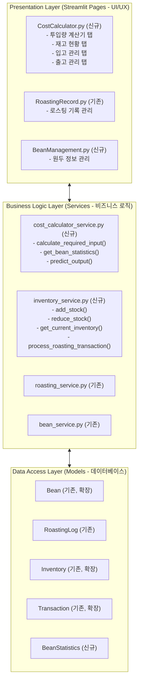
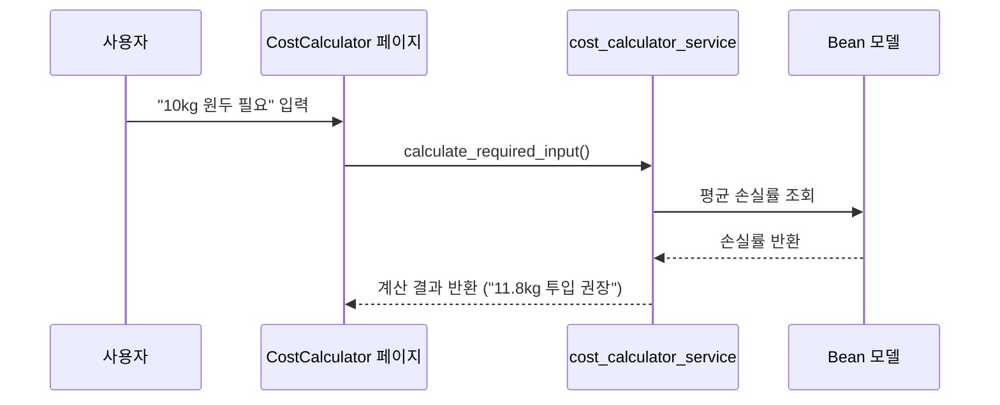
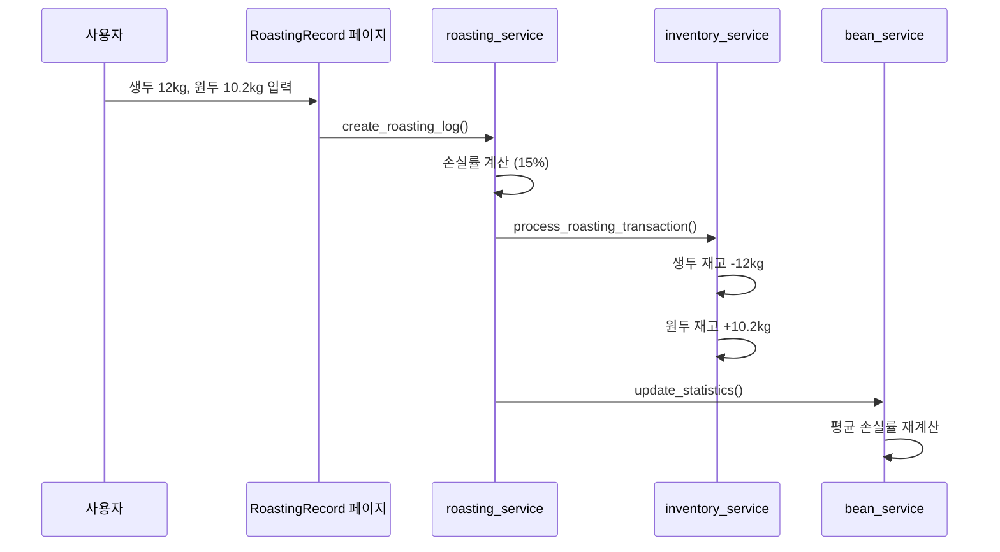

# 더문드립바 원가계산기 고도화 플랜

> **작성일**: 2025-11-09
> **버전**: 1.0.0
> **목표**: 로스팅 비용 계산 및 재고 관리 시스템 고도화

---

## 📋 목차

1. [현재 시스템 분석](#1-현재-시스템-분석)
2. [요구사항 분석](#2-요구사항-분석)
3. [시스템 아키텍처](#3-시스템-아키텍처)
4. [기능별 상세 설계](#4-기능별-상세-설계)
5. [데이터베이스 설계](#5-데이터베이스-설계)
6. [UI/UX 설계](#6-uiux-설계)
7. [구현 단계](#7-구현-단계)
8. [예상 일정](#8-예상-일정)

---

## 1. 현재 시스템 분석

### 1.1 구현된 기능

#### ✅ 로스팅 기록 관리 (RoastingRecord.py)
- **기록 추가**: 생두 투입량, 로스팅 후 무게, 날짜, 원두 종류 입력
- **손실률 자동 계산**: `(생두 - 로스팅후) / 생두 × 100`
- **손실률 상태 판정**: 🟢우수/정상, 🟡주의, 🔴위험
- **통계 분석**: 월별 평균 손실률, 총 손실량, 추이 그래프
- **페이징**: 모바일 최적화된 페이징 시스템
- **조회 기간 필터**: 전체, 오늘, 1개월, 3개월, 6개월, 1년, 날짜조회

#### ✅ 원두 관리 (Bean 모델)
- **원두 정보**: 17종 원두 데이터 (이름, 원산지, 가격, 로스팅 레벨)
- **원두-로스팅 기록 연결**: 어떤 원두를 로스팅했는지 추적

#### ✅ 재고 관리 (Inventory 모델)
- **기본 재고 추적**: 원두별 재고량 관리
- **입출고 기록**: Transaction 모델로 입출고 이력 저장

### 1.2 부족한 기능

#### ❌ 역산 계산기 (투입량 예측)
- 현재: 투입량 → 손실률 계산 (순방향만)
- 필요: 목표 산출량 → 필요한 투입량 계산 (역방향)

#### ❌ 원두별 평균 손실률 분석
- 현재: 전체 평균 손실률만 계산
- 필요: 원두 종류별 평균 손실률 추적 및 활용

#### ❌ 재고 자동 연동
- 현재: 로스팅 기록과 재고가 분리됨
- 필요: 로스팅 시 재고 자동 차감, 입고 시 자동 증가

#### ❌ 출고 관리 시스템
- 현재: 출고 기능 없음
- 필요: 고객 출고 관리, 로스팅 후 원두 재고 추적

---

## 2. 요구사항 분석

### 2.1 손실률 예측 및 총량 산출

#### 비즈니스 요구사항
- **목표**: 원하는 산출량을 얻기 위해 필요한 생두 투입량 자동 계산
- **사용자**: 로스터, 카페 매니저
- **시나리오**:
  1. 사용자가 "10kg의 원두가 필요하다"고 입력
  2. 시스템이 원두별 평균 손실률을 조회 (예: 15%)
  3. 시스템이 필요한 투입량 계산: `10 ÷ (1 - 0.15) = 11.765kg`
  4. 시스템이 실무 권장량 제시: `11.8 ~ 12.0kg` (여유 고려)

#### 기술 요구사항
```python
def calculate_required_raw_weight(
    target_output_kg: float,
    bean_id: int = None,
    safety_margin: float = 0.02  # 2% 여유
) -> dict:
    """
    목표 산출량 기반 투입량 계산

    Returns:
        {
            'target_output': 10.0,
            'avg_loss_rate': 15.0,
            'calculated_input': 11.765,
            'recommended_input': 12.0,
            'safety_margin': 0.235  # 2% 여유분
        }
    """
    # 1. 원두별 평균 손실률 조회
    # 2. 투입량 계산: target ÷ (1 - loss_rate)
    # 3. 여유분 추가: calculated × (1 + safety_margin)
    # 4. 소수점 처리: 올림 또는 반올림
```

### 2.2 로스팅 후 데이터 입력 및 손실률 자동 계산

#### 비즈니스 요구사항
- **목표**: 로스팅 후 실제 결과 입력 시 손실률 자동 계산 및 저장
- **현재 상태**: ✅ 이미 구현됨 (RoastingRecord.py)
- **개선 필요**: 원두별 손실률 통계 자동 업데이트

#### 기술 요구사항
```python
def update_bean_loss_statistics(bean_id: int):
    """
    원두별 평균 손실률 재계산

    - 해당 원두의 모든 로스팅 기록 조회
    - 평균, 표준편차, 최소/최대값 계산
    - Bean 모델에 통계 정보 업데이트
    """
```

### 2.3 원두 목록 관리

#### 비즈니스 요구사항
- **목표**: 다양한 원두 종류 및 브랜드 등록/관리
- **현재 상태**: ✅ 기본 구현됨 (17종 원두 등록)
- **개선 필요**:
  - 원두 추가/수정/삭제 UI
  - 원두별 통계 정보 표시
  - 브랜드 정보 추가

#### 기술 요구사항
```python
# Bean 모델 확장
class Bean:
    # 기존 필드
    id, no, name, country_name, roast_level, price_per_kg

    # 추가 필드
    brand: str  # 브랜드 (예: "산타바바라", "스페셜티", "자가로스팅")
    avg_loss_rate: float  # 평균 손실률 (자동 계산)
    std_loss_rate: float  # 손실률 표준편차
    total_roasted_count: int  # 총 로스팅 횟수
    last_roasted_date: date  # 마지막 로스팅 날짜
```

### 2.4 재고 관리 시스템

#### 비즈니스 요구사항

**2.4.1 생두 재고 관리**
- **입고**: 생두 입고 시 재고 증가
- **소비**: 로스팅 시 생두 재고 자동 차감
- **조회**: 원두별 현재 재고량 확인

**2.4.2 로스팅 후 원두 재고 관리**
- **생산**: 로스팅 완료 시 원두 재고 증가
- **출고**: 고객 판매/배송 시 원두 재고 차감
- **조회**: 판매 가능한 원두 재고 확인

#### 시나리오 예시

```
초기 상태:
  - 에티오피아 예가체프 (생두): 0kg
  - 에티오피아 예가체프 (원두): 0kg

1️⃣ 입고 (2025-11-01)
  - 생두 20kg 입고
  → 생두 재고: 20kg

2️⃣ 로스팅 (2025-11-05)
  - 생두 12kg 투입 → 원두 10.2kg 생산
  → 생두 재고: 8kg (20 - 12)
  → 원두 재고: 10.2kg (0 + 10.2)

3️⃣ 출고 (2025-11-10)
  - 고객에게 5kg 판매
  → 원두 재고: 5.2kg (10.2 - 5)

4️⃣ 재로스팅 (2025-11-15)
  - 생두 8kg 투입 → 원두 6.8kg 생산
  → 생두 재고: 0kg (8 - 8)
  → 원두 재고: 12kg (5.2 + 6.8)
```

#### 기술 요구사항

```python
# 재고 유형 구분
class InventoryType(Enum):
    RAW_BEAN = "생두"  # 로스팅 전
    ROASTED_BEAN = "원두"  # 로스팅 후

# 거래 유형
class TransactionType(Enum):
    # 생두 거래
    PURCHASE = "입고"  # 생두 구매 입고
    ROASTING = "로스팅"  # 로스팅 (생두 → 원두)

    # 원두 거래
    PRODUCTION = "생산"  # 로스팅 완료 (원두 생산)
    SALES = "판매출고"  # 고객 판매
    GIFT = "증정출고"  # 샘플/증정
    WASTE = "폐기"  # 불량 원두 폐기
    ADJUSTMENT = "재고조정"  # 재고 실사 후 조정

# Inventory 모델 확장
class Inventory:
    id: int
    bean_id: int
    inventory_type: InventoryType  # 생두 or 원두
    quantity_kg: float  # 현재 재고량
    last_updated: datetime

# Transaction 모델 확장
class Transaction:
    id: int
    bean_id: int
    transaction_type: TransactionType
    inventory_type: InventoryType  # 어떤 재고에 영향?
    quantity_kg: float  # 거래량 (+ or -)
    unit_price: float  # 단가
    total_price: float  # 총액
    roasting_log_id: int | None  # 로스팅 기록 연결
    notes: str
    created_at: datetime
```

---

## 3. 시스템 아키텍처

### 3.1 계층 구조



### 3.2 데이터 흐름

#### 시나리오 1: 투입량 계산


#### 시나리오 2: 로스팅 및 재고 자동 연동


---

## 4. 기능별 상세 설계

### 4.1 투입량 계산기

#### 4.1.1 UI 설계

```
┌──────────────────────────────────────┐
│  🧮 투입량 계산기                     │
├──────────────────────────────────────┤
│                                      │
│  ☕ 원두 선택                         │
│  [▼ 에티오피아 예가체프 (에티오피아)]  │
│                                      │
│  📊 평균 손실률: 15.2% (최근 10회)    │
│  📉 표준편차: ±1.8%                   │
│                                      │
│  🎯 목표 산출량 (kg)                  │
│  [ 10.0  ]                           │
│                                      │
│  ✨ 여유율 설정                        │
│  [ 2%  ] (배치 편차 고려)              │
│                                      │
│  ──────────────────────────────────  │
│                                      │
│  💡 계산 결과                         │
│  ┌────────────────────────────────┐ │
│  │ 필요한 생두 투입량                │ │
│  │ 11.765 kg (기본 계산)            │ │
│  │                                 │ │
│  │ ⭐ 권장 투입량                    │ │
│  │ 12.0 kg (여유 2% 포함)          │ │
│  │                                 │ │
│  │ 📦 예상 결과                     │ │
│  │ • 최소: 9.8 kg                  │ │
│  │ • 예상: 10.0 kg                 │ │
│  │ • 최대: 10.2 kg                 │ │
│  └────────────────────────────────┘ │
│                                      │
│  [📋 로스팅 기록으로 이동]             │
│                                      │
└──────────────────────────────────────┘
```

#### 4.1.2 계산 로직

```python
class CostCalculatorService:
    @staticmethod
    def calculate_required_input(
        target_output_kg: float,
        bean_id: int = None,
        safety_margin: float = 0.02
    ) -> dict:
        """
        투입량 계산 (역산)

        Args:
            target_output_kg: 목표 산출량 (kg)
            bean_id: 원두 ID (None이면 전체 평균 사용)
            safety_margin: 안전 여유율 (기본 2%)

        Returns:
            {
                'target_output': 10.0,
                'bean_name': '에티오피아 예가체프',
                'avg_loss_rate': 15.2,
                'std_loss_rate': 1.8,
                'sample_count': 10,
                'calculated_input': 11.765,
                'recommended_input': 12.0,
                'min_output': 9.8,
                'max_output': 10.2
            }
        """
        # 1. 원두별 통계 조회
        stats = BeanStatistics.get_statistics(bean_id)
        avg_loss_rate = stats.avg_loss_rate / 100  # 15.2 → 0.152
        std_loss_rate = stats.std_loss_rate / 100  # 1.8 → 0.018

        # 2. 기본 투입량 계산
        calculated_input = target_output_kg / (1 - avg_loss_rate)

        # 3. 여유분 추가
        recommended_input = calculated_input * (1 + safety_margin)

        # 4. 예상 범위 계산 (표준편차 고려)
        min_loss = avg_loss_rate - std_loss_rate
        max_loss = avg_loss_rate + std_loss_rate

        min_output = recommended_input * (1 - max_loss)
        max_output = recommended_input * (1 - min_loss)

        return {
            'target_output': target_output_kg,
            'bean_name': stats.bean_name,
            'avg_loss_rate': stats.avg_loss_rate,
            'std_loss_rate': stats.std_loss_rate,
            'sample_count': stats.sample_count,
            'calculated_input': round(calculated_input, 3),
            'recommended_input': round(recommended_input, 1),
            'min_output': round(min_output, 1),
            'max_output': round(max_output, 1)
        }
```

### 4.2 재고 관리 시스템

#### 4.2.1 입고 관리 UI

```
┌──────────────────────────────────────┐
│  📦 생두 입고 관리                     │
├──────────────────────────────────────┤
│                                      │
│  📅 입고 날짜                         │
│  [ 2025-11-09 ]                      │
│                                      │
│  ☕ 원두 종류                         │
│  [▼ 에티오피아 예가체프]               │
│                                      │
│  ⚖️ 입고량 (kg)                      │
│  [ 20.0  ]                           │
│                                      │
│  💰 단가 (원/kg)                     │
│  [ 7,500  ]                          │
│                                      │
│  💵 총액: ₩150,000                   │
│                                      │
│  📝 메모                              │
│  [ 산타바바라 11월 1차 입고 ]          │
│                                      │
│  ──────────────────────────────────  │
│                                      │
│  📊 현재 재고 (입고 전)                │
│  • 생두: 8.0 kg                      │
│  • 원두: 5.2 kg                      │
│                                      │
│  ──────────────────────────────────  │
│                                      │
│  [✅ 입고 처리]  [🔄 초기화]           │
│                                      │
└──────────────────────────────────────┘
```

#### 4.2.2 출고 관리 UI

```
┌──────────────────────────────────────┐
│  🚚 원두 출고 관리                     │
├──────────────────────────────────────┤
│                                      │
│  📅 출고 날짜                         │
│  [ 2025-11-09 ]                      │
│                                      │
│  ☕ 원두 종류                         │
│  [▼ 에티오피아 예가체프]               │
│                                      │
│  🏷️ 출고 유형                        │
│  [▼ 판매출고 ]                        │
│    • 판매출고                         │
│    • 증정출고 (샘플)                  │
│    • 폐기                            │
│                                      │
│  ⚖️ 출고량 (kg)                      │
│  [ 5.0  ]                            │
│                                      │
│  💰 판매 단가 (원/kg)                 │
│  [ 35,000  ]                         │
│                                      │
│  💵 총 판매액: ₩175,000               │
│                                      │
│  👤 고객 정보 (선택)                  │
│  [ 카페 ㅇㅇ ]                        │
│                                      │
│  📝 메모                              │
│  [ 정기 배송 고객 ]                   │
│                                      │
│  ──────────────────────────────────  │
│                                      │
│  📊 현재 원두 재고                    │
│  • 출고 전: 12.0 kg                  │
│  • 출고 후: 7.0 kg                   │
│                                      │
│  ⚠️ 재고 부족 알림                    │
│  재고가 10kg 이하입니다!               │
│  추가 로스팅을 고려하세요.              │
│                                      │
│  ──────────────────────────────────  │
│                                      │
│  [✅ 출고 처리]  [🔄 초기화]           │
│                                      │
└──────────────────────────────────────┘
```

#### 4.2.3 재고 현황 대시보드

```
┌──────────────────────────────────────────────────────────┐
│  📊 재고 현황                                             │
├──────────────────────────────────────────────────────────┤
│                                                          │
│  🔍 원두 선택: [▼ 전체 원두]                              │
│                                                          │
│  ┌────────────────────────────────────────────────────┐ │
│  │ 에티오피아 예가체프                                   │ │
│  ├────────────────────────────────────────────────────┤ │
│  │ 🌱 생두 재고: 8.0 kg      ⚠️ 재입고 필요             │ │
│  │ ☕ 원두 재고: 7.0 kg      ⚠️ 추가 로스팅 필요        │ │
│  │                                                      │ │
│  │ 📈 최근 30일 소비량: 15.2 kg                         │ │
│  │ 📉 예상 재고 소진일: 14일                            │ │
│  │                                                      │ │
│  │ 💰 재고 가치                                         │ │
│  │ • 생두: ₩60,000 (8kg × ₩7,500)                     │ │
│  │ • 원두: ₩245,000 (7kg × ₩35,000)                   │ │
│  │ • 총계: ₩305,000                                    │ │
│  │                                                      │ │
│  │ [📦 입고] [🚚 출고] [🔥 로스팅 기록]                  │ │
│  └────────────────────────────────────────────────────┘ │
│                                                          │
│  ┌────────────────────────────────────────────────────┐ │
│  │ 케냐 AA                                             │ │
│  ├────────────────────────────────────────────────────┤ │
│  │ 🌱 생두 재고: 0.0 kg      🔴 재고 없음               │ │
│  │ ☕ 원두 재고: 12.5 kg     ✅ 충분                    │ │
│  │                                                      │ │
│  │ 📈 최근 30일 소비량: 8.3 kg                          │ │
│  │ 📉 예상 재고 소진일: 45일                            │ │
│  │                                                      │ │
│  │ [📦 입고] [🚚 출고] [🔥 로스팅 기록]                  │ │
│  └────────────────────────────────────────────────────┘ │
│                                                          │
│  ──────────────────────────────────────────────────────  │
│                                                          │
│  📊 전체 요약                                             │
│  • 총 생두 재고: 23.5 kg (₩185,000)                     │
│  • 총 원두 재고: 45.2 kg (₩1,582,000)                   │
│  • 총 재고 가치: ₩1,767,000                              │
│                                                          │
└──────────────────────────────────────────────────────────┘
```

#### 4.2.4 로스팅 시 재고 자동 연동

```python
class InventoryService:
    @staticmethod
    def process_roasting_transaction(
        roasting_log: RoastingLog
    ) -> tuple[Transaction, Transaction]:
        """
        로스팅 시 재고 자동 차감/증가

        1. 생두 재고 차감
        2. 원두 재고 증가
        3. 거래 기록 생성

        Returns:
            (생두 차감 거래, 원두 증가 거래)
        """
        bean_id = roasting_log.bean_id
        raw_weight = roasting_log.raw_weight_kg
        roasted_weight = roasting_log.roasted_weight_kg

        # 1. 생두 재고 확인
        raw_inventory = Inventory.get_or_create(
            bean_id, InventoryType.RAW_BEAN
        )

        if raw_inventory.quantity_kg < raw_weight:
            raise InsufficientStockError(
                f"생두 재고 부족: {raw_inventory.quantity_kg}kg < {raw_weight}kg"
            )

        # 2. 생두 재고 차감
        raw_transaction = Transaction(
            bean_id=bean_id,
            transaction_type=TransactionType.ROASTING,
            inventory_type=InventoryType.RAW_BEAN,
            quantity_kg=-raw_weight,  # 마이너스
            roasting_log_id=roasting_log.id,
            notes=f"로스팅 #{roasting_log.id}"
        )

        raw_inventory.quantity_kg -= raw_weight
        raw_inventory.last_updated = datetime.now()

        # 3. 원두 재고 증가
        roasted_inventory = Inventory.get_or_create(
            bean_id, InventoryType.ROASTED_BEAN
        )

        roasted_transaction = Transaction(
            bean_id=bean_id,
            transaction_type=TransactionType.PRODUCTION,
            inventory_type=InventoryType.ROASTED_BEAN,
            quantity_kg=+roasted_weight,  # 플러스
            roasting_log_id=roasting_log.id,
            notes=f"로스팅 #{roasting_log.id} 생산"
        )

        roasted_inventory.quantity_kg += roasted_weight
        roasted_inventory.last_updated = datetime.now()

        # 4. DB 저장
        db.add(raw_transaction)
        db.add(roasted_transaction)
        db.commit()

        return (raw_transaction, roasted_transaction)
```

### 4.3 원두별 손실률 통계

#### 4.3.1 BeanStatistics 모델

```python
class BeanStatistics(Base):
    """원두별 로스팅 통계"""
    __tablename__ = "bean_statistics"

    id = Column(Integer, primary_key=True)
    bean_id = Column(Integer, ForeignKey("beans.id"), unique=True)

    # 손실률 통계
    avg_loss_rate = Column(Float, default=17.0)  # 평균 손실률 (%)
    std_loss_rate = Column(Float, default=0.0)   # 표준편차
    min_loss_rate = Column(Float, default=0.0)   # 최소값
    max_loss_rate = Column(Float, default=0.0)   # 최대값

    # 로스팅 이력
    total_roasted_count = Column(Integer, default=0)  # 총 횟수
    total_raw_weight = Column(Float, default=0.0)    # 총 투입량
    total_roasted_weight = Column(Float, default=0.0) # 총 산출량

    # 날짜
    first_roasted_date = Column(Date, nullable=True)
    last_roasted_date = Column(Date, nullable=True)
    last_updated = Column(DateTime, default=datetime.utcnow)

    # 관계
    bean = relationship("Bean", backref="statistics")

    @classmethod
    def update_statistics(cls, db: Session, bean_id: int):
        """원두별 통계 재계산"""
        # 1. 해당 원두의 모든 로스팅 기록 조회
        logs = db.query(RoastingLog).filter(
            RoastingLog.bean_id == bean_id
        ).all()

        if not logs:
            return None

        # 2. 통계 계산
        loss_rates = [log.loss_rate_percent for log in logs]

        stats = cls.get_or_create(db, bean_id)
        stats.avg_loss_rate = round(np.mean(loss_rates), 2)
        stats.std_loss_rate = round(np.std(loss_rates), 2)
        stats.min_loss_rate = round(min(loss_rates), 2)
        stats.max_loss_rate = round(max(loss_rates), 2)

        stats.total_roasted_count = len(logs)
        stats.total_raw_weight = sum(log.raw_weight_kg for log in logs)
        stats.total_roasted_weight = sum(log.roasted_weight_kg for log in logs)

        stats.first_roasted_date = min(log.roasting_date for log in logs)
        stats.last_roasted_date = max(log.roasting_date for log in logs)
        stats.last_updated = datetime.now()

        db.commit()
        return stats
```

---

## 5. 데이터베이스 설계

### 5.1 ERD (Entity-Relationship Diagram)

```mermaid
erd
    Bean {
        int id PK
        string name
        string country_name
        float price_per_kg
        string brand "★"
    }

    BeanStatistics {
        int id PK
        int bean_id FK "Unique"
        float avg_loss_rate
        float std_loss_rate
        int total_count
    }

    RoastingLog {
        int id PK
        int bean_id FK
        float raw_weight_kg
        float roasted_weight
        float loss_rate
    }

    Inventory {
        int id PK
        int bean_id FK
        string type "★"
        float quantity_kg
    }

    Transaction {
        int id PK
        int bean_id FK
        string type "★"
        string inventory_type "★"
        float quantity_kg
        int roasting_log_id FK
        float unit_price
        float total_price
    }

    LossRateWarning {
        int id PK
        int roasting_log_id FK
        string warning_type
        string severity
    }

    Bean ||--|| BeanStatistics : "1:1"
    Bean ||--o{ RoastingLog : "1:N"
    Bean ||--o{ Inventory : "1:N"
    Inventory ||--o{ Transaction : "1:N"
    RoastingLog ||--o{ LossRateWarning : "1:N"
```
**★ = 신규 또는 확장 필드**

### 5.2 테이블 정의 (SQL)

```sql
-- Bean 테이블 확장
ALTER TABLE beans
ADD COLUMN brand VARCHAR(100) DEFAULT '기본';

-- BeanStatistics 테이블 (신규)
CREATE TABLE bean_statistics (
    id INTEGER PRIMARY KEY AUTOINCREMENT,
    bean_id INTEGER UNIQUE NOT NULL,
    avg_loss_rate REAL DEFAULT 17.0,
    std_loss_rate REAL DEFAULT 0.0,
    min_loss_rate REAL DEFAULT 0.0,
    max_loss_rate REAL DEFAULT 0.0,
    total_roasted_count INTEGER DEFAULT 0,
    total_raw_weight REAL DEFAULT 0.0,
    total_roasted_weight REAL DEFAULT 0.0,
    first_roasted_date DATE,
    last_roasted_date DATE,
    last_updated TIMESTAMP DEFAULT CURRENT_TIMESTAMP,
    FOREIGN KEY (bean_id) REFERENCES beans(id)
);

-- Inventory 테이블 확장
ALTER TABLE inventory
ADD COLUMN inventory_type VARCHAR(20) DEFAULT 'RAW_BEAN';
-- 값: 'RAW_BEAN' (생두) 또는 'ROASTED_BEAN' (원두)

-- Transaction 테이블 확장
ALTER TABLE transactions
ADD COLUMN inventory_type VARCHAR(20) DEFAULT 'RAW_BEAN',
ADD COLUMN roasting_log_id INTEGER,
ADD COLUMN unit_price REAL DEFAULT 0.0,
ADD COLUMN total_price REAL DEFAULT 0.0,
ADD FOREIGN KEY (roasting_log_id) REFERENCES roasting_logs(id);

-- transaction_type 값:
-- 'PURCHASE' (입고), 'ROASTING' (로스팅-생두 차감)
-- 'PRODUCTION' (생산-원두 증가), 'SALES' (판매출고)
-- 'GIFT' (증정), 'WASTE' (폐기), 'ADJUSTMENT' (조정)
```

---

## 6. UI/UX 설계

### 6.1 페이지 구조

```
app/pages/
├── CostCalculator.py (신규)
│   ├─ Tab 1: 🧮 투입량 계산기
│   ├─ Tab 2: 📊 재고 현황
│   ├─ Tab 3: 📦 입고 관리
│   └─ Tab 4: 🚚 출고 관리
│
├── RoastingRecord.py (기존)
│   ├─ Tab 1: 📋 목록 조회
│   ├─ Tab 2: ➕ 기록 추가 (재고 자동 연동 ★)
│   ├─ Tab 3: ✏️ 기록 편집
│   └─ Tab 4: 📊 통계 분석
│
└── BeanManagement.py (신규)
    ├─ Tab 1: 📋 원두 목록
    ├─ Tab 2: ➕ 원두 추가
    ├─ Tab 3: ✏️ 원두 편집
    └─ Tab 4: 📊 원두별 통계
```

### 6.2 네비게이션 구조

```
사이드바:
├─ 🏠 홈
├─ 🧮 원가계산기 (신규)
│   └─ "투입량 계산, 재고 현황, 입출고 관리"
├─ 🔥 로스팅 기록
│   └─ "로스팅 이력, 손실률 분석"
├─ ☕ 원두 관리 (신규)
│   └─ "원두 정보, 통계"
└─ 📊 대시보드
    └─ "전체 요약"
```

### 6.3 모바일 최적화

- **터치 친화적 버튼**: 최소 44px × 44px
- **간소화된 입력**: selectbox, number_input 활용
- **반응형 레이아웃**: st.columns() 사용
- **축약된 정보 표시**: caption, metric 활용

---

## 7. 구현 단계

### Phase 1: 기본 재고 관리 (1주)

#### T1-1: 데이터베이스 마이그레이션
- [ ] BeanStatistics 모델 생성
- [ ] Inventory 모델 확장 (inventory_type 추가)
- [ ] Transaction 모델 확장
- [ ] 마이그레이션 스크립트 작성

#### T1-2: 재고 서비스 구현
- [ ] `inventory_service.py` 생성
- [ ] `add_stock()` - 입고 처리
- [ ] `reduce_stock()` - 출고 처리
- [ ] `get_current_inventory()` - 재고 조회
- [ ] `process_roasting_transaction()` - 로스팅 시 재고 자동 연동

#### T1-3: 재고 관리 UI
- [ ] `CostCalculator.py` 생성
- [ ] Tab 2: 재고 현황 대시보드
- [ ] Tab 3: 입고 관리 폼
- [ ] Tab 4: 출고 관리 폼

#### T1-4: 로스팅 기록 연동
- [ ] `RoastingRecord.py` 수정
- [ ] 로스팅 기록 추가 시 재고 자동 차감/증가
- [ ] 재고 부족 시 경고 메시지

### Phase 2: 투입량 계산기 (1주)

#### T2-1: 통계 시스템 구현
- [ ] `BeanStatistics` 모델 초기화
- [ ] 기존 로스팅 기록 기반 통계 계산
- [ ] 로스팅 기록 추가/수정 시 통계 자동 업데이트

#### T2-2: 계산기 서비스 구현
- [ ] `cost_calculator_service.py` 생성
- [ ] `calculate_required_input()` - 투입량 역산
- [ ] `get_bean_statistics()` - 원두별 통계 조회
- [ ] `predict_output()` - 산출량 예측

#### T2-3: 계산기 UI
- [ ] Tab 1: 투입량 계산기
- [ ] 원두 선택, 목표 산출량 입력
- [ ] 평균 손실률, 표준편차 표시
- [ ] 권장 투입량 및 예상 범위 표시

### Phase 3: 원두 관리 고도화 (3일)

#### T3-1: 원두 관리 페이지
- [ ] `BeanManagement.py` 생성
- [ ] Tab 1: 원두 목록 (통계 포함)
- [ ] Tab 2: 원두 추가 (브랜드 정보 포함)
- [ ] Tab 3: 원두 편집
- [ ] Tab 4: 원두별 상세 통계

#### T3-2: 원두 정보 확장
- [ ] `Bean` 모델에 `brand` 필드 추가
- [ ] 기존 원두 데이터에 브랜드 정보 추가
- [ ] 브랜드별 필터링 기능

### Phase 4: 고급 기능 (3일)

#### T4-1: 대시보드 개선
- [ ] 전체 재고 가치 계산
- [ ] 재고 소진 예측 (최근 30일 소비량 기반)
- [ ] 재입고 알림 시스템

#### T4-2: 보고서 기능
- [ ] 월별 입출고 현황 리포트
- [ ] 원두별 수익성 분석
- [ ] Excel/CSV 다운로드 기능

#### T4-3: 알림 시스템
- [ ] 재고 부족 알림 (임계값 설정)
- [ ] 손실률 이상 알림
- [ ] 재입고 시기 추천

---

## 8. 예상 일정

### 전체 일정: 약 3주

```
Week 1: Phase 1 - 재고 관리 기본 구현
├─ Day 1-2: 데이터베이스 설계 및 마이그레이션
├─ Day 3-4: 재고 서비스 구현
└─ Day 5-7: 재고 관리 UI 구현

Week 2: Phase 2 - 투입량 계산기
├─ Day 1-2: 통계 시스템 구현
├─ Day 3-4: 계산기 서비스 구현
└─ Day 5-7: 계산기 UI 구현

Week 3: Phase 3-4 - 원두 관리 & 고급 기능
├─ Day 1-3: 원두 관리 페이지 구현
├─ Day 4-5: 대시보드 및 보고서 기능
└─ Day 6-7: 테스트 및 버그 수정
```

---

## 9. 성공 지표 (KPI)

### 9.1 기능 완성도
- [ ] 투입량 계산기 정확도 95% 이상
- [ ] 재고 자동 연동 100% (로스팅 시 항상 작동)
- [ ] 원두별 통계 자동 업데이트

### 9.2 사용성
- [ ] 모바일에서 모든 기능 접근 가능
- [ ] 페이지 로딩 시간 3초 이내
- [ ] 입력 오류 시 명확한 피드백

### 9.3 데이터 정확성
- [ ] 재고 불일치 발생률 0%
- [ ] 손실률 계산 정확도 100%
- [ ] 통계 업데이트 지연 0초 (실시간)

---

## 10. 리스크 및 대응 방안

### 10.1 기술적 리스크

**리스크 1: 재고 불일치**
- 원인: 로스팅 기록 추가/삭제 시 재고 미반영
- 대응: 트랜잭션 처리로 원자성 보장, 재고 실사 기능 추가

**리스크 2: 통계 계산 성능**
- 원인: 로스팅 기록이 많아질 경우 통계 계산 느림
- 대응: 캐싱, 비동기 업데이트, 인덱스 최적화

**리스크 3: 데이터 마이그레이션 오류**
- 원인: 기존 데이터와 신규 스키마 불일치
- 대응: 백업 필수, 단계별 마이그레이션, 롤백 계획

### 10.2 비즈니스 리스크

**리스크 1: 사용자 학습 곡선**
- 원인: 기능이 많아져 복잡해질 수 있음
- 대응: 직관적인 UI, 도움말 기능, 튜토리얼

**리스크 2: 데이터 입력 오류**
- 원인: 사용자의 잘못된 입력
- 대응: 유효성 검증 강화, 확인 단계 추가

---

## 11. 참고 자료

### 11.1 관련 문서
- `Documents/Architecture/SYSTEM_ARCHITECTURE.md`
- `Documents/Planning/MASTER_PLAN_v2_Phase2.md`
- `app/pages/RoastingRecord.py`
- `app/models/database.py`

### 11.2 외부 참고
- Streamlit 공식 문서: https://docs.streamlit.io
- SQLAlchemy 공식 문서: https://docs.sqlalchemy.org

---

**문서 작성자**: Claude (AI Assistant)
**최종 수정일**: 2025-11-09
**승인자**: [프로젝트 관리자 승인 필요]
