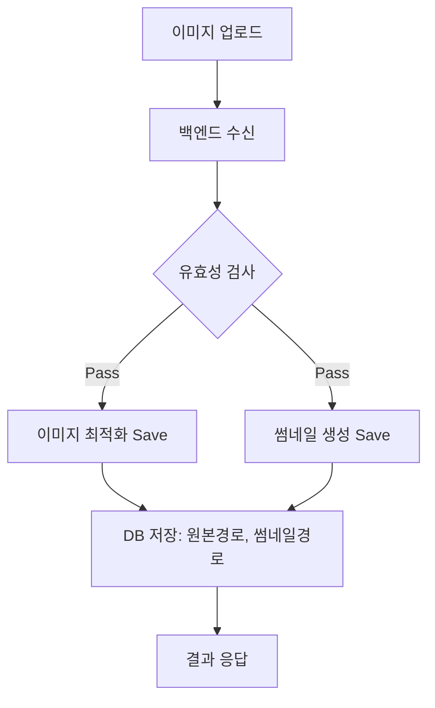

# 업로드 이미지 처리 및 최적화 로직 구현 플랜

명세서 이미지의 관리 효율성을 높이고, 추후 명세서 조회(Invoice) 기능과의 연동을 위한 최적화 전략입니다.

## 1. 이미지 용량 최적화 (Compression)

명세서 이미지는 텍스트 식별이 중요하지만, 원본 용량이 너무 크면 저장 공간과 전송 속도에 부담이 됩니다.

- **전략**: 업로드 전 프론트엔드에서 압축하거나, 백엔드 저장 시 리사이징을 수행합니다.
- **구현 방식**:
    - **프론트엔드**: `browser-image-compression` 같은 라이브러리를 사용하여 업로드 전 1-2MB 내외로 압축.
    - **백엔드**: Python `Pillow` 라이브러리를 사용하여 이미지를 읽어들인 후, `quality=85` 및 `max_size=(1600, 1600)` 정도로 최적화하여 저장.

## 2. 참조용 썸네일(Thumbnail) 생성 및 저장

목록에서 빠르게 명세서 내용을 확인할 수 있도록 썸네일을 생성합니다.

- **전략**: 원본 저장 시 200x200 또는 400x400 크기의 작은 썸네일을 생성하여 별도 폴더(`.thumbnails/`)에 저장.
- **구현 방식**:
    - 백엔드 `inbound` API에서 파일 저장 시 썸네일 생성 로직 추가.
    - DB 테이블(`inbound_documents`)에 `thumbnail_path` 컬럼 추가.

## 3. 명세서 조회 및 리스트 연동 (Invoice Integration)

저장된 데이터와 이미지를 효율적으로 연결하여 사용자에게 제공합니다.

- **조회 기능**:
    - 계약/주문 번호를 기반으로 특정 명세서의 상세 데이터와 이미지 호출.
- **리스트 출력**:
    - 명세서 목록 페이지에서 썸네일을 출력하여 시각적 확인 지원.
    - 썸네일 클릭 시 해당 `contract_number`를 인식하여 명세서 상세 팝업 또는 페이지 이동.

## 4. 로직 흐름 (Current Goal)

## 5. 단계별 추진 계획

1.  **Phase 1**: 백엔드 이미지 최적화 및 썸네일 생성 엔진 구축 (Pillow 활용).
2.  **Phase 2**: DB 스키마 업데이트 (thumbnail_path 추가).
3.  **Phase 3**: 명세서 목록 페이지 UI 설계 (썸네일 그리드/리스트).
4.  **Phase 4**: 썸네일 클릭 시 상세 명세서 뷰어 연동.
