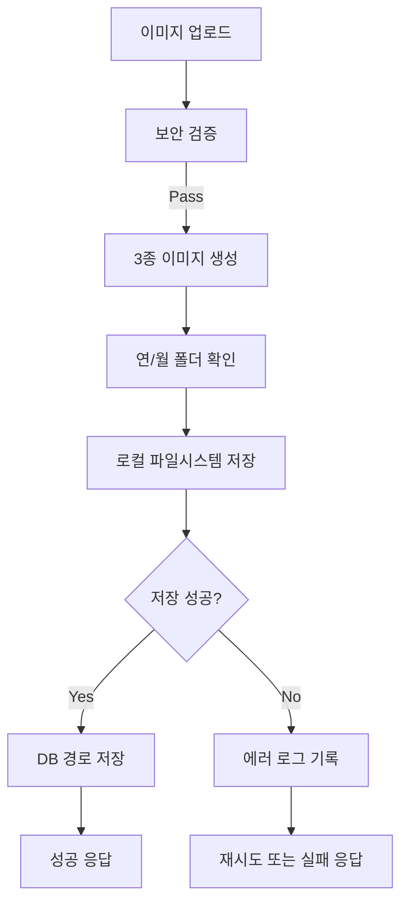

# 업로드 이미지 처리 및 최적화 로직 구현 플랜

**Version**: 2.1
**Last Updated**: 2025-12-22
**Status**: In Planning
**Dependencies**: OCR Service, FastAPI Backend, Pillow

---

## 📋 개요 (Overview)

명세서 이미지의 관리 효율성을 높이고, 추후 명세서 조회(Invoice) 기능과의 연동을 위한 종합 최적화 전략입니다.

### 🎯 핵심 목표 (Constitution)

1. **성능**: 이미지 로딩 시간 80% 단축 (목표: 평균 200ms 이하)
2. **용량**: 저장 공간 70% 절감 (원본 대비)
3. **품질**: OCR 정확도 95% 이상 유지
4. **보안**: 악성 파일 업로드 100% 차단
5. **가용성**: 99.9% 이미지 접근 가능성 (백업 포함)

### 🔧 기술 스택

- **이미지 처리**: Pillow (Python)
- **저장소**: Local Filesystem (Primary), 외부 백업 스토리지 (Secondary)
- **OCR**: 기존 OCR Service 연동
- **모니터링**: Custom logging + Error tracking

---

## 1. 이미지 보안 검증 (Security Validation)

**우선순위**: 🔴 Critical

업로드된 파일이 실제 이미지인지, 악성 코드가 포함되지 않았는지 검증합니다.

### 1.1 파일 타입 검증

```python
ALLOWED_EXTENSIONS = {'jpg', 'jpeg', 'png', 'webp', 'tiff'}
ALLOWED_MIME_TYPES = {
    'image/jpeg',
    'image/png',
    'image/webp',
    'image/tiff'
}
MAX_FILE_SIZE = 20 * 1024 * 1024  # 20MB
```

### 1.2 보안 검증 단계

1. **확장자 검증**: 파일 확장자가 허용 목록에 있는지 확인
2. **Magic Bytes 검증**: 파일 헤더의 실제 타입 확인 (python-magic)
3. **MIME Type 검증**: Content-Type 헤더와 실제 타입 일치 확인
4. **이미지 무결성 검증**: Pillow로 이미지 열기 시도 (손상된 파일 탐지)
5. **크기 제한**: 최대 20MB 초과 파일 거부

### 1.3 에러 처리

- **거부 사유 로깅**: 모든 거부된 업로드 기록 (IP, 시간, 사유)
- **사용자 피드백**: 명확한 에러 메시지 제공
- **관리자 알림**: 반복적인 악성 업로드 시도 감지

---

## 2. 이미지 용량 최적화 (Compression)

**우선순위**: 🟡 High

명세서 이미지는 텍스트 식별이 중요하지만, 원본 용량이 너무 크면 저장 공간과 전송 속도에 부담이 됩니다.

### 2.1 최적화 전략

| 타입 | 목적 | 크기 | 품질 | 포맷 |
|------|------|------|------|------|
| **원본** | OCR 처리 | 최대 1600x2400 | 95% | JPEG |
| **웹뷰** | 브라우저 표시 | 최대 1200x1800 | 85% | WebP |
| **썸네일** | 목록 표시 | 400x400 | 75% | WebP |

### 2.2 구현 방식

**백엔드 (Pillow 사용)**:
```python
from PIL import Image
import io

def optimize_image(image_bytes, target_type='original'):
    img = Image.open(io.BytesIO(image_bytes))

    # EXIF 데이터 보존 (방향 정보 중요)
    exif = img.info.get('exif', b'')

    # 프로필별 설정
    profiles = {
        'original': {'size': (1600, 2400), 'quality': 95, 'format': 'JPEG'},
        'webview': {'size': (1200, 1800), 'quality': 85, 'format': 'WEBP'},
        'thumbnail': {'size': (400, 400), 'quality': 75, 'format': 'WEBP'}
    }

    config = profiles[target_type]

    # 비율 유지 리사이징
    img.thumbnail(config['size'], Image.Resampling.LANCZOS)

    # 최적화 저장
    output = io.BytesIO()
    img.save(output, format=config['format'],
             quality=config['quality'],
             optimize=True,
             exif=exif)

    return output.getvalue()
```

### 2.3 성능 목표

- **압축률**: 원본 대비 60-80% 용량 감소
- **처리 속도**: 이미지당 평균 500ms 이하
- **품질 유지**: OCR 정확도 95% 이상 유지

---

## 3. 썸네일 생성 및 관리 (Thumbnail Generation)

**우선순위**: 🟡 High

목록에서 빠르게 명세서 내용을 확인할 수 있도록 썸네일을 생성합니다.

### 3.1 생성 전략

- **크기**: 400x400 (정사각형, aspect ratio 유지)
- **포맷**: WebP (최대 압축률)
- **품질**: 75% (목록 표시에 충분)
- **저장 위치**: 로컬 파일시스템의 별도 디렉토리

### 3.2 파일 명명 규칙

```
원본: {contract_number}_{timestamp}_{uuid}.jpg
썸네일: {contract_number}_{timestamp}_{uuid}_thumb.webp
웹뷰: {contract_number}_{timestamp}_{uuid}_web.webp
```

**예시**:
```
CTR20231215001_20231215143022_a7f3d9e2.jpg
CTR20231215001_20231215143022_a7f3d9e2_thumb.webp
CTR20231215001_20231215143022_a7f3d9e2_web.webp
```

### 3.3 DB 스키마 업데이트

`inbound_documents` 테이블에 추가 컬럼:

```sql
ALTER TABLE inbound_documents ADD COLUMN original_image_path VARCHAR(500);
ALTER TABLE inbound_documents ADD COLUMN webview_image_path VARCHAR(500);
ALTER TABLE inbound_documents ADD COLUMN thumbnail_image_path VARCHAR(500);
ALTER TABLE inbound_documents ADD COLUMN image_width INTEGER;
ALTER TABLE inbound_documents ADD COLUMN image_height INTEGER;
ALTER TABLE inbound_documents ADD COLUMN file_size_bytes INTEGER;
ALTER TABLE inbound_documents ADD COLUMN processing_status VARCHAR(20) DEFAULT 'pending';
```

---

## 4. 로컬 스토리지 구조 (Local Storage Architecture)

**우선순위**: 🟡 High

로컬 파일시스템에 효율적으로 이미지를 저장하고 관리합니다.

### 4.1 디렉토리 구조

```
backend/uploads/invoices/
├── originals/
│   └── 2023/
│       └── 12/
│           └── CTR20231215001_20231215143022_a7f3d9e2.jpg
├── webviews/
│   └── 2023/
│       └── 12/
│           └── CTR20231215001_20231215143022_a7f3d9e2_web.webp
└── thumbnails/
    └── 2023/
        └── 12/
            └── CTR20231215001_20231215143022_a7f3d9e2_thumb.webp
```

### 4.2 저장 전략

- **연/월별 폴더 분류**: 과도한 파일 집중 방지
- **원자적 저장**: 임시 파일 생성 후 rename으로 안전성 확보
- **권한 관리**: 웹 서버 프로세스만 읽기/쓰기 가능
- **디스크 용량 모니터링**: 80% 도달 시 경고

### 4.3 구현 플로우



### 4.4 에러 핸들링

- **디스크 풀**: 공간 부족 시 사용자에게 명확한 에러 메시지
- **권한 오류**: 파일시스템 권한 문제 로깅 및 관리자 알림
- **I/O 오류**: 3회 재시도 후 실패 처리

---

## 5. OCR 전처리 최적화 (OCR Enhancement)

**우선순위**: 🟡 High

OCR 정확도를 높이기 위한 이미지 전처리 단계입니다.

### 5.1 전처리 파이프라인

```python
def preprocess_for_ocr(image):
    """OCR 정확도를 높이기 위한 이미지 전처리"""
    # 1. 그레이스케일 변환
    gray = image.convert('L')

    # 2. 대비 향상 (CLAHE)
    from PIL import ImageEnhance
    enhancer = ImageEnhance.Contrast(gray)
    enhanced = enhancer.enhance(1.5)

    # 3. 노이즈 제거 (선택적)
    # enhanced = enhanced.filter(ImageFilter.MedianFilter(size=3))

    # 4. 이진화 (Adaptive Thresholding - OpenCV 필요 시)
    # threshold = cv2.adaptiveThreshold(...)

    return enhanced
```

### 5.2 품질 검증

- **해상도 체크**: 최소 300 DPI 권장
- **텍스트 영역 탐지**: 텍스트가 없는 이미지 경고
- **명도 체크**: 너무 어둡거나 밝은 이미지 보정

---

## 6. 명세서 조회 및 리스트 연동 (Invoice Integration)

**우선순위**: 🟡 High

저장된 데이터와 이미지를 효율적으로 연결하여 사용자에게 제공합니다.

### 6.1 API 엔드포인트

```
GET  /api/invoices                    # 목록 조회 (썸네일 포함)
GET  /api/invoices/{contract_number}  # 상세 조회 (원본 이미지)
GET  /api/invoices/{id}/image         # 이미지 직접 다운로드
POST /api/invoices/upload              # 이미지 업로드
```

### 6.2 캐싱 전략

- **브라우저 캐시**: `Cache-Control: max-age=86400` (24시간)
- **서버 메모리 캐시**: 최근 100개 썸네일 메모리 보관 (LRU)
- **정적 파일 서빙**: Nginx 또는 FastAPI StaticFiles로 직접 서빙

### 6.3 Lazy Loading

- **목록 페이지**: 스크롤 시 점진적 로딩 (Intersection Observer)
- **상세 페이지**: 블러 처리된 썸네일 먼저 표시 후 원본 로딩

---

## 7. 모니터링 및 로깅 (Monitoring)

**우선순위**: 🟢 Medium

운영 관점에서 이미지 처리 상태를 추적합니다.

### 7.1 추적 메트릭

| 메트릭 | 설명 | 목표 |
|--------|------|------|
| **업로드 성공률** | 전체 업로드 중 성공 비율 | > 99% |
| **평균 처리 시간** | 업로드부터 저장까지 | < 2초 |
| **이미지 크기** | 원본, 웹뷰, 썸네일 평균 크기 | 추적 |
| **OCR 정확도** | 추출된 데이터 정확도 | > 95% |
| **디스크 사용량** | 전체 이미지 저장소 용량 | < 80% |

### 7.2 로깅 구조

```python
import logging

logger = logging.getLogger('image_processing')

# 성공 로그
logger.info({
    'event': 'image_uploaded',
    'contract_number': 'CTR20231215001',
    'original_size': 5242880,
    'optimized_size': 1048576,
    'compression_ratio': 80,
    'processing_time_ms': 1234,
    'local_path': '/uploads/invoices/originals/2023/12/...'
})

# 에러 로그
logger.error({
    'event': 'image_upload_failed',
    'contract_number': 'CTR20231215002',
    'error_type': 'invalid_format',
    'error_message': 'File is not a valid image',
    'user_ip': '192.168.1.1'
})
```

---

## 8. 백업 및 복구 전략 (Backup & Recovery)

**우선순위**: 🟢 Medium

데이터 손실 방지를 위한 백업 체계입니다.

### 8.1 백업 계층

1. **Primary**: Local Filesystem (`backend/uploads/invoices/`)
2. **Secondary**: 외부 스토리지 (NAS, 외장 HDD) - 주 1회 전체 백업
3. **Tertiary**: DB 메타데이터 백업 (일 1회)

### 8.2 백업 스크립트

```bash
#!/bin/bash
# backup_images.sh - 주간 백업 스크립트

BACKUP_DIR="/mnt/nas/themoon_backups"
SOURCE_DIR="/mnt/d/Ai/WslProject/Themoon/backend/uploads/invoices"
DATE=$(date +%Y%m%d)

# 증분 백업 (rsync)
rsync -avz --delete \
  "$SOURCE_DIR/" \
  "$BACKUP_DIR/invoices_$DATE/"

# 7일 이전 백업 삭제
find "$BACKUP_DIR" -type d -mtime +7 -name "invoices_*" -exec rm -rf {} \;
```

### 8.3 복구 절차

1. 로컬 파일시스템 확인
2. 최신 백업에서 복구 (`rsync` 역방향 실행)
3. DB 메타데이터와 파일 경로 일치 확인
4. 최악의 경우: 사용자에게 재업로드 요청

---

## 9. 단계별 추진 계획 (Implementation Roadmap)

### Phase 1: 기반 구축 (Week 1-2)

- [ ] 보안 검증 로직 구현 (Magic Bytes, MIME Type)
- [ ] Pillow 기반 이미지 최적화 엔진 구축
- [ ] 3종 이미지 생성 파이프라인 구현
- [ ] 로컬 디렉토리 구조 생성 및 권한 설정
- [ ] DB 스키마 업데이트

### Phase 2: 스토리지 및 백업 (Week 3)

- [ ] 로컬 파일시스템 저장 로직 구현
- [ ] 연/월별 폴더 자동 생성 로직
- [ ] 에러 핸들링 및 로깅
- [ ] 백업 스크립트 작성 및 Cron 설정

### Phase 3: OCR 최적화 (Week 4)

- [ ] OCR 전처리 파이프라인 구현
- [ ] 품질 검증 로직 추가
- [ ] OCR Service와 통합 테스트

### Phase 4: 프론트엔드 통합 (Week 5)

- [ ] Invoice 목록 페이지 UI (썸네일 그리드)
- [ ] 상세 뷰어 구현 (원본 이미지 표시)
- [ ] Lazy Loading 적용
- [ ] 이미지 다운로드 기능

### Phase 5: 모니터링 및 최적화 (Week 6)

- [ ] 로깅 시스템 구축
- [ ] 성능 메트릭 대시보드
- [ ] 캐싱 전략 적용
- [ ] 부하 테스트 및 최적화
- [ ] 디스크 용량 모니터링 알림

---

## 10. 성능 검증 체크리스트 (Validation Checklist)

**구현 완료 후 반드시 확인:**

- [ ] 보안: 악성 파일 업로드 차단 테스트 통과
- [ ] 성능: 평균 로딩 시간 200ms 이하
- [ ] 품질: OCR 정확도 95% 이상
- [ ] 용량: 저장 공간 70% 절감 달성
- [ ] 가용성: 로컬 스토리지 접근 성공률 99.9% 이상
- [ ] 백업: 주간 백업 자동화 검증
- [ ] UX: 사용자 피드백 수집 및 반영
- [ ] 문서화: API 문서, 운영 가이드 작성 완료

---

## 11. 참고 문서 (References)

- `Documents/Architecture/SYSTEM_ARCHITECTURE.md` - 전체 시스템 구조
- `backend/app/services/ocr_service.py` - OCR Service 구현
- `backend/app/routers/inbound.py` - Inbound API 엔드포인트

---

## 변경 이력 (Change Log)

| 버전 | 날짜 | 변경 내용 |
|------|------|-----------|
| 2.1 | 2025-12-22 | Google Drive 통합 제거, 로컬 파일시스템 중심 재설계 (정책 제약 대응) |
| 2.0 | 2025-12-22 | 전문적 개선: 보안, Google Drive 통합, OCR 최적화, 모니터링, 백업 전략 추가 |
| 1.0 | 2025-12-21 | 초기 플랜 작성: 기본 최적화 및 썸네일 생성 전략 |

---

**Next Steps**: Phase 1 구현 시작 (보안 검증 및 이미지 최적화 엔진)

**Storage Strategy**: 로컬 파일시스템 + 주간 백업으로 단순하고 안정적인 구조 확보
