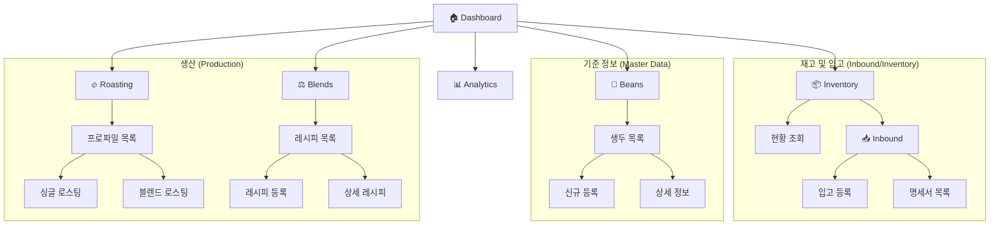
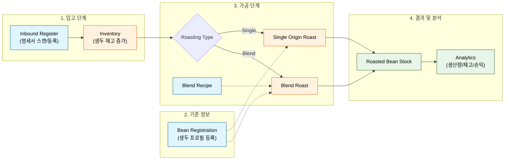
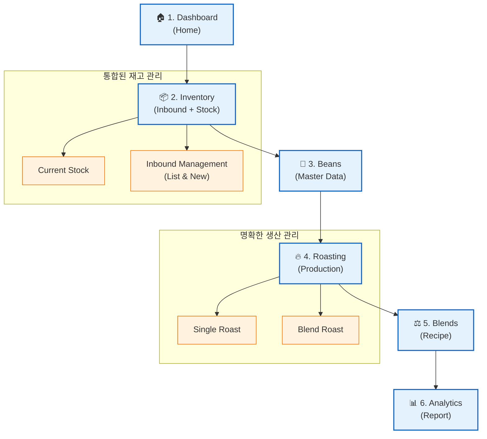

# Project Menu Hierarchy & Optimization

## 1. 개요 (Overview)

현재 The Moon 프로젝트의 메뉴 구조를 분석하고, 사용자 워크플로우(Workflow)와 정보의 성격에 맞춰 최적의 메뉴 계층과 순서를 도출합니다.

## 2. 현재 메뉴 구조 (Current State)

The Moon 프로젝트의 실제 구현된 페이지(`frontend/app/**/page.tsx`)를 전수 조사하여, 누락 없는 메뉴 구조를 파악하고 최적화된 사용자 경험(UX)을 위한 메뉴 계층 및 순서를 정의합니다.

---

## 2. 구현된 페이지 목록 (Implemented Pages)

실제 라우팅(Routing) 기준 페이지 목록입니다. (데모/디자인 랩 제외)

| Level 1       | Level 2 | Level 3   | 경로 (Route)              | 설명                   | 비고                  |
| :------------ | :------ | :-------- | :------------------------ | :--------------------- | :-------------------- |
| **Home**      | -       | -         | `/`                       | 대시보드 메인          |                       |
| **Beans**     | 목록    | -         | `/beans`                  | 생두 재고/품목 관리    |                       |
|               | 등록    | -         | `/beans/new`              | 신규 생두 등록         |                       |
|               | 상세    | -         | `/beans/[id]`             | 생두 상세 정보         |                       |
| **Roasting**  | 목록    | -         | `/roasting`               | 로스팅 프로파일 목록   |                       |
|               | Single  | -         | `/roasting/single-origin` | 싱글 오리진 로스팅     |                       |
|               | Blend   | -         | `/roasting/blend`         | 블렌드 로스팅          |                       |
| **Blends**    | 목록    | -         | `/blends`                 | 블렌드 레시피 목록     |                       |
|               | 등록    | -         | `/blends/new`             | 신규 블렌드 생성       |                       |
|               | 상세    | -         | `/blends/[id]`            | 블렌드 상세/수정       |                       |
| **Inventory** | 현황    | -         | `/inventory`              | 통합 재고 현황         |                       |
|               | Inbound | 입고 등록 | `/inventory/inbound`      | 신규 입고(명세서) 등록 | 현: `/inbound` 믹스됨 |
|               |         | 입고 목록 | `/inventory/inbound/list` | 명세서(Invoice) 이력   | **(New Phase 4)**     |
|               |         | 상세 (구) | `/inbound/invoice`        | *Legacy?*              | 확인 필요             |
|               |         | 뷰어      | `/inventory/inbound/view` | *Legacy/Dev?*          | 확인 필요             |
| **Analytics** | -       | -         | `/analytics`              | 분석 대시보드          |                       |

---

## 3. 메뉴 구조도 (Menu Structure Diagram)

현재 구현된 페이지들의 계층 구조를 시각화합니다.

---

## 4. 사용자 워크플로우 (User Flowchart)

실제 사용자가 데이터를 입력하고 가공하여 분석에 이르는 흐름입니다.

---

## 5. 최적화 제안 (Recommendations)

### 🚨 구조적 개선사항

1.  **Inbound 경로 통일**:
    *   현재 `/inventory/inbound` (등록)와 `/inventory/inbound/list` (목록)이 잘 정리되어 있으나, `/inbound/invoice` 등 레거시로 보이는 경로가 발견됨.
    *   **Action**: 모든 입고 관련 기능은 `/inventory/inbound/*` 하위로 엄격하게 통합 권장.

2.  **Roasting 하위 메뉴 접근성**:
    *   로스팅은 'Single'과 'Blend'의 행위가 구분되어 있음. 메뉴에서 바로 접근 가능하도록 서브 메뉴(Submenu) UI 도입 고려.

3.  **메뉴 순서 재배치 (최종안)**:
    *   **Home**
    *   **Inventory** (재고/입고) - *재료가 있어야 생산이 가능하므로 상단 이동*
    *   **Beans** (생두 관리)
    *   **Roasting** (로스팅)
    *   **Blends** (블렌딩)
    *   **Analytics** (분석)

### 📐 최적화된 메뉴 구조도 (Proposed Diagram)

