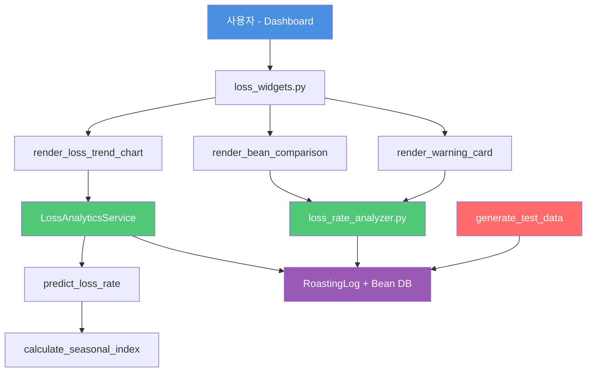

# T2-1 손실률 분석 시스템 강화 - 상세 계획

> **작성일**: 2025-11-08
> **목표 버전**: v0.22.0
> **예상 시간**: 4시간
> **우선순위**: ⭐⭐⭐ 높음

---

## 📋 목차

1. [Constitution (기본 원칙)](#1-constitution-기본-원칙)
2. [Specify (기능 명세)](#2-specify-기능-명세)
3. [Clarify (사용자 결정사항)](#3-clarify-사용자-결정사항)
4. [Plan (아키텍처 설계)](#4-plan-아키텍처-설계)
5. [Tasks (작업 분해)](#5-tasks-작업-분해)
6. [예상 일정](#6-예상-일정)
7. [성공 기준](#7-성공-기준)

---

## 1. Constitution (기본 원칙)

### 📋 프로젝트 목표

**손실률 분석 시스템을 강화하여 로스팅 품질 관리와 예측 정확도 향상**

### 🎯 핵심 원칙

#### 1.1 기존 코드 활용
- ✅ `app/services/loss_rate_analyzer.py` 이미 존재
- ✅ 기본 통계 분석 기능 구현됨 (7개 메서드)
- ⚠️ 미구현: 원두별 분석, 예측 모델, UI 위젯

#### 1.2 점진적 개선
- 기존 코드 삭제 ❌
- 기존 코드에 기능 추가 ✅
- 하위 호환성 유지 ✅

#### 1.3 데이터 기반 의사결정
- 통계적 유의성 검증 (±3σ 이상치 탐지)
- 시각화를 통한 직관적 이해
- 실행 가능한 인사이트 제공

### 🚫 제약사항

#### 1. 기술 스택
- **Python**: 3.12 (프로젝트 venv)
- **ORM**: SQLAlchemy
- **데이터 분석**: pandas, numpy, statsmodels
- **시각화**: plotly
- **UI**: Streamlit

#### 2. 데이터 상황
- **현재**: 14개 로스팅 기록 (부족)
- **해결**: 1년치 테스트 데이터 100개 생성
- **총**: 114개 데이터로 계절성 분석

#### 3. 성능 요구사항
- 응답 시간 < 2초 (Dashboard 위젯)
- 메모리 사용량 < 100MB
- 데이터베이스 쿼리 최적화

---

## 2. Specify (기능 명세)

### 현재 구현 상태 (✅)

| 기능 | 메서드 | 상태 | 파일 |
|------|--------|------|------|
| 기간별 트렌드 분석 | `analyze_loss_rate_trend()` | ✅ 완성 | loss_rate_analyzer.py |
| 월별 요약 | `get_monthly_summary()` | ✅ 완성 | loss_rate_analyzer.py |
| 연속 이상치 탐지 | `detect_continuous_anomalies()` | ✅ 완성 | loss_rate_analyzer.py |
| 심각도별 분포 | `get_severity_distribution()` | ✅ 완성 | loss_rate_analyzer.py |
| 경고 조회/해결 | `get_recent_warnings()`, `resolve_warning()` | ✅ 완성 | loss_rate_analyzer.py |

### 신규 구현 필요 (❌)

#### 기능 2.1: 원두별 손실률 통계 분석

**메서드**: `get_loss_rate_by_bean(db, days=30)`

**위치**: `app/services/loss_rate_analyzer.py` (line 178-192 수정)

**입력**:
- db: SQLAlchemy Session
- days: 분석 기간 (일 단위, 기본 30)

**출력**:
```python
[
  {
    "bean_id": 1,
    "bean_name": "예가체프",
    "roast_count": 12,
    "avg_loss_rate": 17.2,
    "std_deviation": 1.5,
    "min_loss": 15.0,
    "max_loss": 19.5,
    "variance_from_global": +0.2,  # 전체 평균 대비 편차
    "status": "NORMAL"  # NORMAL | ATTENTION | CRITICAL
  },
  ...
]
```

**로직**:
1. RoastingLog ↔ Bean JOIN
2. GROUP BY bean_id
3. 통계 계산: mean, std, min, max, count
4. 전체 평균 대비 편차 계산
5. 상태 판단 (±2% 이내: NORMAL, ±3% 이상: CRITICAL)

---

#### 기능 2.2: 손실률 예측 모델 (계절성 반영)

**메서드**: `predict_loss_rate(db, bean_id=None, months_ahead=1)`

**위치**: `app/services/loss_analytics_service.py` (신규 파일)

**입력**:
- db: SQLAlchemy Session
- bean_id: 원두 ID (None이면 전체 평균)
- months_ahead: 예측 기간 (월 단위, 기본 1)

**출력**:
```python
{
  "bean_id": 1,
  "bean_name": "예가체프",
  "current_avg_loss_rate": 17.2,
  "predicted_loss_rate": 17.8,
  "confidence_interval_lower": 16.8,
  "confidence_interval_upper": 18.8,
  "seasonal_index": 1.035,  # 다음 달 계절 지수
  "model_type": "moving_average_with_seasonality",
  "prediction_date": "2025-12",
  "data_points_used": 30,
  "last_updated": "2025-11-08T12:00:00Z"
}
```

**로직**:
1. **이동평균 계산**: 최근 30일 또는 7회 로스팅 평균
2. **계절 지수 조회**: 월별 계절 지수 (1월~12월)
3. **예측값 계산**: 이동평균 × 다음 달 계절 지수
4. **신뢰구간**: ±2σ (95% 신뢰수준)

---

#### 기능 2.3: 계절 지수 계산

**메서드**: `calculate_seasonal_index(db)`

**위치**: `app/services/loss_analytics_service.py`

**출력**:
```python
{
  "1": 0.985,   # 1월: -1.5% (겨울, 건조)
  "2": 0.990,   # 2월: -1.0%
  "3": 1.000,   # 3월: 정상
  "4": 1.005,   # 4월: +0.5%
  "5": 1.010,   # 5월: +1.0%
  "6": 1.020,   # 6월: +2.0% (여름 시작, 습도 상승)
  "7": 1.035,   # 7월: +3.5% (여름 최고)
  "8": 1.030,   # 8월: +3.0%
  "9": 1.010,   # 9월: +1.0%
  "10": 1.000,  # 10월: 정상
  "11": 0.995,  # 11월: -0.5%
  "12": 0.985,  # 12월: -1.5%
  "global_avg": 17.0
}
```

**로직**:
1. 월별 평균 손실률 계산
2. 전체 평균 계산
3. 계절 지수 = 월별 평균 / 전체 평균
4. 정규화 (평균 1.0)

---

#### 기능 2.4: Dashboard 위젯 3종

**파일**: `app/components/loss_widgets.py` (신규)

**위젯 1**: `render_loss_trend_chart(db, days=30)`
- **타입**: Plotly 라인 차트
- **데이터**: 최근 30일 손실률
- **표시**: 실제값, 예상값 (17%), ±3σ 범위 (음영)
- **색상**: 정상(초록), 경고(노랑), 심각(빨강)

**위젯 2**: `render_bean_comparison(db, days=30)`
- **타입**: Plotly 막대 그래프
- **데이터**: 원두별 평균 손실률
- **표시**: 평균값 + 오차 막대 (±1σ)
- **정렬**: 손실률 높은 순

**위젯 3**: `render_warning_card(db, limit=5)`
- **타입**: Streamlit Card + 표
- **데이터**: 미해결 경고 상위 5건
- **표시**: 날짜, 원두, 편차, 심각도
- **액션**: "해결" 버튼

---

## 3. Clarify (사용자 결정사항)

### ✅ 확정된 구현 방식

| 결정 항목 | 선택 | 이유 / 영향 |
|----------|------|------------|
| **예측 모델 복잡도** | 계절성 반영 모델 | 월별 패턴 분석 포함, 예상 2시간 소요 |
| **데이터 부족 문제** | 테스트 데이터 추가 | 1년치 100개 테스트 데이터 생성 (총 114개) |
| **Dashboard 위치** | 재사용 컴포넌트 | `app/components/loss_widgets.py` 생성 후 import |

---

## 4. Plan (아키텍처 설계)

### 📐 기술 스택

| 계층 | 기술 | 버전 | 용도 |
|------|------|------|------|
| **데이터 분석** | pandas | 2.2+ | 데이터 처리 및 그룹화 |
| **통계 계산** | numpy | 1.26+ | 수학 연산 및 통계 함수 |
| **시계열 분석** | statsmodels | 0.14+ | 계절성 분해 (선택적) |
| **시각화** | plotly | 5.18+ | 인터랙티브 차트 |
| **UI** | streamlit | 1.29+ | Dashboard 컴포넌트 |
| **ORM** | SQLAlchemy | 2.0+ | 데이터베이스 조회 |

### 📁 파일 구조

```
app/
├── services/
│   ├── loss_rate_analyzer.py          # 기존 (개선)
│   │   ├── analyze_loss_rate_trend()  # ✅ 기존
│   │   ├── get_monthly_summary()      # ✅ 기존
│   │   ├── get_loss_rate_by_bean()    # ❌ 신규 구현
│   │   ├── ...                        # ✅ 기존 5개 메서드
│   │
│   └── loss_analytics_service.py      # ❌ 신규 (통합 서비스)
│       ├── LossAnalyticsService       # 클래스
│       ├── calculate_seasonal_index() # 계절 지수 계산
│       ├── predict_loss_rate()        # 예측 모델
│       └── generate_test_data()       # 테스트 데이터 생성
│
├── components/
│   └── loss_widgets.py                # ❌ 신규 (Dashboard 위젯)
│       ├── render_loss_trend_chart()  # 위젯 1: 트렌드 차트
│       ├── render_bean_comparison()   # 위젯 2: 원두별 비교
│       └── render_warning_card()      # 위젯 3: 경고 카드
│
├── pages/
│   └── Dashboard.py                   # ✅ 기존 (개선)
│       └── "손실률 분석" 섹션 추가
│
├── tests/
│   ├── test_loss_rate_analyzer.py     # ✅ 기존 (보강)
│   └── test_loss_analytics_service.py # ❌ 신규 테스트
│
└── scripts/
    └── generate_test_roasting_data.py # ❌ 신규 (테스트 데이터)
```

### 🗄️ 데이터 모델 (기존 활용)

```python
# 기존 모델 (변경 없음)
class RoastingLog(Base):
    __tablename__ = "roasting_logs"
    id = Column(Integer, primary_key=True)
    bean_id = Column(Integer, ForeignKey("beans.id"))
    raw_weight_kg = Column(Float)
    roasted_weight_kg = Column(Float)
    loss_rate_percent = Column(Float)           # 손실률
    expected_loss_rate_percent = Column(Float)  # 예상 손실률 (17%)
    loss_variance_percent = Column(Float)       # 편차
    roasting_date = Column(Date)
    roasting_month = Column(String(7))          # YYYY-MM

class Bean(Base):
    __tablename__ = "beans"
    id = Column(Integer, primary_key=True)
    name = Column(String(100))
    price_per_kg = Column(Float)
```

### 🔄 데이터 흐름



---

## 5. Tasks (작업 분해)

### Phase 1: 테스트 데이터 생성 (30분)

#### Task 1.1: 테스트 데이터 생성 스크립트 작성
**파일**: `app/scripts/generate_test_roasting_data.py`

**데이터 사양**:
- 기간: 2024-01-01 ~ 2025-11-08 (약 23개월)
- 개수: 100개 로스팅 기록
- 원두: 17종 원두 중 랜덤 선택

**계절성 패턴**:
```python
SEASONAL_PATTERN = {
    1: -1.5,   # 1월: 겨울, 건조, 손실률 낮음
    2: -1.0,   # 2월
    3: 0.0,    # 3월: 봄, 정상
    4: +0.5,   # 4월
    5: +1.0,   # 5월
    6: +2.0,   # 6월: 여름 시작, 습도 증가
    7: +3.5,   # 7월: 여름 최고
    8: +3.0,   # 8월
    9: +1.0,   # 9월: 가을
    10: 0.0,   # 10월: 정상
    11: -0.5,  # 11월
    12: -1.5,  # 12월: 겨울
}
```

**정규 분포 노이즈**: μ=17.0, σ=1.5

**코드 구조**:
```python
def generate_test_roasting_data(count=100):
    records = []
    for i in range(count):
        # 1. 랜덤 날짜 생성 (2024-01-01 ~ 2025-11-08)
        # 2. 랜덤 원두 선택 (1~17)
        # 3. 계절 지수 조회
        # 4. 손실률 = 17.0 + 계절 지수 + random.gauss(0, 1.5)
        # 5. raw_weight = random.uniform(10, 50)
        # 6. roasted_weight = raw_weight * (1 - loss_rate/100)
        # 7. RoastingLog 생성
        pass
    return records
```

#### Task 1.2: 테스트 데이터 DB 삽입
- 기존 14개 데이터 유지
- 100개 추가 삽입
- 총 114개 데이터 확보

---

### Phase 2: 원두별 손실률 분석 (1시간)

#### Task 2.1: `get_loss_rate_by_bean()` 구현
**파일**: `app/services/loss_rate_analyzer.py` (line 178-192 수정)

**구현 로직**:
```python
@staticmethod
def get_loss_rate_by_bean(db: Session, days: int = 30) -> list:
    start_date = datetime.now().date() - timedelta(days=days)

    # JOIN + GROUP BY
    results = db.query(
        Bean.id,
        Bean.name,
        func.count(RoastingLog.id).label('roast_count'),
        func.avg(RoastingLog.loss_rate_percent).label('avg_loss'),
        func.stddev(RoastingLog.loss_rate_percent).label('std_loss'),
        func.min(RoastingLog.loss_rate_percent).label('min_loss'),
        func.max(RoastingLog.loss_rate_percent).label('max_loss'),
    ).join(
        RoastingLog, RoastingLog.bean_id == Bean.id
    ).filter(
        RoastingLog.roasting_date >= start_date
    ).group_by(
        Bean.id, Bean.name
    ).all()

    # 전체 평균 계산
    global_avg = db.query(func.avg(RoastingLog.loss_rate_percent)).scalar()

    # 결과 가공
    bean_stats = []
    for r in results:
        variance = r.avg_loss - global_avg
        status = "CRITICAL" if abs(variance) > 3 else \
                 "ATTENTION" if abs(variance) > 2 else "NORMAL"

        bean_stats.append({
            "bean_id": r.id,
            "bean_name": r.name,
            "roast_count": r.roast_count,
            "avg_loss_rate": round(r.avg_loss, 2),
            "std_deviation": round(r.std_loss, 2),
            "min_loss": round(r.min_loss, 2),
            "max_loss": round(r.max_loss, 2),
            "variance_from_global": round(variance, 2),
            "status": status
        })

    return sorted(bean_stats, key=lambda x: x['avg_loss_rate'], reverse=True)
```

#### Task 2.2: 테스트 코드 작성
**파일**: `app/tests/test_loss_rate_analyzer.py`

**테스트 케이스**:
1. `test_get_loss_rate_by_bean_normal()` - 정상 원두 (데이터 10개 이상)
2. `test_get_loss_rate_by_bean_insufficient_data()` - 데이터 부족 원두 (1~2개)
3. `test_get_loss_rate_by_bean_no_data()` - 데이터 없는 원두

---

### Phase 3: 계절성 예측 모델 (1.5시간)

#### Task 3.1: `LossAnalyticsService` 클래스 생성
**파일**: `app/services/loss_analytics_service.py` (신규)

**클래스 구조**:
```python
class LossAnalyticsService:
    """손실률 예측 및 계절성 분석 서비스"""

    # 계절 지수 캐시 (메모리)
    _seasonal_index_cache = None
    _cache_updated_at = None

    @classmethod
    def calculate_seasonal_index(cls, db: Session) -> dict:
        """월별 계절 지수 계산"""
        # 1. 월별 평균 손실률 조회
        monthly_avg = db.query(
            func.substr(RoastingLog.roasting_month, 6, 2).label('month'),
            func.avg(RoastingLog.loss_rate_percent).label('avg_loss')
        ).group_by('month').all()

        # 2. 전체 평균
        global_avg = db.query(
            func.avg(RoastingLog.loss_rate_percent)
        ).scalar()

        # 3. 계절 지수 = 월별 평균 / 전체 평균
        seasonal_index = {}
        for month, avg_loss in monthly_avg:
            seasonal_index[month] = avg_loss / global_avg

        # 4. 캐싱
        cls._seasonal_index_cache = seasonal_index
        cls._cache_updated_at = datetime.now()

        return seasonal_index

    @classmethod
    def predict_loss_rate(
        cls,
        db: Session,
        bean_id: int = None,
        months_ahead: int = 1
    ) -> dict:
        """손실률 예측"""
        # 1. 계절 지수 확인/생성
        if not cls._seasonal_index_cache:
            cls.calculate_seasonal_index(db)

        # 2. 최근 이동평균 계산
        query = db.query(RoastingLog.loss_rate_percent)
        if bean_id:
            query = query.filter(RoastingLog.bean_id == bean_id)

        recent_losses = query.order_by(
            RoastingLog.roasting_date.desc()
        ).limit(30).all()

        moving_avg = statistics.mean([r.loss_rate_percent for r in recent_losses])
        std_dev = statistics.stdev([r.loss_rate_percent for r in recent_losses])

        # 3. 다음 달 계절 지수
        next_month = (datetime.now().month + months_ahead) % 12 or 12
        seasonal_factor = cls._seasonal_index_cache.get(str(next_month), 1.0)

        # 4. 예측값 및 신뢰구간
        predicted = moving_avg * seasonal_factor
        ci_lower = predicted - 2 * std_dev
        ci_upper = predicted + 2 * std_dev

        return {
            "bean_id": bean_id,
            "current_avg_loss_rate": round(moving_avg, 2),
            "predicted_loss_rate": round(predicted, 2),
            "confidence_interval_lower": round(ci_lower, 2),
            "confidence_interval_upper": round(ci_upper, 2),
            "seasonal_index": round(seasonal_factor, 3),
            "model_type": "moving_average_with_seasonality",
            "prediction_month": f"2025-{next_month:02d}",
            "data_points_used": len(recent_losses),
            "last_updated": datetime.now().isoformat()
        }
```

#### Task 3.2: 테스트 코드 작성
**파일**: `app/tests/test_loss_analytics_service.py`

**테스트 케이스**:
1. `test_calculate_seasonal_index()` - 계절 지수 계산 검증
2. `test_predict_loss_rate_summer()` - 여름철 예측 (높은 손실률)
3. `test_predict_loss_rate_winter()` - 겨울철 예측 (낮은 손실률)
4. `test_confidence_interval()` - 신뢰구간 포함 여부

---

### Phase 4: Dashboard 위젯 (1시간)

#### Task 4.1: 위젯 컴포넌트 작성
**파일**: `app/components/loss_widgets.py` (신규)

**위젯 1**: `render_loss_trend_chart()`
```python
import plotly.graph_objects as go

def render_loss_trend_chart(db: Session, days: int = 30):
    """손실률 트렌드 차트 (Plotly)"""
    # 1. 데이터 조회
    start_date = datetime.now().date() - timedelta(days=days)
    logs = db.query(RoastingLog).filter(
        RoastingLog.roasting_date >= start_date
    ).order_by(RoastingLog.roasting_date).all()

    dates = [log.roasting_date for log in logs]
    loss_rates = [log.loss_rate_percent for log in logs]

    # 2. 3σ 범위 계산
    avg = statistics.mean(loss_rates)
    std = statistics.stdev(loss_rates)
    upper_3sigma = avg + 3 * std
    lower_3sigma = avg - 3 * std

    # 3. Plotly 차트
    fig = go.Figure()

    # 실제 손실률
    fig.add_trace(go.Scatter(
        x=dates,
        y=loss_rates,
        mode='lines+markers',
        name='실제 손실률',
        line=dict(color='#4A90E2')
    ))

    # 예상 손실률 (17%)
    fig.add_trace(go.Scatter(
        x=dates,
        y=[17.0] * len(dates),
        mode='lines',
        name='예상 손실률',
        line=dict(color='gray', dash='dash')
    ))

    # ±3σ 범위 (음영)
    fig.add_trace(go.Scatter(
        x=dates + dates[::-1],
        y=[upper_3sigma] * len(dates) + [lower_3sigma] * len(dates)[::-1],
        fill='toself',
        fillcolor='rgba(74, 144, 226, 0.2)',
        line=dict(color='rgba(255, 255, 255, 0)'),
        showlegend=True,
        name='±3σ 범위'
    ))

    fig.update_layout(
        title=f'손실률 트렌드 (최근 {days}일)',
        xaxis_title='날짜',
        yaxis_title='손실률 (%)',
        hovermode='x unified'
    )

    st.plotly_chart(fig, use_container_width=True)
```

**위젯 2**: `render_bean_comparison()`
```python
def render_bean_comparison(db: Session, days: int = 30):
    """원두별 손실률 비교 (막대 그래프)"""
    # 1. 원두별 통계 조회
    bean_stats = LossRateAnalyzer.get_loss_rate_by_bean(db, days)

    bean_names = [s['bean_name'] for s in bean_stats]
    avg_losses = [s['avg_loss_rate'] for s in bean_stats]
    std_devs = [s['std_deviation'] for s in bean_stats]

    # 2. 색상 (상태별)
    colors = []
    for s in bean_stats:
        if s['status'] == 'CRITICAL':
            colors.append('#E74C3C')  # 빨강
        elif s['status'] == 'ATTENTION':
            colors.append('#F39C12')  # 노랑
        else:
            colors.append('#50C878')  # 초록

    # 3. Plotly 막대 그래프
    fig = go.Figure()

    fig.add_trace(go.Bar(
        x=bean_names,
        y=avg_losses,
        error_y=dict(type='data', array=std_devs),
        marker_color=colors,
        text=[f"{l:.1f}%" for l in avg_losses],
        textposition='outside'
    ))

    fig.update_layout(
        title=f'원두별 평균 손실률 (최근 {days}일)',
        xaxis_title='원두',
        yaxis_title='평균 손실률 (%)',
        yaxis_range=[0, max(avg_losses) + 5]
    )

    st.plotly_chart(fig, use_container_width=True)
```

**위젯 3**: `render_warning_card()`
```python
def render_warning_card(db: Session, limit: int = 5):
    """경고 알림 카드"""
    warnings = LossRateAnalyzer.get_recent_warnings(db, limit)

    if not warnings:
        st.success("✅ 미해결 경고 없음")
        return

    st.warning(f"⚠️ 미해결 경고 {len(warnings)}건")

    # 테이블 표시
    df = pd.DataFrame(warnings)
    st.dataframe(df[['roasting_date', 'severity', 'variance', 'consecutive']],
                 use_container_width=True)

    # 해결 버튼 (선택)
    if st.button("모두 해결"):
        for w in warnings:
            LossRateAnalyzer.resolve_warning(db, w['id'])
        st.rerun()
```

#### Task 4.2: Dashboard 통합
**파일**: `app/pages/Dashboard.py` (기존 파일 수정)

**추가 위치**: 기존 Dashboard 하단에 "손실률 분석" 섹션 추가

```python
# Dashboard.py 하단에 추가

from app.components.loss_widgets import (
    render_loss_trend_chart,
    render_bean_comparison,
    render_warning_card
)

st.header("📊 손실률 분석")

col1, col2 = st.columns(2)

with col1:
    render_loss_trend_chart(db, days=30)

with col2:
    render_bean_comparison(db, days=30)

st.divider()

render_warning_card(db, limit=5)
```

#### Task 4.3: UI 테스트
- Streamlit 앱 실행 후 Dashboard 확인
- 데이터 새로고침 동작 확인
- 차트 인터랙션 테스트

---

## 6. 예상 일정

### 📅 작업 타임라인 (총 4시간)

```
Day 1 (2시간):
  09:00 - 09:30  Phase 1: 테스트 데이터 생성
  09:30 - 10:30  Phase 2: 원두별 손실률 분석
  10:30 - 11:00  휴식
  11:00 - 12:00  Phase 3: 계절성 예측 모델 (Part 1)

Day 2 (2시간):
  14:00 - 14:30  Phase 3: 계절성 예측 모델 (Part 2)
  14:30 - 15:30  Phase 4: Dashboard 위젯
  15:30 - 16:00  테스트 및 디버깅
```

### ⏱️ Phase별 상세 시간

| Phase | 작업 내용 | 예상 시간 |
|-------|----------|----------|
| **Phase 1** | 테스트 데이터 생성 | 30분 |
| **Phase 2** | 원두별 손실률 분석 | 1시간 |
| **Phase 3** | 계절성 예측 모델 | 1.5시간 |
| **Phase 4** | Dashboard 위젯 | 1시간 |
| **총계** | | **4시간** |

---

## 7. 성공 기준

### ✅ 기능적 목표

- [ ] **원두별 손실률 분석**: 17종 원두별 통계 제공
- [ ] **계절성 예측 모델**: 다음 달 손실률 예측 (±2% 신뢰구간)
- [ ] **Dashboard 위젯**: 3종 시각화 정상 동작
- [ ] **테스트 커버리지**: 새 코드 90% 이상
- [ ] **문서화**: 각 메서드 Docstring 작성

### 📊 품질 목표

- [ ] **성능**: Dashboard 로딩 시간 < 2초
- [ ] **메모리**: 메모리 사용량 < 100MB
- [ ] **정확도**: 예측 모델 RMSE < 2% (테스트 데이터 기준)
- [ ] **안정성**: 에러 핸들링 완료 (빈 데이터, NULL 값 등)

### 🧪 테스트 목표

- [ ] **Unit Test**: 5개 이상 작성
  - `test_get_loss_rate_by_bean_*` × 3
  - `test_predict_loss_rate_*` × 2
- [ ] **Integration Test**: Dashboard 렌더링 테스트
- [ ] **Edge Case**: 데이터 부족/없음 케이스 처리

### 📄 문서화 목표

- [ ] **코드 주석**: 모든 public 메서드 Docstring
- [ ] **README 업데이트**: 새 기능 설명 추가
- [ ] **CHANGELOG 업데이트**: v0.22.0 항목 작성
- [ ] **Session Summary**: 작업 완료 후 세션 요약 작성

---

## 📚 참고 자료

### 기존 파일
- `app/services/loss_rate_analyzer.py` (기존 구현 참고)
- `app/models/database.py` (RoastingLog, Bean 모델)
- `app/pages/Dashboard.py` (Dashboard 구조 참고)

### Python 라이브러리 문서
- pandas: https://pandas.pydata.org/docs/
- plotly: https://plotly.com/python/
- statsmodels: https://www.statsmodels.org/stable/

### 통계 개념
- 계절성 분해 (Seasonal Decomposition)
- 이동평균 (Moving Average)
- 신뢰구간 (Confidence Interval)

---

**작성자**: Claude Code
**최종 업데이트**: 2025-11-08
**상태**: 계획 완료, 구현 준비 완료
