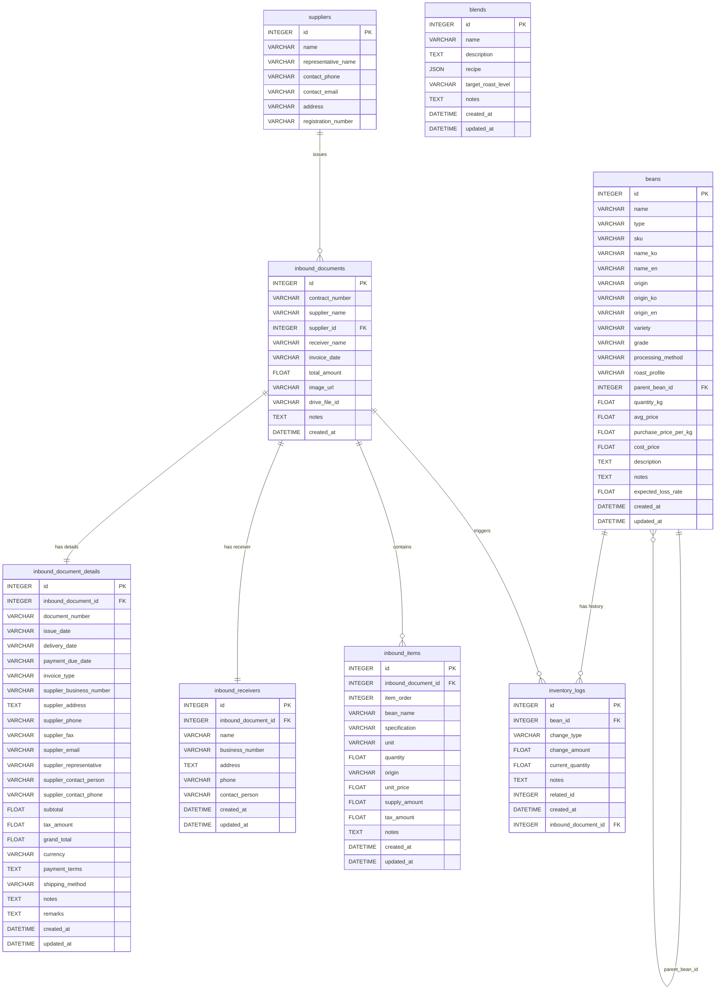

# Database Schema Diagram

```mermaid
erDiagram
    beans {
        INTEGER id PK
        VARCHAR name
        VARCHAR type
        VARCHAR sku
        VARCHAR name_ko
        VARCHAR name_en
        VARCHAR origin
        VARCHAR origin_ko
        VARCHAR origin_en
        VARCHAR variety
        VARCHAR grade
        VARCHAR processing_method
        VARCHAR roast_profile
        INTEGER parent_bean_id FK
        FLOAT quantity_kg
        FLOAT avg_price
        FLOAT purchase_price_per_kg
        FLOAT cost_price
        TEXT description
        TEXT notes
        FLOAT expected_loss_rate
        DATETIME created_at
        DATETIME updated_at
    }

    suppliers {
        INTEGER id PK
        VARCHAR name
        VARCHAR representative_name
        VARCHAR contact_phone
        VARCHAR contact_email
        VARCHAR address
        VARCHAR registration_number
    }

    blends {
        INTEGER id PK
        VARCHAR name
        TEXT description
        JSON recipe
        VARCHAR target_roast_level
        TEXT notes
        DATETIME created_at
        DATETIME updated_at
    }

    inbound_documents {
        INTEGER id PK
        VARCHAR contract_number
        VARCHAR supplier_name
        INTEGER supplier_id FK
        VARCHAR receiver_name
        VARCHAR invoice_date
        FLOAT total_amount
        VARCHAR image_url
        VARCHAR drive_file_id
        TEXT notes
        DATETIME created_at
    }

    inbound_document_details {
        INTEGER id PK
        INTEGER inbound_document_id FK
        VARCHAR document_number
        VARCHAR issue_date
        VARCHAR delivery_date
        VARCHAR payment_due_date
        VARCHAR invoice_type
        VARCHAR supplier_business_number
        TEXT supplier_address
        VARCHAR supplier_phone
        VARCHAR supplier_fax
        VARCHAR supplier_email
        VARCHAR supplier_representative
        VARCHAR supplier_contact_person
        VARCHAR supplier_contact_phone
        FLOAT subtotal
        FLOAT tax_amount
        FLOAT grand_total
        VARCHAR currency
        TEXT payment_terms
        VARCHAR shipping_method
        TEXT notes
        TEXT remarks
        DATETIME created_at
        DATETIME updated_at
    }

    inbound_receivers {
        INTEGER id PK
        INTEGER inbound_document_id FK
        VARCHAR name
        VARCHAR business_number
        TEXT address
        VARCHAR phone
        VARCHAR contact_person
        DATETIME created_at
        DATETIME updated_at
    }

    inbound_items {
        INTEGER id PK
        INTEGER inbound_document_id FK
        INTEGER item_order
        VARCHAR bean_name
        VARCHAR specification
        VARCHAR unit
        FLOAT quantity
        VARCHAR origin
        FLOAT unit_price
        FLOAT supply_amount
        FLOAT tax_amount
        TEXT notes
        DATETIME created_at
        DATETIME updated_at
    }

    inventory_logs {
        INTEGER id PK
        INTEGER bean_id FK
        VARCHAR change_type
        FLOAT change_amount
        FLOAT current_quantity
        TEXT notes
        INTEGER related_id
        DATETIME created_at
        INTEGER inbound_document_id FK
    }

    %% Relationships
    beans ||--o{ beans : "parent_bean_id"
    beans ||--o{ inventory_logs : "has history"
    suppliers ||--o{ inbound_documents : "issues"
    inbound_documents ||--o{ inventory_logs : "triggers"
    inbound_documents ||--|| inbound_document_details : "has details"
    inbound_documents ||--|| inbound_receivers : "has receiver"
    inbound_documents ||--o{ inbound_items : "contains"
```
