# TheMoon 프로젝트 기능 흐름도 (Feature Flows)

> **문서 버전**: 1.0
> **최종 업데이트**: 2025-12-22
> **프로젝트 버전**: 0.4.5

---

## 📋 목차

1. [시스템 개요](#시스템-개요)
2. [전체 아키텍처](#전체-아키텍처)
3. [핵심 기능별 흐름도](#핵심-기능별-흐름도)
   - [Beans Management (생두 관리)](#1-beans-management-생두-관리)
   - [Inbound Processing (입고 처리)](#2-inbound-processing-입고-처리)
   - [Roasting Operations (로스팅 작업)](#3-roasting-operations-로스팅-작업)
   - [Blends Management (블렌드 관리)](#4-blends-management-블렌드-관리)
   - [Inventory Tracking (재고 추적)](#5-inventory-tracking-재고-추적)
   - [Analytics Dashboard (분석 대시보드)](#6-analytics-dashboard-분석-대시보드)
   - [Cost Calculation (원가 계산)](#7-cost-calculation-원가-계산)
4. [데이터 모델 관계도](#데이터-모델-관계도)
5. [API 엔드포인트 참조](#api-엔드포인트-참조)

---

## 시스템 개요

TheMoon은 커피 로스팅 사업의 **생두 구매부터 로스팅, 원가 계산까지** 전 과정을 관리하는 시스템입니다.

### 핵심 모듈

- **Frontend**: Next.js 14 (App Router, TypeScript)
- **Backend**: FastAPI (Python 3.10+)
- **Database**: PostgreSQL (SQLAlchemy ORM)
- **AI/ML**: Google Gemini 2.5 Flash (OCR & Document Analysis)

### 주요 기능 (7가지)

1. **Beans Management**: 생두/로스팅 원두 재고 관리
2. **Inbound Processing**: 명세서 OCR 분석 및 입고 처리
3. **Roasting Operations**: 단일 원산지 & 블렌드 로스팅
4. **Blends Management**: 블렌드 레시피 관리
5. **Inventory Tracking**: 재고 이동 로그 추적
6. **Analytics Dashboard**: 비용 분석 및 통계
7. **Cost Calculation**: FIFO 기반 원가 계산

---

## 전체 아키텍처

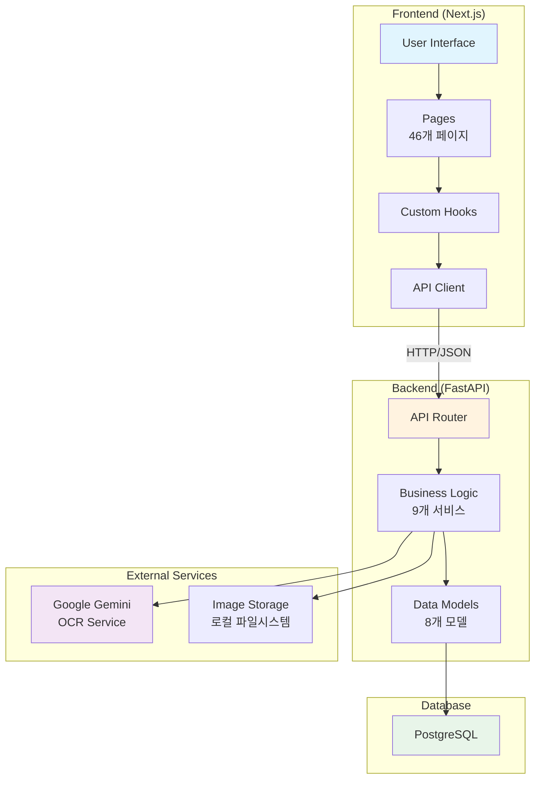

---

## 핵심 기능별 흐름도

### 1. Beans Management (생두 관리)

**페이지**: `/beans`, `/beans/new`, `/beans/[id]`
**API**: `GET/POST/PUT/DELETE /api/v1/beans`
**서비스**: `BeanService`
**모델**: `Bean`

#### 1.1 생두 목록 조회 플로우

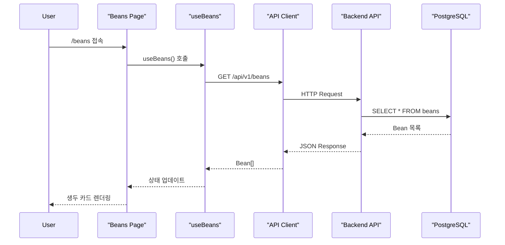

#### 1.2 생두 등록 플로우

```mermaid
graph TD
    Start(["사용자: 생두 등록 버튼 클릭"]) --> Form["/beans/new<br/>등록 폼 렌더링"]
    Form --> Input["입력 항목:<br/>- 이름<br/>- 원산지<br/>- 수량<br/>- 단가<br/>- 타입"]
    Input --> Validate{입력 검증}
    Validate -->|실패| Error[에러 메시지 표시]
    Validate -->|성공| Submit[POST /api/v1/beans]
    Submit --> Backend[BeanService.create_bean]
    Backend --> DB[(DB INSERT)]
    DB --> Redirect[/beans로 리다이렉트]
    Redirect --> End([생두 목록에 추가됨])

    Error --> Input

    style Start fill:#e1f5fe
    style End fill:#c8e6c9
    style Error fill:#ffcdd2
```

#### 1.3 주요 기능

- **필터링**: 타입별 (GREEN_BEAN, ROASTED_BEAN, BLEND_BEAN)
- **검색**: 이름, 원산지
- **정렬**: 이름순, 재고순
- **이미지**: 16개 생두 품종 × 3종 이미지 (original/webview/thumbnail)
- **수량 조정**: PATCH `/beans/{id}/quantity`
- **배치 체크**: POST `/beans/check-batch` (매칭 확인)

---

### 2. Inbound Processing (입고 처리)

**페이지**: `/inventory/inbound`, `/inventory/inbound/list`, `/inventory/inbound/view`
**API**: `POST /api/v1/inbound/analyze`, `POST /api/v1/inbound/confirm`
**서비스**: `OCRService`, `ImageService`, `BeanService`
**모델**: `InboundDocument`, `InboundItem`, `Supplier`

#### 2.1 명세서 분석 플로우 (OCR)

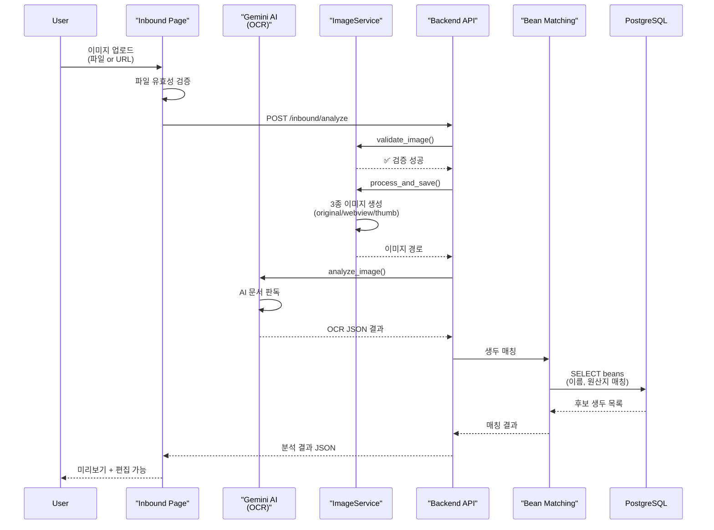

#### 2.2 입고 확정 플로우

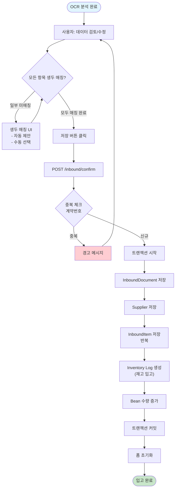

#### 2.3 OCR JSON 스키마 (Gemini 2.5 Flash)

```json
{
  "error": null,
  "debug_raw_text": "문서 전체 텍스트",
  "document_info": {
    "document_number": "문서번호",
    "contract_number": "발주번호 (중복 체크 키)",
    "issue_date": "YYYY-MM-DD",
    "invoice_date": "YYYY-MM-DD",
    "invoice_type": "GSC | HACIELO | STANDARD"
  },
  "supplier": {
    "name": "공급자명",
    "business_number": "사업자등록번호",
    "address": "주소"
  },
  "items": [
    {
      "bean_name": "Ethiopia Yirgacheffe",
      "quantity": 300,
      "unit": "kg",
      "unit_price": 15000,
      "amount": 4500000
    }
  ],
  "amounts": {
    "subtotal": 4500000,
    "tax_amount": 450000,
    "total_amount": 4950000
  }
}
```

#### 2.4 이미지 처리 파이프라인

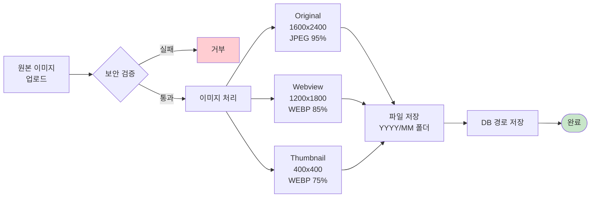

---

### 3. Roasting Operations (로스팅 작업)

**페이지**: `/roasting/single-origin`, `/roasting/blend`
**API**: `POST /api/v1/roasting/roast` (예정)
**서비스**: `RoastingService`
**모델**: `Bean`, `Blend`, `InventoryLog`

#### 3.1 단일 원산지 로스팅 플로우

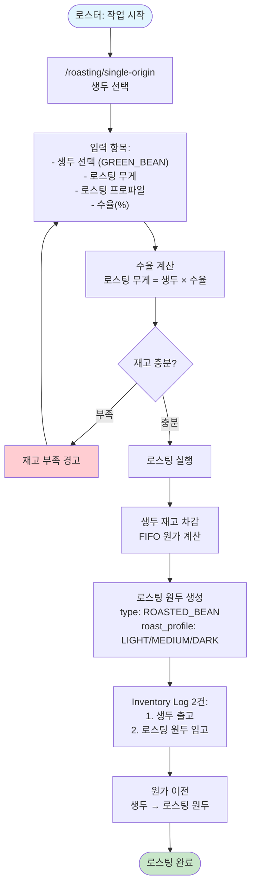

#### 3.2 블렌드 로스팅 플로우

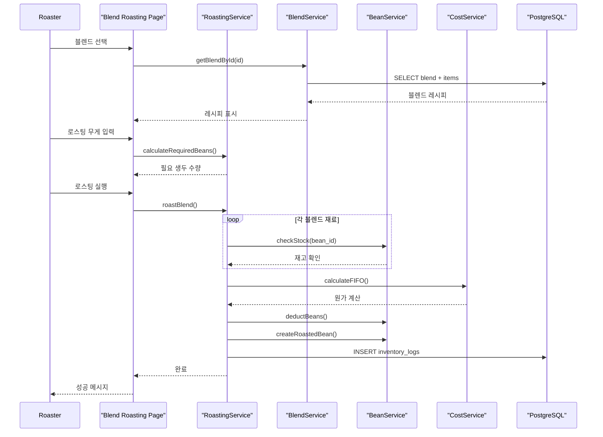

---

### 4. Blends Management (블렌드 관리)

**페이지**: `/blends`, `/blends/new`, `/blends/[id]`
**API**: `GET/POST/PUT/DELETE /api/v1/blends`
**서비스**: `BlendService`
**모델**: `Blend`, `BlendItem`

#### 4.1 블렌드 레시피 생성 플로우

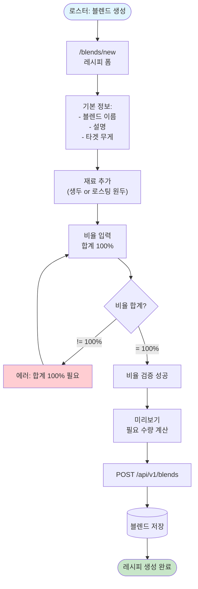

#### 4.2 블렌드 데이터 구조

```typescript
interface Blend {
  id: number
  name: string
  description: string
  is_active: boolean
  created_at: string
  blend_items: BlendItem[]
}

interface BlendItem {
  id: number
  blend_id: number
  bean_id: number
  ratio_percent: number  // 0-100
  bean: Bean
}
```

**예시**: Full Moon Blend

```json
{
  "name": "Full Moon Blend",
  "description": "밸런스 잡힌 블렌드",
  "blend_items": [
    {
      "bean_id": 1,  // Ethiopia Yirgacheffe
      "ratio_percent": 40
    },
    {
      "bean_id": 5,  // Colombia Huila
      "ratio_percent": 30
    },
    {
      "bean_id": 8,  // Brazil Santos
      "ratio_percent": 30
    }
  ]
}
```

---

### 5. Inventory Tracking (재고 추적)

**페이지**: `/inventory`
**API**: `GET /api/v1/inventory-logs`, `POST /api/v1/inventory-logs`
**서비스**: `InventoryLogService`
**모델**: `InventoryLog`

#### 5.1 재고 이동 로그 시스템

```mermaid
erDiagram
    INVENTORY_LOG {
        int id PK
        int bean_id FK
        string change_type
        float quantity_change
        float quantity_after
        string reason
        datetime created_at
        jsonb metadata
    }

    BEAN {
        int id PK
        float current_quantity
    }

    INVENTORY_LOG ||-- "BEAN" : tracks
```

#### 5.2 재고 변동 트리거

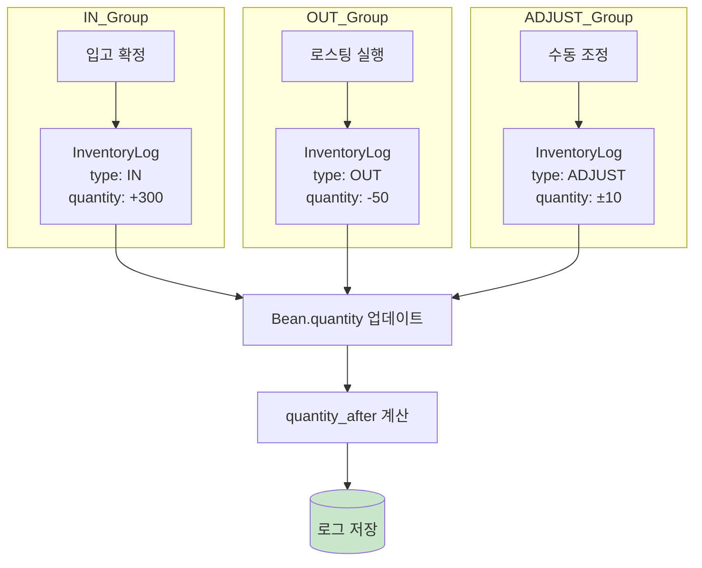

---

### 6. Analytics Dashboard (분석 대시보드)

**페이지**: `/analytics`
**API**: `GET /api/v1/dashboard`
**서비스**: `StatsService`, `CostService`
**모델**: `Bean`, `InboundDocument`, `InventoryLog`

#### 6.1 대시보드 데이터 흐름

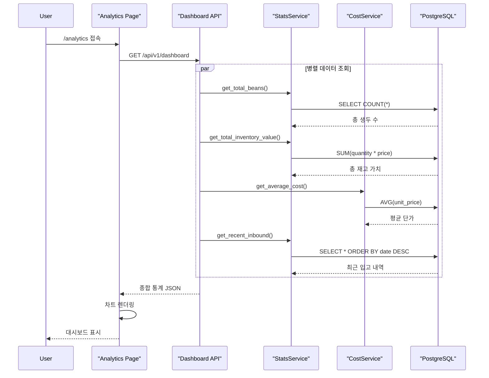

#### 6.2 분석 지표

```typescript
interface DashboardMetrics {
  // 재고 통계
  total_beans: number
  total_quantity_kg: number
  total_inventory_value: number

  // 원가 통계
  average_cost_per_kg: number
  weighted_average_cost: number

  // 활동 통계
  recent_inbound_count: number
  recent_roasting_count: number

  // 트렌드 차트 데이터
  monthly_inbound: Array<{month: string, value: number}>
  cost_trend: Array<{date: string, cost: number}>
  inventory_movement: Array<{date: string, in: number, out: number}>
}
```

---

### 7. Cost Calculation (원가 계산)

**서비스**: `CostService`
**알고리즘**: FIFO (First-In-First-Out)

#### 7.1 FIFO 원가 계산 로직

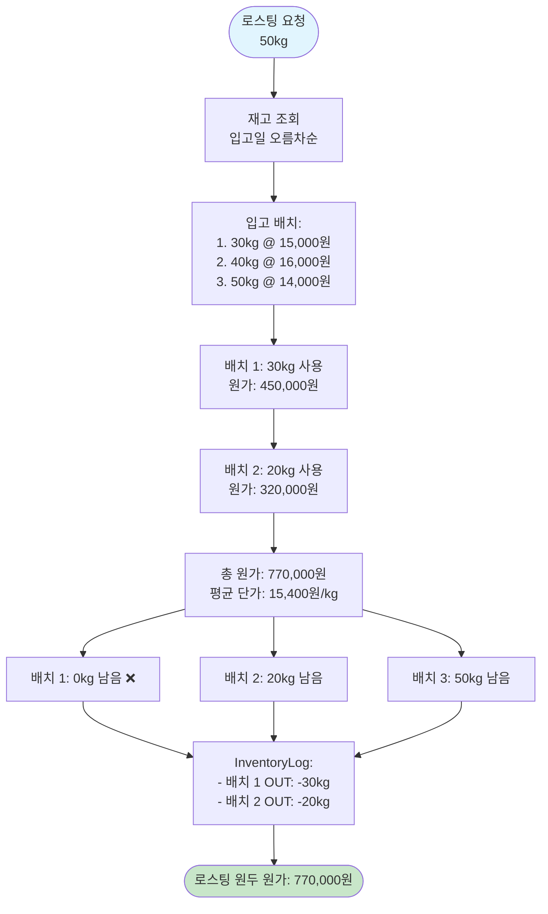

#### 7.2 원가 계산 시나리오

**시나리오**: Colombia Huila 50kg 로스팅

**재고 현황** (입고일 순):

| 입고일     | 수량 | 단가     | 잔여 |
| ---------- | ---- | -------- | ---- |
| 2025-01-10 | 30kg | 15,000원 | 30kg |
| 2025-01-25 | 40kg | 16,000원 | 40kg |
| 2025-02-05 | 50kg | 14,000원 | 50kg |

**FIFO 적용**:

1. 배치 1 (2025-01-10): 30kg × 15,000원 = 450,000원
2. 배치 2 (2025-01-25): 20kg × 16,000원 = 320,000원
3. **총 원가**: 770,000원
4. **평균 단가**: 15,400원/kg

**재고 업데이트**:

| 입고일         | 수량     | 단가         | 잔여 (After) |
| -------------- | -------- | ------------ | ------------ |
| ~~2025-01-10~~ | ~~30kg~~ | ~~15,000원~~ | ~~0kg~~ ❌    |
| 2025-01-25     | 40kg     | 16,000원     | **20kg** ✅   |
| 2025-02-05     | 50kg     | 14,000원     | 50kg         |

---

## 데이터 모델 관계도

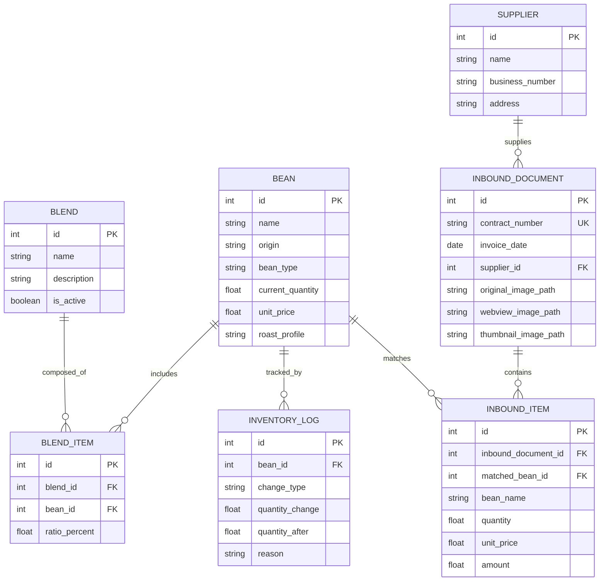

---

## API 엔드포인트 참조

### Beans API (`/api/v1/beans`)

| Method | Endpoint              | 기능           | 입력                 | 출력                     |
| ------ | --------------------- | -------------- | -------------------- | ------------------------ |
| GET    | `/`                   | 생두 목록 조회 | 필터, 검색, 정렬     | `BeanListResponse`       |
| GET    | `/{bean_id}`          | 생두 상세 조회 | bean_id              | `Bean`                   |
| POST   | `/`                   | 생두 등록      | `BeanCreate`         | `Bean`                   |
| PUT    | `/{bean_id}`          | 생두 수정      | bean_id,`BeanUpdate` | `Bean`                   |
| DELETE | `/{bean_id}`          | 생두 삭제      | bean_id              | 204 No Content           |
| GET    | `/stats/count`        | 생두 개수 통계 | -                    | `{count: number}`        |
| PATCH  | `/{bean_id}/quantity` | 수량 조정      | bean_id, quantity    | `Bean`                   |
| POST   | `/check-batch`        | 배치 매칭 체크 | `{names: string[]}`  | `Array<{name, matched}>` |

### Blends API (`/api/v1/blends`)

| Method | Endpoint      | 기능             | 입력                   | 출력           |
| ------ | ------------- | ---------------- | ---------------------- | -------------- |
| GET    | `/`           | 블렌드 목록 조회 | -                      | `Blend[]`      |
| GET    | `/{blend_id}` | 블렌드 상세 조회 | blend_id               | `Blend`        |
| POST   | `/`           | 블렌드 생성      | `BlendCreate`          | `Blend`        |
| PUT    | `/{blend_id}` | 블렌드 수정      | blend_id,`BlendUpdate` | `Blend`        |
| DELETE | `/{blend_id}` | 블렌드 삭제      | blend_id               | 204 No Content |

### Inbound API (`/api/v1/inbound`)

| Method | Endpoint                             | 기능            | 입력             | 출력                       |
| ------ | ------------------------------------ | --------------- | ---------------- | -------------------------- |
| POST   | `/analyze`                           | 명세서 OCR 분석 | 파일 or URL      | `OCRResponse`              |
| POST   | `/confirm`                           | 입고 확정       | `InboundConfirm` | 201 Created                |
| GET    | `/list`                              | 입고 내역 목록  | page, limit      | `PaginatedInboundResponse` |
| GET    | `/{document_id}`                     | 입고 상세 조회  | document_id      | `InboundDocument`          |
| GET    | `/check-duplicate/{contract_number}` | 중복 체크       | contract_number  | `{exists: boolean}`        |

### Inventory Logs API (`/api/v1/inventory-logs`)

| Method | Endpoint    | 기능           | 입력                        | 출력                       |
| ------ | ----------- | -------------- | --------------------------- | -------------------------- |
| GET    | `/`         | 재고 로그 조회 | bean_id, type, page         | `InventoryLogListResponse` |
| POST   | `/`         | 재고 로그 생성 | `InventoryLogCreate`        | `InventoryLog`             |
| PUT    | `/{log_id}` | 재고 로그 수정 | log_id,`InventoryLogUpdate` | `InventoryLog`             |
| DELETE | `/{log_id}` | 재고 로그 삭제 | log_id                      | 204 No Content             |

### Dashboard API (`/api/v1/dashboard`)

| Method | Endpoint | 기능          | 입력 | 출력               |
| ------ | -------- | ------------- | ---- | ------------------ |
| GET    | `/`      | 대시보드 통계 | -    | `DashboardMetrics` |

---

## 부록

### 페이지 전체 목록 (46개)

**핵심 기능 (13개)**:

- `/` - Home
- `/beans` - 생두 목록
- `/beans/new` - 생두 등록
- `/beans/[id]` - 생두 상세
- `/blends` - 블렌드 목록
- `/blends/new` - 블렌드 생성
- `/blends/[id]` - 블렌드 상세
- `/roasting` - 로스팅 메인
- `/roasting/single-origin` - 단일 원산지 로스팅
- `/roasting/blend` - 블렌드 로스팅
- `/inventory` - 재고 현황
- `/inventory/inbound` - 입고 처리 (OCR)
- `/inventory/inbound/list` - 입고 내역
- `/inventory/inbound/view` - 입고 상세
- `/analytics` - 분석 대시보드

**개발/테스트 페이지 (31개)**:

- `/design-demo` - 디자인 데모
- `/design-showcase` - 디자인 쇼케이스
- `/design-lab` (6개) - 디자인 스타일 테스트
- `/design-sample` (15개) - 컴포넌트 샘플
- `/components-demo` - 컴포넌트 데모
- `/sidebar-concepts` - 사이드바 컨셉
- `/rostings-invoice-demo` - 인보이스 데모
- `/inbound/invoice` - 인보이스 뷰

---

**문서 작성일**: 2025-12-22
**작성자**: Claude Sonnet 4.5
**관련 문서**:

- `Documents/Architecture/MENU_STRUCTURE.md`
- `Documents/Architecture/SYSTEM_ARCHITECTURE.md`
- `Documents/Planning/IMAGE_OPTIMIZATION_PLAN.md`
