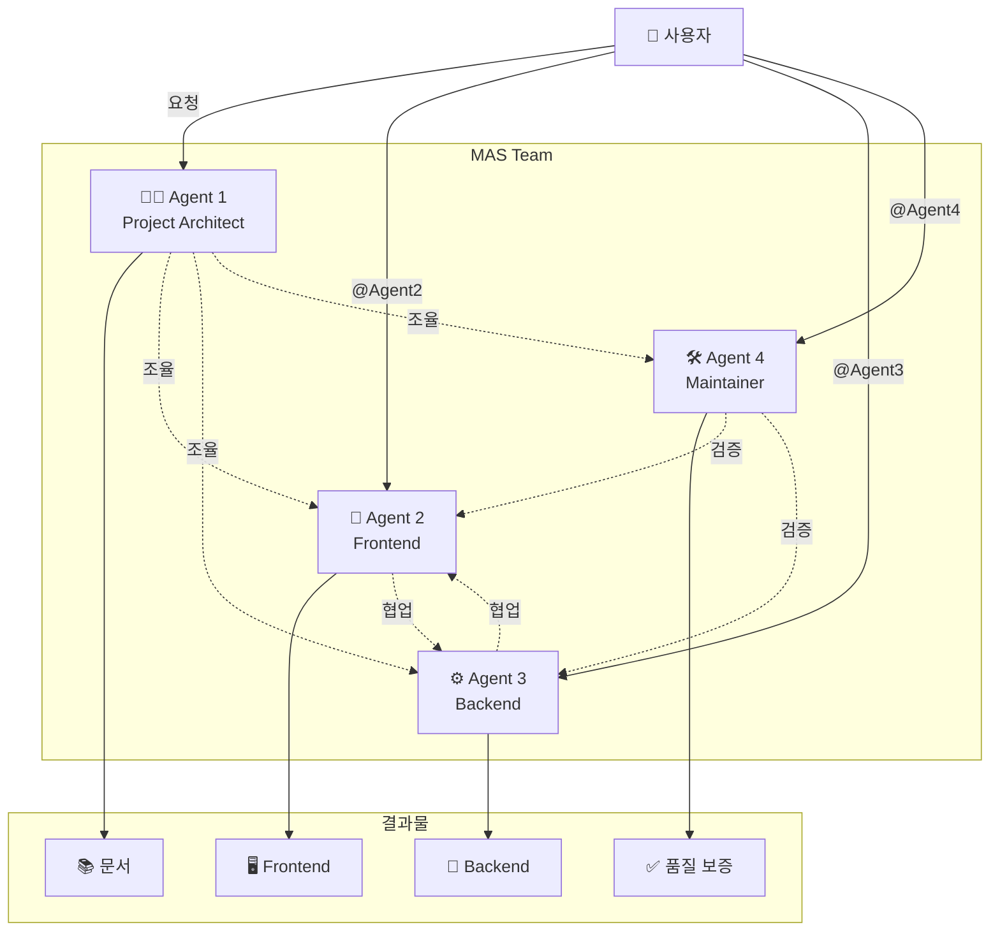
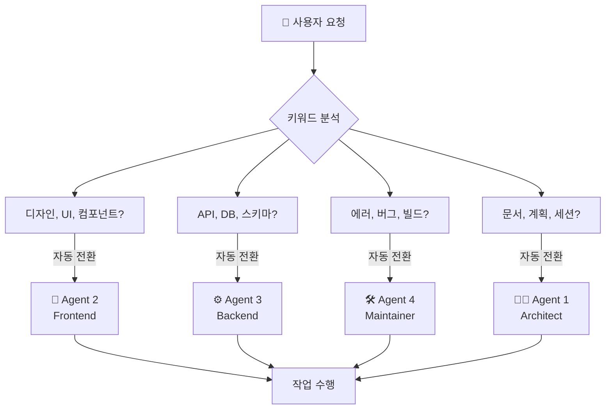
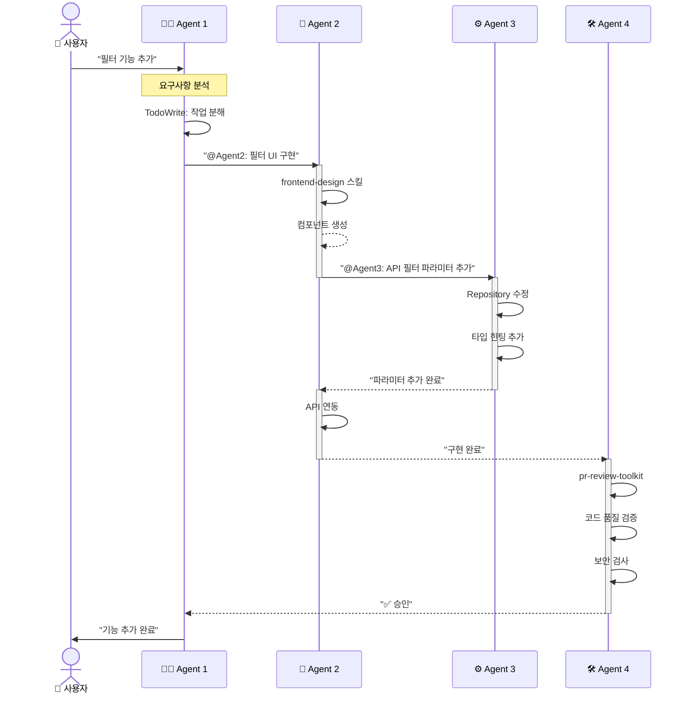
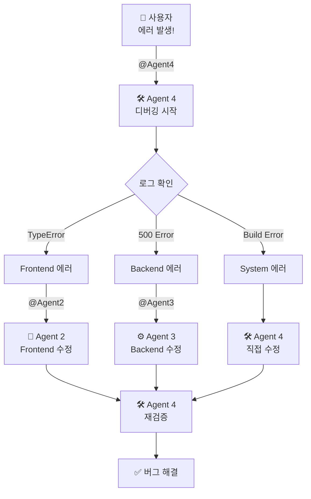
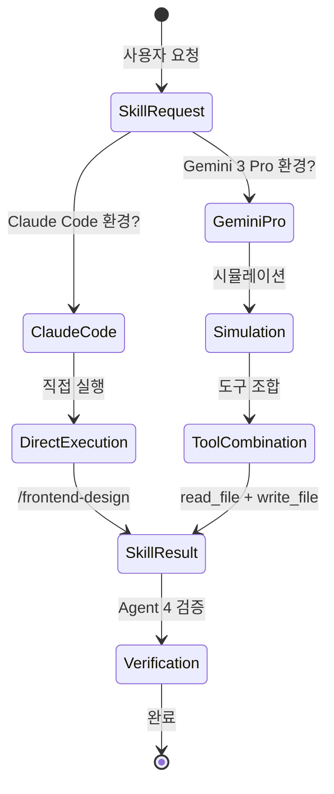
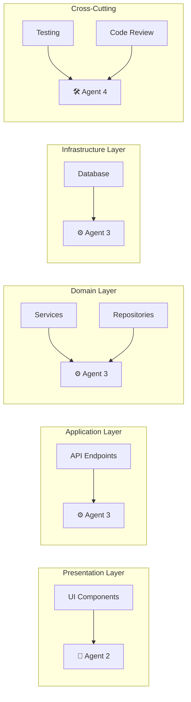
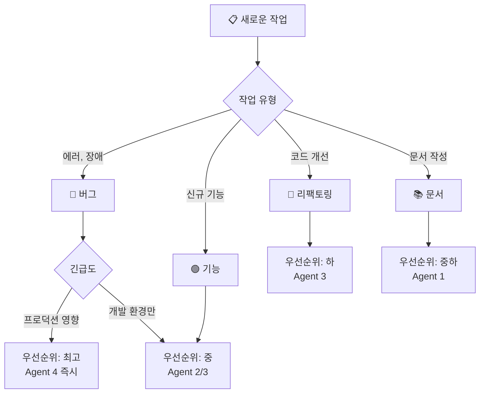
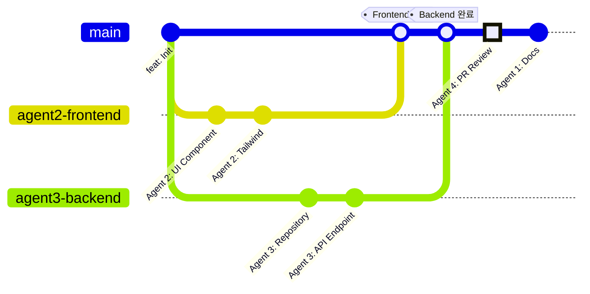
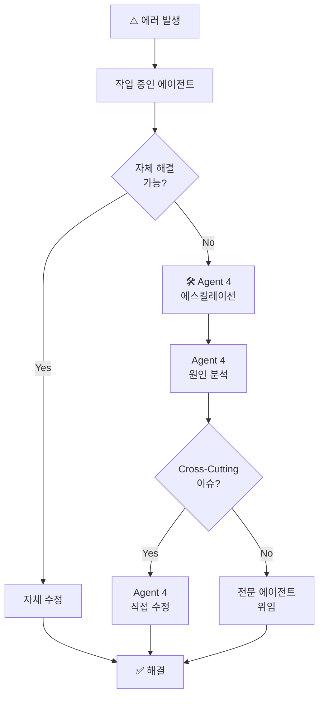
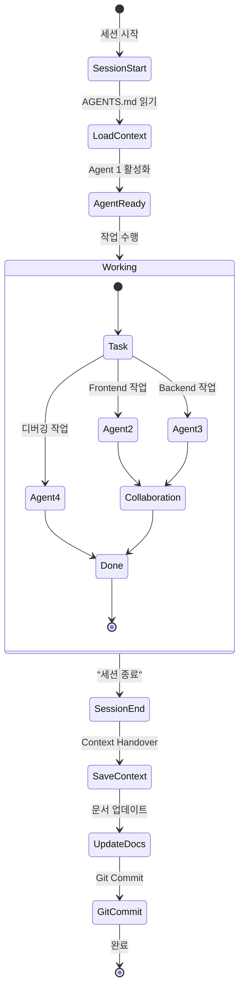

# MAS (Multi-Agent System) 플로우 다이어그램

> **작성일**: 2025-12-27
> **목적**: MAS 협업 프로세스 시각화
> **도구**: Mermaid v8.8.0

---

## 1. 전체 시스템 개요

---

## 2. 역할 전환 프로세스

---

## 3. 협업 플로우 - 기능 추가

---

## 4. 협업 플로우 - 버그 수정

---

## 5. 스킬 호출 플로우

---

## 6. Clean Architecture 레이어별 담당

---

## 7. 작업 우선순위 결정 플로우

---

## 8. Git 워크플로우와 MAS

---

## 9. 에러 에스컬레이션 플로우

---

## 10. 세션 관리 플로우

---

## 📊 다이어그램 범례

### 에이전트 표기
- 🧑‍💼 Agent 1: Project Architect (PM)
- 🎨 Agent 2: Frontend Specialist
- ⚙️ Agent 3: Backend Engineer
- 🛠️ Agent 4: System Maintainer

### 화살표 종류
- `-->` : 직접 작업 흐름
- `-.->` : 협업/통신
- `==>` : 강조된 흐름

### 노드 색상 (Mermaid 기본)
- 사각형: 프로세스
- 마름모: 의사결정
- 원: 시작/종료

---

**작성자**: Agent 1 (Project Architect)
**Mermaid 버전**: v8.8.0 호환
**최종 업데이트**: 2025-12-27
