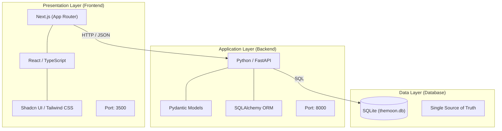
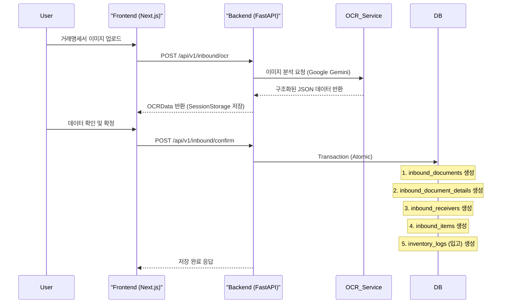

# 🏗️ 시스템 아키텍처 & 데이터 흐름 (System Architecture)

> 프로젝트의 기술 스택, 시스템 구조, 데이터 흐름을 설명하는 문서입니다.
> **Last Updated**: 2025-12-23
> **Architecture**: Next.js (App Router) + FastAPI + PostgreSQL (Transition from SQLite)

---

## 🏗️ 시스템 아키텍처 (Current Tech Stack)

### 3계층 아키텍처



---

## 🔄 데이터 흐름 (Data Flow)

### 1️⃣ OCR 데이터 처리 및 저장 프로세스 (Inbound)



### 2️⃣ 원두 재고 관리 흐름

```text
1. 입고 (Inbound): 
   - OCR 확정 시 `inbound_items` 테이블에 기록됨
   - 동시에 `inventory_logs`에 `INBOUND` 타입으로 수량 증가 기록

2. 출고 (Outbound / Roasting):
   - 로스팅 실행 시 `inventory_logs`에 `USED_FOR_ROASTING`으로 생두 감소
   - 동시에 `inventory_logs`에 `ROASTED_BATCH`로 원두(볶은콩) 증가
```

---

## 💾 데이터베이스 스키마 구조

### 핵심 테이블 그룹

1. **Master Data**
   - `beans`: 원두 마스터 (품종, 원산지 등)
   - `suppliers`: 공급자 정보
   - `blends`: 블렌딩 레시피

2. **Inbound & OCR Data** (OCR 데이터 100% 저장)
   - `inbound_documents`: 헤더 정보 (계약번호, 이미지 등)
   - `inbound_document_details`: 상세 정보 (세금, 결제조건 등 25개 필드)
   - `inbound_receivers`: 공급받는자 정보
   - `inbound_items`: 품목 리스트

3. **Inventory**
   - `inventory_logs`: 모든 수량 변화 기록

---

## 🚧 향후 확장 계획

1. **PostgreSQL 마이그레이션**: 배포 환경을 위한 DB 전환
2. **원가 분석 기능**: `inbound_items`의 단가 정보를 활용한 정밀 원가 계산
3. **통계 대시보드**: 공급자별, 품목별 매입 현황 시각화
