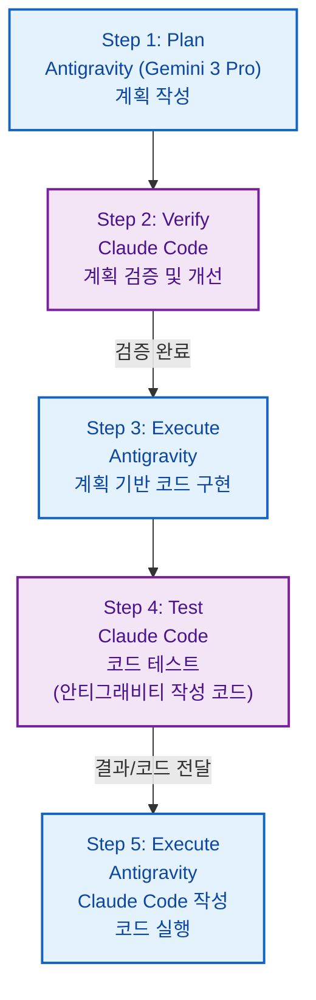
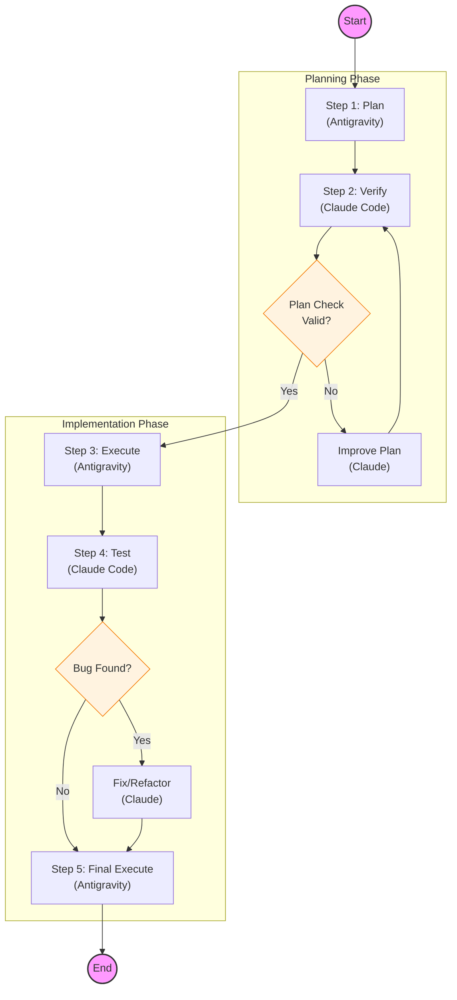
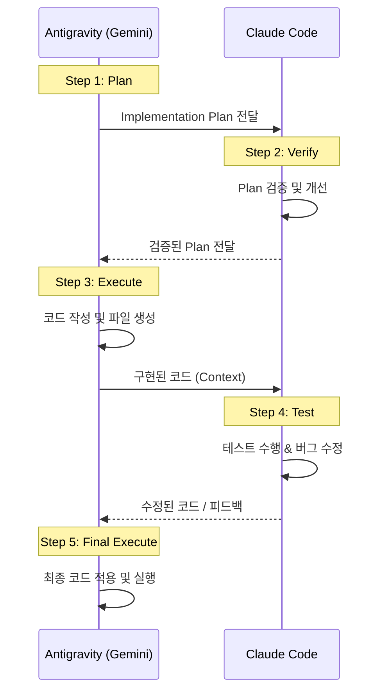

# AI 협업 워크플로우 (AI Collaboration Workflow)

TheMoon 프로젝트 개발 시 **Antigravity (Gemini 3 Pro)**와 **Claude Code** 간의 체계적인 협업 프로세스를 정의합니다.

## 🔄 5단계 협업 프로세스 (5-Step Cycle)

### 상세 단계 설명

1.  **Antigravity (Gemini 3 Pro) Plan (계획) 작성**
    *   주체: **Antigravity**
    *   내용: 사용자 요구사항을 분석하고 초기 `implementation_plan.md`를 작성합니다.

2.  **Claude Code에서 작성된 Plan (계획) Verify (검증) 및 개선 작업**
    *   주체: **Claude Code**
    *   내용: Antigravity가 작성한 계획을 검토하고, 잠재적 문제점을 식별하거나 더 나은 방식을 제안하여 계획을 개선합니다.

3.  **검증된 Plan (계획)으로 Antigravity에서 코드 작성 Execute (실행)**
    *   주체: **Antigravity**
    *   내용: 검증 완료된 계획을 기반으로 Antigravity가 실제 코드를 작성하고 파일을 생성/수정합니다.

4.  **Antigravity에서 작성된 코드 Claude Code에서 Test (테스트)**
    *   주체: **Claude Code**
    *   내용: Antigravity가 구현한 코드를 로드하여 테스트를 수행하고, 버그를 수정하거나 테스트 코드를 작성합니다.

5.  **Claude Code에서 작성된 코드를 Antigravity에서 Execute (실행)**
    *   주체: **Antigravity**
    *   내용: Claude Code가 테스트 과정에서 수정하거나 작성한 코드를 Antigravity 환경에서 최종적으로 실행하고 적용합니다.

## 🔀 상세 로직 흐름도 (Detailed Logic Flowchart)

의사결정 및 분기 처리를 포함한 상세 흐름도입니다.

## 🎬 시퀀스 다이어그램 (Sequence Diagram)

에이전트 간의 상호작용 순서입니다.

## 🤝 컨텍스트 핸드오버 프로토콜 (Context Handover Protocol)

Antigravity(Gemini)와 Claude Code 간의 작업 이관 규칙입니다.

### 1. 핸드오버 파일 생성 규칙
사용자가 **"클로드 전달"** 명령을 내리거나 작업 단계가 완료되면 핸드오버 파일을 생성합니다.

- **TO_CLAUDE.md**: Antigravity → Claude (사용자가 복사해서 Claude에게 전달)
- **TO_ANTIGRAVITY.md**: Claude → Antigravity (Claude가 작성, Antigravity가 읽음)

### 2. 사용자 행동 가이드 (User Action)
1.  Antigravity가 `TO_CLAUDE.md`를 생성했다고 알림.
2.  사용자는 파일 내용을 복사(**Ctrl+C**)하여 Claude Code 터미널에 붙여넣기(**Ctrl+V**).
