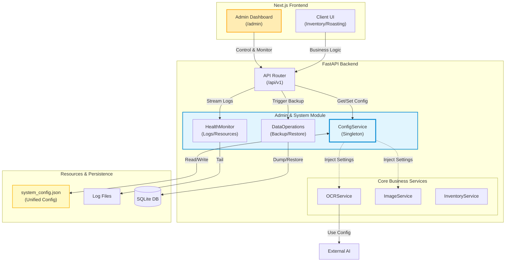

# TheMoon Admin & System Evolution Master Plan
> **작성일**: 2025-12-23
> **작성자**: Antigravity (Planning Expert)
> **대상**: TheMoon Project (Next.js + FastAPI)

## 1. 서론 (Introduction)

현재 TheMoon 프로젝트는 기능 개발(원두 관리, 로스팅, 명세서 OCR 등)이 빠르게 진행되며 성숙기에 접어들고 있습니다. 이 시점에서 시스템의 **안정성(Stability)**, **유지보수성(Maintainability)**, **확장성(Scalability)**을 보장하기 위한 **중앙 관리 체계(Admin System)**의 도입이 필수적입니다.

본 문서는 단순한 "설정 페이지" 추가를 넘어, 프로젝트의 장기적인 발전 방향을 고려한 **시스템 진화 마스터 플랜**입니다.

---

## 2. 전략적 방향성 (Strategic Direction)

### 2.1. Centralized Control (중앙 집중 제어)
*   **문제점**: 코드 곳곳에 산재된 설정(OCR 모델명, 이미지 경로, 임계값 등)으로 인해 운영 중 변경이 어렵고 재배포가 필요함.
*   **해결책**: `system_config.json` 기반의 중앙 설정 시스템 도입. UI에서 실시간으로 시스템 동작 변경 가능 (Hot-swapping).

---

## 6. 시스템 아키텍처 다이어그램 (System Architecture Diagram)

Admin System이 기존 프로젝트(Core Core)와 어떻게 상호작용하는지 보여주는 전체 구조도입니다.

### 2.2. Observability & Feedback (관측 가능성 및 피드백)
*   **문제점**: 백그라운드 작업(OCR 분석, 이미지 최적화)의 상태나 에러를 개발자가 아니면 확인하기 어려움.
*   **해결책**: 시스템 로그, API 상태, 리소스 사용량을 시각화하는 대시보드 구축.

### 2.3. Data Governance (데이터 거버넌스)
*   **문제점**: 데이터 백업/복구, 잘못 입력된 마스터 데이터(공급처명 통일 등) 관리가 수동으로 이루어짐.
*   **해결책**: GUI 기반 백업/복구, 데이터 정제(Cleaning) 도구 제공.

---

## 3. 핵심 모듈 설계 (Core Modules)

### Module A: 통합 설정 관리 (Configuration Hub)
> **"코드를 수정하지 않고 시스템의 행동을 바꾼다."**

*   **기능**:
    *   **서비스 스위치**: OCR 공급자(Gemini <-> Claude) 즉시 전환, 특정 기능 On/Off.
    *   **파라미터 튜닝**: 이미지 전처리 강도, OCR 프롬프트 템플릿 수정, 캐시 만료 시간 설정.
    *   **JSON Editor**: 계층화된 설정을 트리(Tree) 형태 또는 Raw JSON으로 편집.
*   **기술**: `ConfigService` (Singleton), `Pydantic` Validation.

### Module B: 시스템 헬스센터 (System Health Center)
> **"시스템의 맥박을 짚는다."**

*   **기능**:
    *   **실시간 로그 뷰어**: `backend/logs/*.log` 파일을 웹소켓으로 실시간 스트리밍. 에러 키워드 하이라이팅.
    *   **리소스 모니터링**: CPU/Memory 사용량, 디스크 용량(`images/` 폴더 크기) 시각화.
    *   **API 상태**: 외부 서비스(Anthropic, Google AI) 연결 상태 핑(Ping) 테스트.

### Module C: 데이터 운영실 (Data Operations)
> **"데이터를 안전하게 지키고 관리한다."**

*   **기능**:
    *   **백업/복구**: `sqlite` DB 파일 및 이미지 폴더 스냅샷 생성/다운로드/복원.
    *   **마스터 데이터 관리**:
        *   **동의어 사전**: "GSC", "지에스씨", "G.S.C" -> "GSC International"로 자동 매핑 규칙 설정.
        *   **원두 매핑 룰**: OCR에서 추출된 "Ethiopia Sidamo"를 내부 원두 ID 5번에 매핑하는 규칙 편집.

### Module D: AI 실험실 (AI Playground)
> **"AI 성능을 지속적으로 개선한다."**

*   **기능**:
    *   **프롬프트 엔지니어링**: OCR 프롬프트 템플릿 버전 관리 및 A/B 테스트.
    *   **실패 케이스 분석**: OCR 인식 실패한 이미지 모아보기 및 재분석 시뮬레이션.

---

## 4. 단계별 이행 로드맵 (Implementation Roadmap)

구현의 시급성과 의존성을 고려하여 4단계로 진행합니다.

### 📅 Phase 1: Foundation (기반 구축) - *Current Priority*
*   **목표**: 설정 파일 중앙화 및 기본 관리 UI 구현.
*   **작업**:
    *   [Backend] `system_config.json` 설계 및 마이그레이션.
    *   [Backend] `ConfigService` 구현 (Read/Write/Validate).
    *   [Frontend] `/admin/settings` 페이지 구현 (JSON Editor 연동).
    *   [Migration] 기존 `ocr_service.py`, `image_service.py`가 `ConfigService`를 참조하도록 리팩토링.

### 📅 Phase 2: Observability (가시성 확보)
*   **목표**: 개발자 도구 없이 시스템 상태 확인 가능.
*   **작업**:
    *   [Backend] 로그 스트리밍 WebSocket 엔드포인트 구현.
    *   [Backend] 디스크 용량 체크 API 고도화.
    *   [Frontend] `/admin/logs`, `/admin/status` 대시보드 구현.

### 📅 Phase 3: Data Safety (데이터 안전)
*   **목표**: 데이터 손실 방지 및 복구 체계 확립.
*   **작업**:
    *   [Backend] DB 및 이미지 리소스 압축 백업 스크립트 API화.
    *   [Frontend] 원클릭 백업 및 복원 UI.

### 📅 Phase 4: AI & Logic Refinement (지능화)
*   **목표**: 비즈니스 로직(매핑, AI) 정교화.
*   **작업**:
    *   [Backend] OCR 결과 후처리 매핑 테이블(Synonyms) DB화.
    *   [Frontend] 동의어 관리 및 OCR 프롬프트 수정 페이지.

---

## 5. 결론 및 제언

현재 가장 시급한 것은 **Phase 1 (기반 구축)**입니다. 설정 파일이 여러 곳에 흩어져 있으면 향후 기능 확장 시 "기술 부채"가 됩니다.

먼저 **`system_config.json`으로의 통합**을 최우선 과제로 진행하고, 이후 관리자 페이지 UI를 붙이는 순서로 진행하는 것을 강력히 권장합니다.
